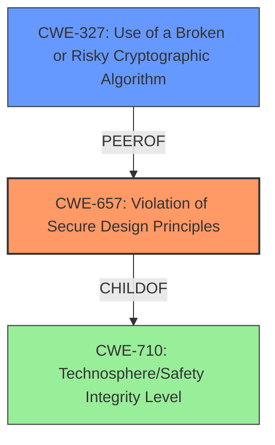

# Analysis for CVE-2021-40006

# Summary
| CWE ID | CWE Name | Confidence | CWE Abstraction Level | CWE Vulnerability Mapping Label | CWE-Vulnerability Mapping Notes |
|---|---|---|---|---|---|
| CWE-657 | Violation of Secure Design Principles | 0.8 | Class | Primary | Allowed-with-Review |
| CWE-327 | Use of a Broken or Risky Cryptographic Algorithm | 0.6 | Class | Secondary | Allowed-with-Review |

## Evidence and Confidence

*   **Confidence Score:** 0.7
*   **Evidence Strength:** MEDIUM

## Relationship Analysis
The primary CWE, CWE-657, is a Class-level CWE that falls under the Pillar CWE-710. While it's a higher-level abstraction, the vulnerability description centers around "**design defects**" in the security algorithm. A more specific Base or Variant CWE would be ideal, but the information provided is insufficient to pinpoint a more precise weakness. CWE-327 is related as a possible type of **design defect** related to cryptography, and is a peer of CWE-311.

## Vulnerability Chain
The chain of events is as follows:
1.  **Root Cause:** **Design defects** in the security algorithm component (CWE-657).
2.  **Impact:** Potential compromise of confidentiality.

The description indicates a **design defect** as the root cause.

## Summary of Analysis
Initially, the vulnerability description points to a **design defect** in a security algorithm component that could affect confidentiality. The primary indicator is the key phrase "**design defects**".

The Retriever results suggest several potential CWEs, including CWE-657, CWE-327, and others.

Given the available evidence and the mapping guidance, CWE-657 is chosen as the primary CWE because it directly addresses the **design defect**. However, it is a class-level CWE, and the guidance suggests considering more specific options if available. Since the component is a "security algorithm component", CWE-327 (Use of a Broken or Risky Cryptographic Algorithm) is added as a secondary CWE because the **design defect** could be related to the cryptographic algorithm itself, but this is speculative.

CWE-657 is at the appropriate level of specificity given the available information. While a more specific CWE would be preferred, there isn't enough detail to determine the exact nature of the **design defect**. The selection of CWE-657 is primarily based on the vulnerability description and the provided summary from the CVE Reference Links.

Relevant CWE Information:

# Enhanced Context (25 CWEs)
The following CWEs were identified as potentially relevant to this vulnerability:

## CWE-657: Violation of Secure Design Principles
**Abstraction Level**: Class
**Similarity Score**: 0.77
**Source**: dense

**Description**:
The product violates well-established principles for secure design.

**Mapping Guidance**:
- Usage: Discouraged
- Rationale: This CWE entry is a level-1 Class (i.e., a child of a Pillar). It might have lower-level children that would be more appropriate

## CWE-327: Use of a Broken or Risky Cryptographic Algorithm
**Abstraction Level**: Class
**Similarity Score**: 4963.41
**Source**: sparse

**Description**:
The product uses a broken or risky cryptographic algorithm or protocol.

**Mapping Guidance**:
- Usage: Allowed-with-Review
- Rationale: This CWE entry is a Class and might have Base-level children that would be more appropriate

## CWE-287: Improper Authentication
**Abstraction Level**: Class
**Similarity Score**: 0.103
**Source**: sparse
**Description**: When an actor claims to have a given identity, the product does not prove or insufficiently proves that the claim is correct.
**Mapping Guidance**: Discouraged, consider children.

## CWE-15: External Control of System or Configuration Setting
**Abstraction Level**: Base
**Similarity Score**: 0.101
**Source**: sparse
**Description**: One or more system settings or configuration elements can be externally controlled by a user.
**Mapping Guidance**: Allowed

## CWE-1391: Use of Weak Credentials
**Abstraction Level**: Class
**Similarity Score**: 0.099
**Source**: sparse
**Description**: The product uses weak credentials (such as a default key or hard-coded password) that can be calculated, derived, reused, or guessed by an attacker.
**Mapping Guidance**: Allowed-with-Review

## CWE-208: Observable Timing Discrepancy
**Abstraction Level**: Base
**Similarity Score**: 0.002
**Source**: graph
**Description**: Two separate operations in a product require different amounts of time to complete, in a way that is observable to an actor and reveals security-relevant information about the state of the product, such as whether a particular operation was successful or not.
**Mapping Guidance**: Allowed

## CWE-456: Missing Initialization of a Variable
**Abstraction Level**: Variant
**Similarity Score**: 0.098
**Source**: sparse
**Description**: The product does not initialize critical variables, which causes the execution environment to use unexpected values.
**Mapping Guidance**: Allowed

## CWE-636: Not Failing Securely ('Failing Open')
**Abstraction Level**: Class
**Similarity Score**: 0.098
**Source**: sparse
**Description**: When the product encounters an error condition or failure, its design requires it to fall back to a state that is less secure than other options that are available, such as selecting the weakest encryption algorithm or using the most permissive access control restrictions.
**Mapping Guidance**: Allowed-with-Review

## CWE-125: Out-of-bounds Read
**Abstraction Level**: Base
**Similarity Score**: 0.097
**Source**: sparse
**Description**: The product reads data past the end, or before the beginning, of the intended buffer.
**Mapping Guidance**: Allowed