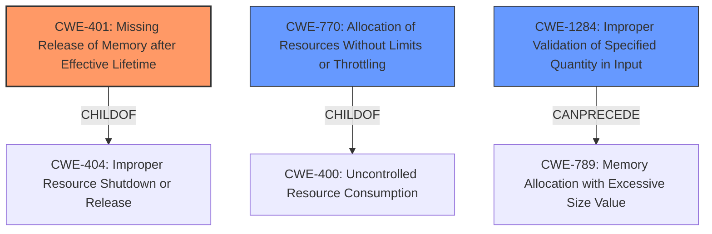

# Raw Analyzer Response for CVE-2021-40008

# Summary
| CWE ID | CWE Name | Confidence | CWE Abstraction Level | CWE Vulnerability Mapping Label | CWE-Vulnerability Mapping Notes |
|---|---|---|---|---|---|
| CWE-401 | Missing Release of Memory after Effective Lifetime | 1.0 | Variant | Allowed | Primary CWE. Memory leak due to failure to release allocated memory. |
| CWE-770 | Allocation of Resources Without Limits or Throttling | 0.6 | Base | Allowed | Secondary CWE. The system allocates memory without proper limits. |
| CWE-1284 | Improper Validation of Specified Quantity in Input | 0.5 | Base | Allowed | Secondary CWE. The crafted binary messages are not validated for size/length. |

## Evidence and Confidence

*   **Confidence Score:** 0.8
*   **Evidence Strength:** HIGH

## Relationship Analysis
The primary CWE is CWE-401 (Missing Release of Memory after Effective Lifetime), which is a variant of CWE-404 (Improper Resource Shutdown or Release). CWE-770 (Allocation of Resources Without Limits or Throttling) can lead to CWE-400 (Uncontrolled Resource Consumption), and CWE-1284 (Improper Validation of Specified Quantity in Input) can precede CWE-789 (Memory Allocation with Excessive Size Value). The selection favors the most specific variant, CWE-401, while also acknowledging the role of resource allocation without limits.

## Vulnerability Chain
The vulnerability chain starts with the software **not sufficiently tracking and releasing allocated memory** (CWE-401), potentially triggered by crafted binary messages that are **not validated properly** (CWE-1284). This leads to the consumption of remaining memory, eventually resulting in **memory exhaustion**. The **allocation of memory without limits or throttling** (CWE-770) exacerbates the problem.

## Summary of Analysis
The analysis indicates a clear **memory leak** vulnerability (CWE-401) where the software fails to release allocated memory after it's no longer needed. The provided evidence from the "CVE Reference Links Content Summary" states that the **root cause of the vulnerability** is that "the software does not properly track and release allocated memory while parsing crafted binary messages." The vulnerability description also mentions that the software "does not sufficiently track and release allocated memory." This directly aligns with the description of CWE-401, which states: "The product does not sufficiently track and release allocated memory after it has been used, which slowly consumes remaining memory."

The retriever results list CWE-401 as the top candidate with a score of 1.0, further solidifying this choice. The description aligns perfectly with the vulnerability description, and the mapping guidance suggests that this variant level of abstraction is preferred.

CWE-770 and CWE-1284 are considered as secondary CWEs. CWE-770 is relevant because the crafted binary messages could lead to excessive memory allocation without proper limits. CWE-1284 is relevant because the size/length of the crafted messages is not validated, potentially contributing to the memory exhaustion. These two combined could exacerbate the memory leak.

Other CWEs considered but not chosen as primary:

*   **CWE-400 (Uncontrolled Resource Consumption):** This is a class-level CWE and is too general. The specific issue is the missing release of memory, which is better captured by CWE-401.
*   **CWE-789 (Memory Allocation with Excessive Size Value):** While excessive memory allocation can be a contributing factor, the primary issue is the failure to release allocated memory, making CWE-401 more appropriate.
*   **CWE-125 (Out-of-bounds Read):** There is no evidence to suggest that the vulnerability leads to an out-of-bounds read.
*   **CWE-787 (Out-of-bounds Write):** There is no evidence to suggest that the vulnerability leads to an out-of-bounds write.
*   **CWE-665 (Improper Initialization) and CWE-909 (Missing Initialization of Resource):** The vulnerability is about releasing memory, not initializing it.
*   **CWE-20 (Improper Input Validation):** While input validation is generally important, the specific failure to release memory is better captured by CWE-401.