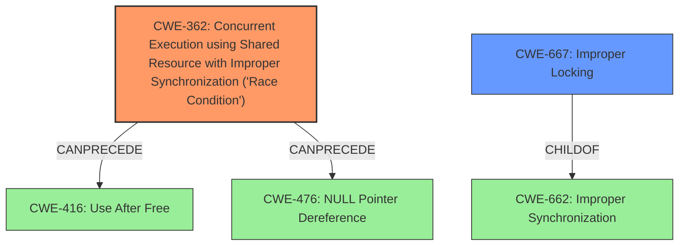

# Enhanced Analysis for CVE-2021-4001

# Summary
| CWE ID | CWE Name | Confidence | CWE Abstraction Level | CWE Vulnerability Mapping Label | CWE-Vulnerability Mapping Notes |
|---|---|---|---|---|---|
| CWE-362 | Concurrent Execution using Shared Resource with Improper Synchronization ('Race Condition') | 0.9 | Class | Allowed-with-Review | Primary |
| CWE-667 | Improper Locking | 0.7 | Class | Allowed-with-Review | Secondary |

## Evidence and Confidence

*   **Confidence Score:** 0.8
*   **Evidence Strength:** HIGH

## Relationship Analysis
The primary CWE is CWE-362, a Class-level weakness describing a race condition. The secondary CWE is CWE-667, also a Class, which describes improper locking. CWE-667 is a child of CWE-662, which deals with improper synchronization. CWE-362 can precede CWE-416 (Use After Free) and CWE-476 (NULL Pointer Dereference), indicating potential follow-on vulnerabilities.



## Vulnerability Chain
The vulnerability chain starts with a **missing lock** (identified in the Vulnerability Description Key Phrases), which leads to a **race condition**. This **race condition** allows a local user to modify the frozen mapped address space.

## Summary of Analysis
The analysis indicates a **race condition** (CWE-362) due to a **missing lock** (CWE-667) in the Linux kernel's ebpf verifier. The vulnerability allows a local user with special privileges to modify the frozen mapped address space.

The evidence from the Vulnerability Description Key Phrases confirms the **rootcause** as "**missing lock**" and the "**weakness**" as "**race condition**". The CVE Reference Links Content Summary further supports this by detailing the Time-of-Check-Time-of-Use (TOCTOU) **race condition** between `bpf_map_update_elem` and `bpf_map_freeze`. The fix involves expanding the use of `map->writecnt` and using atomic operations to prevent **race conditions**, confirming the accuracy of the CWE mapping.

Based on the evidence and the Retriever Results, CWE-362 (Concurrent Execution using Shared Resource with Improper Synchronization ('Race Condition')) is the most appropriate primary CWE because it directly describes the core weakness. CWE-667 (Improper Locking) is selected as a secondary CWE since the missing lock is the direct cause of the race condition. While the retriever results contained more specific CWEs like CWE-367 (Time-of-check Time-of-use (TOCTOU) Race Condition), the description better aligns with a general race condition rather than specifically a TOCTOU.

Relevant CWE Information:

# Enhanced Context (25 CWEs)

## CWE-667: Improper Locking
**Abstraction Level**: Class
**Similarity Score**: 0.81
**Source**: dense

**Description**:
The product does not properly acquire or release a lock on a resource, leading to unexpected resource state changes and behaviors.

**Mapping Guidance**:
- Usage: Allowed-with-Review
- Rationale: This CWE entry is a Class and might have Base-level children that would be more appropriate

**Justification:** The description aligns directly with the **missing lock** (**rootcause**) described in the Vulnerability Description Key Phrases. The **missing lock** is the reason why the race condition can occur. Since this is a class, it is a secondary candidate. Confidence: 0.7

## CWE-362: Concurrent Execution using Shared Resource with Improper Synchronization ('Race Condition')
**Abstraction Level**: Class
**Similarity Score**: 0.78
**Source**: dense

**Description**:
The product contains a concurrent code sequence that requires temporary, exclusive access to a shared resource, but a timing window exists in which the shared resource can be modified by another code sequence operating concurrently.

**Mapping Guidance**:
- Usage: Allowed-with-Review
- Rationale: This CWE entry is a Class and might have Base-level children that would be more appropriate

**Justification:** This CWE accurately captures the **weakness** described as a "**race condition**" in the Vulnerability Description and the root cause as a missing lock which leads to a timing window where the shared resource can be modified by another code sequence operating concurrently. Confidence: 0.9

## CWE-367: Time-of-check Time-of-use (TOCTOU) Race Condition
**Abstraction Level**: Base
**Similarity Score**: 0.77
**Source**: dense

**Description**:
The product checks the state of a resource before using that resource, but the resource's state can change between the check and the use in a way that invalidates the results of the check. This can cause the product to perform invalid actions when the resource is in an unexpected state.

**Mapping Guidance**:
- Usage: Allowed
- Rationale: This CWE entry is at the Base level of abstraction, which is a preferred level of abstraction for mapping to the root causes of vulnerabilities.

**Justification:** While the CVE Reference Links Content Summary mentions a TOCTOU race condition, the core issue is the general race condition due to the missing lock. Therefore, CWE-362 is a better fit. Confidence: 0.6

## CWE-415: Double Free
**Abstraction Level**: Variant
**Similarity Score**: 0.77
**Source**: dense

**Description**:
The product calls free() twice on the same memory address, potentially leading to modification of unexpected memory locations.

**Mapping Guidance**:
- Usage: Allowed
- Rationale: This CWE entry is at the Variant level of abstraction, which is a preferred level of abstraction for mapping to the root causes of vulnerabilities.

**Justification:** There is no mention of double freeing within the description. Confidence: 0.1

## CWE-833: Deadlock
**Abstraction Level**: Base
**Similarity Score**: 0.77
**Source**: dense

**Description**:
The product contains multiple threads or executable segments that are waiting for each other to release a necessary lock, resulting in deadlock.

**Mapping Guidance**:
- Usage: Allowed
- Rationale: This CWE entry is at the Base level of abstraction, which is a preferred level of abstraction for mapping to the root causes of vulnerabilities.

**Justification:** The vulnerability description does not mention a deadlock scenario. The core issue is a **race condition** due to a **missing lock**, not a deadlock. Confidence: 0.1


## CWE Relationship Analysis

Current CWEs represent these abstraction levels: .


### Vulnerability Chain Analysis

**Chain starting from CWE-667:**
- 667 (Improper Locking) - ROOT


**Chain starting from CWE-662:**
- 662 (Improper Synchronization) - ROOT


### CWE Relationship Diagram

```mermaid
graph TD
    classDef primary fill:#f96,stroke:#333,stroke-width:2px
    classDef secondary fill:#69f,stroke:#333
    classDef tertiary fill:#9e9,stroke:#333
```