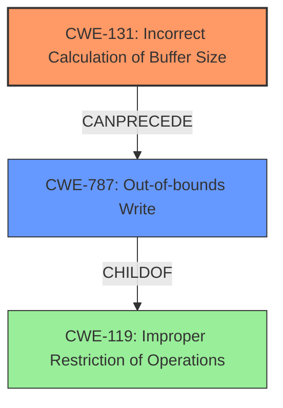

# Enhanced Analysis for CVE-2021-40027

# Summary
| CWE ID | CWE Name | Confidence | CWE Abstraction Level | CWE Vulnerability Mapping Label | CWE-Vulnerability Mapping Notes |
|---|---|---|---|---|---|
| CWE-131 | Incorrect Calculation of Buffer Size | 0.9 | Base | Allowed | Primary CWE |
| CWE-787 | Out-of-bounds Write | 0.6 | Base | Allowed | Secondary CWE |

## Evidence and Confidence

*   **Confidence Score:** 0.75
*   **Evidence Strength:** HIGH

## Relationship Analysis
The primary relationship influencing the selection is the parent-child relationship where CWE-131 (Incorrect Calculation of Buffer Size) can lead to CWE-787 (Out-of-bounds Write). The vulnerability description specifically mentions a "buffer length calculation error," making CWE-131 a direct fit. Since the incorrect calculation of the buffer size leads to writing outside the intended memory location, CWE-787 is a relevant secondary consideration.



## Vulnerability Chain
The vulnerability chain starts with **incorrect calculation of buffer size** (CWE-131), which leads to an **out-of-bounds write** (CWE-787). The final impact is data confidentiality.

## Summary of Analysis
The initial assessment strongly points to CWE-131 due to the explicit mention of a **"buffer length calculation error"**. The CVE Reference Links Content Summary reinforces this, stating "The vulnerability stems from a 'buffer length calculation error'". This evidence is sufficient to confidently assign CWE-131 as the primary weakness.

The relationship graph highlights that CWE-131 can precede CWE-787. Thus, the incorrect calculation could lead to writing past the buffer, resulting in data confidentiality issues.

The selected CWEs are at the optimal level of specificity because CWE-131 directly addresses the root cause, and CWE-787 clarifies the immediate consequence of that root cause.

Relevant CWE Information:

# Enhanced Context (25 CWEs)
The following CWEs were identified as potentially relevant to this vulnerability:

## CWE-805: Buffer Access with Incorrect Length Value
**Abstraction Level**: Base

## CWE-131: Incorrect Calculation of Buffer Size
**Abstraction Level**: Base

## CWE-191: Integer Underflow (Wrap or Wraparound)
**Abstraction Level**: Base

## CWE-126: Buffer Over-read
**Abstraction Level**: Variant

## CWE-124: Buffer Underwrite ('Buffer Underflow')
**Abstraction Level**: Base

## CWE-127: Buffer Under-read
**Abstraction Level**: Variant

## CWE-130: Improper Handling of Length Parameter Inconsistency
**Abstraction Level**: Base

## CWE-125: Out-of-bounds Read
**Abstraction Level**: Base

## CWE-190: Integer Overflow or Wraparound
**Abstraction Level**: Base

## CWE-680: Integer Overflow to Buffer Overflow
**Abstraction Level**: Compound

## CWE-190: Integer Overflow or Wraparound
**Abstraction Level**: Base

## CWE-125: Out-of-bounds Read
**Abstraction Level**: Base

## CWE-1284: Improper Validation of Specified Quantity in Input
**Abstraction Level**: Base

## CWE-131: Incorrect Calculation of Buffer Size
**Abstraction Level**: Base

## CWE-193: Off-by-one Error
**Abstraction Level**: Base

## CWE-170: Improper Null Termination
**Abstraction Level**: base

## CWE-195: Signed to Unsigned Conversion Error
**Abstraction Level**: variant

## CWE-1284: Improper Validation of Specified Quantity in Input
**Abstraction Level**: base

## CWE-123: Write-what-where Condition
**Abstraction Level**: base

## CWE-463: Deletion of Data Structure Sentinel
**Abstraction Level**: base

## CWE-128: Wrap-around Error
**Abstraction Level**: base

## CWE-1339: Insufficient Precision or Accuracy of a Real Number
**Abstraction Level**: base

## CWE-120: Buffer Copy without Checking Size of Input ('Classic Buffer Overflow')
**Abstraction Level**: base

## CWE-787: Out-of-bounds Write
**Abstraction Level**: base

## CWE-124: Buffer Underwrite ('Buffer Underflow')
**Abstraction Level**: Base

### CWE-131: Incorrect Calculation of Buffer Size
The product does not correctly calculate the size to be used when allocating a buffer, which could lead to a buffer overflow. The vulnerability description mentions a "buffer length calculation error," aligning perfectly with this CWE. The security implication is a potential buffer overflow, leading to arbitrary code execution or data corruption.

### CWE-787: Out-of-bounds Write
The product writes data past the end, or before the beginning, of the intended buffer. This CWE is relevant because an incorrect buffer size calculation (CWE-131) can directly lead to writing outside the intended buffer boundaries. The security implication is memory corruption, potentially allowing attackers to overwrite critical data or execute arbitrary code.

**CWE Considerations:**

*   **CWE-125 (Out-of-bounds Read)**: While out-of-bounds reads are possible, the description focuses on a calculation error, implying a write rather than a read issue.
*   **CWE-190 (Integer Overflow or Wraparound)**: Integer overflow might be a contributing factor to the incorrect calculation, but the primary issue is the calculation itself, not necessarily the overflow.
*   **CWE-1284 (Improper Validation of Specified Quantity in Input)**: This CWE could be considered, especially if the length is based on an input value. However, the description is focused on internal calculation **errors**, not necessarily validation of input.
*   **CWE-119 (Improper Restriction of Operations within the Bounds of a Memory Buffer)**: This is a higher-level CWE and less specific than CWE-131 or CWE-787. It's more appropriate to use the specific Base level CWEs.


## CWE Relationship Analysis

Current CWEs represent these abstraction levels: .


### Vulnerability Chain Analysis

**Chain starting from CWE-787:**
- 787 (Out-of-bounds Write) - ROOT


**Chain starting from CWE-680:**
- 680 (Integer Overflow to Buffer Overflow) - ROOT


### CWE Relationship Diagram

```mermaid
graph TD
    classDef primary fill:#f96,stroke:#333,stroke-width:2px
    classDef secondary fill:#69f,stroke:#333
    classDef tertiary fill:#9e9,stroke:#333
```