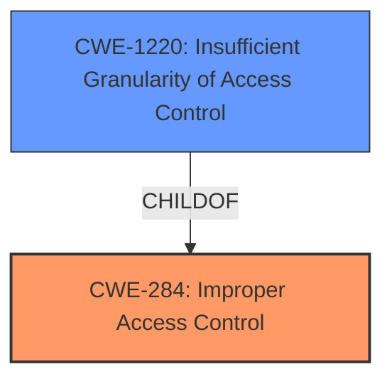

# Analysis for CVE-2021-40063

# Summary
| CWE ID  | CWE Name                      | Confidence | CWE Abstraction Level | CWE Vulnerability Mapping Label | CWE-Vulnerability Mapping Notes |
| :------- | :----------------------------- | :--------- | :---------------------- | :------------------------------ | :----------------------------- |
| CWE-284  | Improper Access Control        | 0.8        | Pillar                  | Primary CWE                     | Discouraged                   |
| CWE-1220 | Insufficient Granularity of Access Control | 0.7        | Base                    | Secondary CWE                   | Allowed                       |

## Evidence and Confidence

*   **Confidence Score:** 0.75
*   **Evidence Strength:** MEDIUM

## Relationship Analysis
The primary relationship that influenced the selection was the hierarchical relationship between CWE-284 (Improper Access Control) and its child CWE-1220 (Insufficient Granularity of Access Control). While CWE-284 is a high-level Pillar, the description suggests a lack of granularity in access control, making CWE-1220 a more specific and relevant candidate. No chain relationships were directly applicable in this scenario.

## Vulnerability Chain
The vulnerability chain is relatively simple:
1.  **Root Cause:** **Improper access control** in the video module (CWE-284).
2.  **Refinement:** Insufficient Granularity of Access Control (CWE-1220) further specifies the nature of the improper access control.
3.  **Impact:** Potential compromise of confidentiality.

## Summary of Analysis
The initial assessment focused on identifying the root cause of the vulnerability. The vulnerability description explicitly states "**improper access control**" as the primary weakness. The "CVE Reference Links Content Summary" reinforces this by mentioning "**Improper access control vulnerability in the video module.**"

The Retriever Results listed CWE-284 (Improper Access Control) as a candidate. However, CWE-284 is a high-level Pillar and its usage is discouraged, so a more specific child was sought.

CWE-1220 (Insufficient Granularity of Access Control) was also present in the retriever results and is a child of CWE-284. The description of CWE-1220 aligns well with the general concept of "**improper access control**" suggesting the access controls are not sufficiently fine-grained, leading to unauthorized access.

Therefore, the final selection includes CWE-284 as the primary, broad classification, and CWE-1220 to provide more specific details regarding the **improper access control**. The confidence level is relatively high (0.75) given the clear evidence in the vulnerability description and the supporting information.

Relevant CWE Information:

# Enhanced Context (25 CWEs)
The following CWEs were identified as potentially relevant to this vulnerability:

## CWE-1289: Improper Validation of Unsafe Equivalence in Input
**Abstraction Level**: Base
**Similarity Score**: 0.79
**Source**: dense

**Description**:
The product receives an input value that is used as a resource identifier or other type of reference, but it does not validate or incorrectly validates that the input is equivalent to a potentially-unsafe value.
**Rationale for not selecting**: This CWE focuses on improper validation of input equivalence, which isn't directly indicated in the provided vulnerability description. The description emphasizes a general **improper access control** issue rather than a specific input validation problem.

## CWE-807: Reliance on Untrusted Inputs in a Security Decision
**Abstraction Level**: Base
**Similarity Score**: 0.76
**Source**: dense

**Description**:
The product uses a protection mechanism that relies on the existence or values of an input, but the input can be modified by an untrusted actor in a way that bypasses the protection mechanism.
**Rationale for not selecting**: While the vulnerability involves access control, there is no direct evidence suggesting that the protection mechanism relies on untrusted inputs. The core issue is the **improper access control** within the video module, rather than the reliance on manipulable inputs.

## CWE-183: Permissive List of Allowed Inputs
**Abstraction Level**: Base
**Similarity Score**: 0.76
**Source**: dense

**Description**:
The product implements a protection mechanism that relies on a list of inputs (or properties of inputs) that are explicitly allowed by policy because the inputs are assumed to be safe, but the list is too permissive - that is, it allows an input that is unsafe, leading to resultant weaknesses.
**Rationale for not selecting**: This CWE pertains to overly permissive lists of allowed inputs, which isn't explicitly mentioned or implied in the vulnerability description. The description centers around a broader **improper access control** issue.

## CWE-1220: Insufficient Granularity of Access Control
**Abstraction Level**: Base
**Similarity Score**: 0.76
**Source**: dense

**Description**:
The product implements access controls via a policy or other feature with the intention to disable or restrict accesses (reads and/or writes) to assets in a system from untrusted agents. However, implemented access controls lack required granularity, which renders the control policy too broad because it allows accesses from unauthorized agents to the security-sensitive assets.
**Rationale for selecting**: This CWE aligns well with the general "**improper access control**" weakness. It suggests that the access controls in place are not fine-grained enough, allowing unauthorized access.

## CWE-691: Insufficient Control Flow Management
**Abstraction Level**: Pillar
**Similarity Score**: 0.76
**Source**: dense

**Description**:
The code does not sufficiently manage its control flow during execution, creating conditions in which the control flow can be modified in unexpected ways.
**Rationale for not selecting**: This is a very generic CWE and doesn't directly apply to the described vulnerability. The problem is specifically related to **improper access control**, not a general issue of control flow management.

## CWE-184: Incomplete List of Disallowed Inputs
**Abstraction Level**: Base
**Similarity Score**: 0.75
**Source**: dense

**Description**:
The product implements a protection mechanism that relies on a list of inputs (or properties of inputs) that are not allowed by policy or otherwise require other action to neutralize before additional processing takes place, but the list is incomplete.
**Rationale for not selecting**: This CWE focuses on incomplete lists of disallowed inputs, which isn't directly related to the described **improper access control** issue.

## CWE-1288: Improper Validation of Consistency within Input
**Abstraction Level**: Base
**Similarity Score**: 0.75
**Source**: dense

**Description**:
The product receives a complex input with multiple elements or fields that must be consistent with each other, but it does not validate or incorrectly validates that the input is actually consistent.
**Rationale for not selecting**: This CWE pertains to consistency validation of complex inputs, which is not the focus of the **improper access control** vulnerability described.

## CWE-653: Improper Isolation or Compartmentalization
**Abstraction Level**: Class
**Similarity Score**: 0.75
**Source**: dense

**Description**:
The product does not properly compartmentalize or isolate functionality, processes, or resources that require different privilege levels, rights, or permissions.
**Rationale for not selecting**: While isolation and access control are related, the vulnerability description specifically points to **improper access control** rather than a general lack of compartmentalization.

## CWE-179: Incorrect Behavior Order: Early Validation
**Abstraction Level**: Base
**Similarity Score**: 0.75
**Source**: dense

**Description**:
The product validates input before applying protection mechanisms that modify the input, which could allow an attacker to bypass the validation via dangerous inputs that only arise after the modification.
**Rationale for not selecting**: This CWE addresses issues with the order of validation, which isn't directly related to the reported **improper access control** vulnerability.

## CWE-274: Improper Handling of Insufficient Privileges
**Abstraction Level**: Base
**Similarity Score**: 0.74
**Source**: dense

**Description**:
The product does not handle or incorrectly handles when it has insufficient privileges to perform an operation, leading to resultant weaknesses.
**Rationale for not selecting**: The issue is not about the handling of insufficient privileges, but about incorrectly granting access.

## CWE-863: Incorrect Authorization
**Abstraction Level**: Class
**Similarity Score**: 7201.03
**Source**: sparse

**Description**:
The product performs an authorization check when an actor attempts to access a resource or perform an action, but it does not correctly perform the check.
**Rationale for not selecting**: This CWE is very similar to CWE-285 but focuses on incorrect checks versus missing checks. The description does not provide enough information to decide if the check is incorrect vs missing.

## CWE-125: Out-of-bounds Read