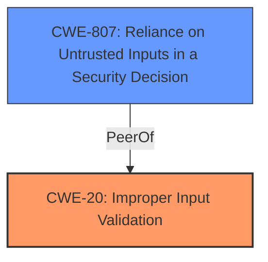

# Enhanced Analysis for CVE-2021-40128

# Summary
| CWE ID | CWE Name | Confidence | CWE Abstraction Level | CWE Vulnerability Mapping Label | CWE-Vulnerability Mapping Notes |
|---|---|---|---|---|---|
| CWE-20 | Improper Input Validation | 0.9 | Class | Primary | Discouraged |
| CWE-807 | Reliance on Untrusted Inputs in a Security Decision | 0.7 | Base | Secondary | Allowed |

## Evidence and Confidence

*   **Confidence Score:** 0.8
*   **Evidence Strength:** HIGH

## Relationship Analysis
The primary CWE selected is CWE-20, "Improper Input Validation," a Class-level CWE. Although generally discouraged for direct mapping due to its high-level nature, it serves as a fitting initial categorization given the vulnerability description's explicit mention of "**insufficient validation of user-supplied parameters**". A more specific Base CWE, CWE-807, "Reliance on Untrusted Inputs in a Security Decision," was also considered due to the reliance on these unvalidated parameters for a security decision (account activation link). The hierarchical parent of CWE-807 is CWE-697, but it is too high level.



## Vulnerability Chain
The chain of events is as follows:
1.  **Root Cause:** **Insufficient validation of user-supplied parameters** (CWE-20) in the account activation feature.
2.  Reliance on these untrusted inputs for security decisions (CWE-807).
3.  **Impact:** An attacker can send a crafted HTTP request, leading to a tampered activation link within an email that redirects users to an attacker-controlled website.

## Summary of Analysis
Initial Analysis: The vulnerability stems from the **insufficient validation of user-supplied parameters** in the account activation feature of Cisco Webex Meetings. This allows an attacker to send a crafted HTTP request, resulting in a tampered activation link within an email.

Criticism: While CWE-20 is a general classification, the provided evidence explicitly mentions "**insufficient validation of user-supplied parameters**", supporting its selection. However, CWE-20 is discouraged for direct mapping.

Resulting Conclusion: Given the direct evidence from the vulnerability description and the retriever results, CWE-20 is selected as the primary CWE because of the explicit mention of **insufficient validation**. In addition, CWE-807 is included to represent the reliance on these untrusted inputs for a security decision. This combination accurately captures the root cause and potential impact of the vulnerability, and is based on the available evidence.

The selection of CWE-20 is justified by the vulnerability description key phrases and the CVE reference links content summary that points to "**insufficient validation of user-supplied parameters**". CWE-807 is included due to the **reliance** on the untrusted input to generate the activation link.

Relevant CWE Information:

# Enhanced Context (25 CWEs)
The following CWEs were identified as potentially relevant to this vulnerability:

## CWE-807: Reliance on Untrusted Inputs in a Security Decision
**Abstraction Level**: Base
**Similarity Score**: 0.78
**Source**: dense

**Description**:
The product uses a protection mechanism that relies on the existence or values of an input, but the input can be modified by an untrusted actor in a way that bypasses the protection mechanism.

**Mapping Guidance**:
- Usage: Allowed
- Rationale: This CWE entry is at the Base level of abstraction, which is a preferred level of abstraction for mapping to the root causes of vulnerabilities.

## CWE-20: Improper Input Validation
**Abstraction:** Class
**Status:** Stable

### Description
The product receives input or data, but it does
        not validate or incorrectly validates that the input has the
        properties that are required to process the data safely and
        correctly.

### Extended Description
Input validation is a frequently-used technique for checking potentially dangerous inputs in order to ensure that the inputs are safe for processing within the code, or when communicating with other components. When software does not validate input properly, an attacker is able to craft the input in a form that is not expected by the rest of the application.

### Mapping Guidance
**Usage:** Discouraged
**Rationale:** CWE-20 is commonly misused in low-information vulnerability reports when lower-level CWEs could be used instead, or when more details about the vulnerability are available [REF-1287]. It is not useful for trend analysis. It is also a level-1 Class (i.e., a child of a Pillar).


## CWE Relationship Analysis

Current CWEs represent these abstraction levels: .


### Vulnerability Chain Analysis

**Chain starting from CWE-807:**
- 807 (Reliance on Untrusted Inputs in a Security Decision) - ROOT


**Chain starting from CWE-697:**
- 697 (Incorrect Comparison) - ROOT


### CWE Relationship Diagram

```mermaid
graph TD
    classDef primary fill:#f96,stroke:#333,stroke-width:2px
    classDef secondary fill:#69f,stroke:#333
    classDef tertiary fill:#9e9,stroke:#333
```