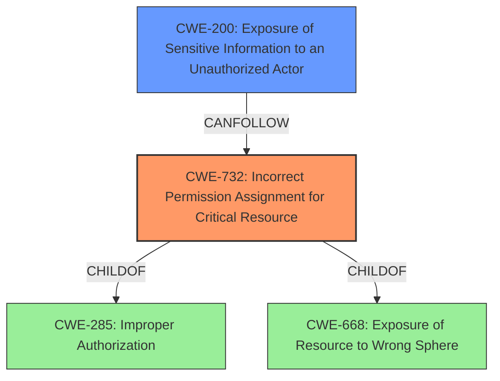

# Analysis for CVE-2021-4016

# Summary
| CWE ID  | CWE Name                                                        | Confidence | CWE Abstraction Level | CWE Vulnerability Mapping Label | CWE-Vulnerability Mapping Notes |
| :-------- | :-------------------------------------------------------------- | :--------- | :-------------------- | :------------------------------ | :------------------------------ |
| CWE-732 | Incorrect Permission Assignment for Critical Resource | 0.95       | Class                 | Allowed-with-Review             |                                 |
| CWE-200 | Exposure of Sensitive Information to an Unauthorized Actor       | 0.7        | Class                 | Discouraged                     |                                 |

## Evidence and Confidence

*   **Confidence Score:** 0.9
*   **Evidence Strength:** HIGH

## Relationship Analysis
The primary CWE selected is CWE-732 which is a child of CWE-285 (Improper Authorization) and CWE-668 (Exposure of Resource to Wrong Sphere). While the vulnerability description mentions "improper access control," CWE-732 is more specific, focusing on incorrect permission assignments for critical resources. CWE-200 is considered as a secondary weakness as it relates to the exposure of sensitive information as a result of the improper permission assignment.

## Vulnerability Chain
The vulnerability chain begins with the **improper permission assignment** (CWE-732) for the Insight Agent snapshot directory. This **weakness** allows unauthorized access to sensitive files within the directory, leading to the **exposure of sensitive information** (CWE-200).

## Summary of Analysis
The initial assessment considered the **improper access control** as the root cause, leading to the consideration of CWE-284. However, the retriever results and the CWE specifications suggest that CWE-732, "Incorrect Permission Assignment for Critical Resource," is a more specific and appropriate classification. This is because the vulnerability specifically involves the incorrect assignment of permissions to the snapshot directory, allowing unauthorized users to access sensitive files. The evidence for this is the vulnerability description which states that the user has access to the snapshot directory which leads to the attacker being able to access, read and copy any of the files in this directory. The "CVE Reference Links Content Summary" also supports this assessment, stating that the root cause is **improper access control** and the **weaknesses/vulnerabilities** present are that non-system users could access the Insight Agent snapshot directory.

CWE-284 is a Pillar-level CWE and is discouraged due to its high level of abstraction. The mapping guidance for CWE-284 suggests considering more specific descendants such as CWE-732.

CWE-200, "Exposure of Sensitive Information to an Unauthorized Actor," is a Class-level CWE that describes the impact of the vulnerability, where sensitive information is exposed due to the improper permission assignment. While relevant, it is not the primary root cause, but rather a consequence of the **incorrect permission assignment**. The mapping guidance for CWE-200 also discourages its use as a primary CWE, suggesting that the CWE for the error that caused the information to be disclosed should be used instead.

Therefore, CWE-732 is the most appropriate primary CWE because it accurately represents the root cause of the vulnerability, which is the incorrect permission assignment for the Insight Agent snapshot directory. This assignment allows unauthorized users to access sensitive files, leading to a loss of confidentiality.

Relevant CWE Information:

# Enhanced Context (25 CWEs)

## CWE-274: Improper Handling of Insufficient Privileges
**Abstraction Level**: Base
**Similarity Score**: 0.76
**Source**: dense

**Description**:
The product does not handle or incorrectly handles when it has insufficient privileges to perform an operation, leading to resultant weaknesses.

**Mapping Guidance**:
- Usage: Discouraged
- Rationale: This CWE entry could be deprecated in a future version of CWE.

## CWE-807: Reliance on Untrusted Inputs in a Security Decision
**Abstraction Level**: Base
**Similarity Score**: 0.75
**Source**: dense

**Description**:
The product uses a protection mechanism that relies on the existence or values of an input, but the input can be modified by an untrusted actor in a way that bypasses the protection mechanism.

**Mapping Guidance**:
- Usage: Allowed
- Rationale: This CWE entry is at the Base level of abstraction, which is a preferred level of abstraction for mapping to the root causes of vulnerabilities.

## CWE-280: Improper Handling of Insufficient Permissions or Privileges
**Abstraction Level**: Base
**Similarity Score**: 0.75
**Source**: dense

**Description**:
The product does not handle or incorrectly handles when it has insufficient privileges to access resources or functionality as specified by their permissions. This may cause it to follow unexpected code paths that may leave the product in an invalid state.

**Mapping Guidance**:
- Usage: Allowed
- Rationale: This CWE entry is at the Base level of abstraction, which is a preferred level of abstraction for mapping to the root causes of vulnerabilities.

## CWE-303: Incorrect Implementation of Authentication Algorithm
**Abstraction Level**: Base
**Similarity Score**: 0.75
**Source**: dense

**Description**:
The requirements for the product dictate the use of an established authentication algorithm, but the implementation of the algorithm is incorrect.

**Mapping Guidance**:
- Usage: Allowed
- Rationale: This CWE entry is at the Base level of abstraction, which is a preferred level of abstraction for mapping to the root causes of vulnerabilities.

## CWE-668: Exposure of Resource to Wrong Sphere
**Abstraction Level**: Class
**Similarity Score**: 0.75
**Source**: dense

**Description**:
The product exposes a resource to the wrong control sphere, providing unintended actors with inappropriate access to the resource.

**Mapping Guidance**:
- Usage: Discouraged
- Rationale: CWE-668 is high-level and is often misused as a catch-all when lower-level CWE IDs might be applicable. It is sometimes used for low-information vulnerability reports [REF-1287]. It is a level-1 Class (i.e., a child of a Pillar). It is not useful for trend analysis.

## CWE-653: Improper Isolation or Compartmentalization
**Abstraction Level**: Class
**Similarity Score**: 0.74
**Source**: dense

**Description**:
The product does not properly compartmentalize or isolate functionality, processes, or resources that require different privilege levels, rights, or permissions.

**Mapping Guidance**:
- Usage: Allowed
- Rationale: This CWE entry is at the Base level of abstraction, which is a preferred level of abstraction for mapping to the root causes of vulnerabilities.

## CWE-1390: Weak Authentication
**Abstraction Level**: Class
**Similarity Score**: 0.74
**Source**: dense

**Description**:
The product uses an authentication mechanism to restrict access to specific users or identities, but the mechanism does not sufficiently prove that the claimed identity is correct.

**Mapping Guidance**:
- Usage: Allowed-with-Review
- Rationale: This CWE entry is a Class and might have Base-level children that would be more appropriate

## CWE-1391: Use of Weak Credentials
**Abstraction Level**: Class
**Similarity Score**: 0.74
**Source**: dense

**Description**:
The product uses weak credentials (such as a default key or hard-coded password) that can be calculated, derived, reused, or guessed by an attacker.

**Mapping Guidance**:
- Usage: Allowed-with-Review
- Rationale: This CWE entry is a Class and might have Base-level children that would be more appropriate

## CWE-1220: Insufficient Granularity of Access Control
**Abstraction Level**: Base
**Similarity Score**: 0.74
**Source**: dense

**Description**:
The product implements access controls via a policy or other feature with the intention to disable or restrict accesses (reads and/or writes) to assets in a system from untrusted agents. However, implemented access controls lack required granularity, which renders the control policy too broad because it allows accesses from unauthorized agents to the security-sensitive assets.

**Mapping Guidance**:
- Usage: Allowed
- Rationale: This CWE entry is at the Base level of abstraction, which is a preferred level of abstraction for mapping to the root causes of vulnerabilities.

## CWE-345: Insufficient Verification of Data Authenticity
**Abstraction Level**: Class