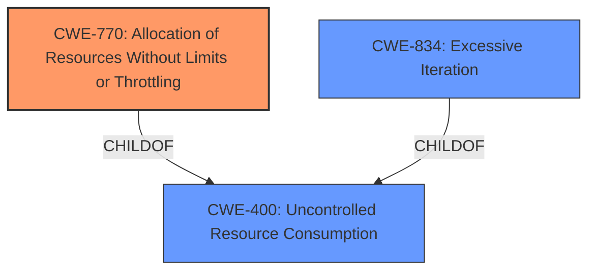

# Enhanced Analysis for CVE-2021-4021

# Summary
| CWE ID  | CWE Name                                                     | Confidence | CWE Abstraction Level | CWE Vulnerability Mapping Label | CWE-Vulnerability Mapping Notes |
| :-------- | :----------------------------------------------------------- | :--------- | :-------------------- | :------------------------------ | :------------------------------ |
| CWE-770  | Allocation of Resources Without Limits or Throttling        | 0.85       | Base                  | Primary CWE                     | Allowed                       |
| CWE-834 | Excessive Iteration | 0.75       | Class                  | Secondary CWE                     | Discouraged                       |
| CWE-400  | Uncontrolled Resource Consumption                            | 0.65       | Class                  | Secondary CWE                     | Discouraged                       |

## Evidence and Confidence

*   **Confidence Score:** 0.80
*   **Evidence Strength:** HIGH

## Relationship Analysis
The primary CWE is CWE-770, which falls under CWE-400. CWE-834 is a peer of CWE-770 and also a child of CWE-400, providing context for the iterative nature of the resource consumption. The abstraction levels guided the selection, with a preference for the base-level CWE-770 due to its specific focus on resource allocation without limits. The relationships highlight how a lack of limits on resource allocation (CWE-770) can lead to uncontrolled resource consumption (CWE-400), potentially through excessive iteration (CWE-834).



## Vulnerability Chain
The vulnerability chain starts with the **improper** handling of a huge section filled with zeros in an ELF64 binary for the MIPS architecture. This leads to **uncontrolled resource consumption**, specifically due to the **allocation of resources without limits or throttling** (CWE-770), which then results in a denial-of-service condition. The excessive consumption may involve **excessive iteration** (CWE-834) while processing the zero-filled section, ultimately leading to **uncontrolled resource consumption** (CWE-400) and DoS.

## Summary of Analysis
The initial assessment identified **uncontrolled resource consumption** as a key weakness. The analysis refined this by pinpointing the **allocation of resources without limits or throttling** (CWE-770) as the root cause. This is supported by the CVE Reference Links Content Summary, which mentions that Radare2 attempts to analyze a large region of memory without proper limits.

The relationships between CWEs further clarified the scenario. CWE-770 is a child of CWE-400, indicating that the uncontrolled resource consumption is a direct consequence of the allocation issue. The inclusion of CWE-834 acknowledges the iterative nature of the analysis, which exacerbates the resource consumption.

The selected CWEs are at the optimal level of specificity because CWE-770 directly addresses the **lack of limits on resource allocation**, while CWE-400 and CWE-834 describe the resulting behavior.

Relevant CWE Information:

# Enhanced Context (25 CWEs)
The following CWEs were identified as potentially relevant to this vulnerability:

## CWE-405: Asymmetric Resource Consumption (Amplification)
**Abstraction Level**: Class
**Similarity Score**: 0.77
**Source**: dense

**Description**:
The product does not properly control situations in which an adversary can cause the product to consume or produce excessive resources without requiring the adversary to invest equivalent work or otherwise prove authorization, i.e., the adversary's influence is "asymmetric."

**Mapping Guidance**:
- Usage: Allowed-with-Review
- Rationale: This CWE entry is a Class and might have Base-level children that would be more appropriate

*Not Selected:* This is a class level and doesn't fit because there are base level CWEs that more directly describe the vulnerability.

## CWE-789: Memory Allocation with Excessive Size Value
**Abstraction Level**: Variant
**Similarity Score**: 0.76
**Source**: dense

**Description**:
The product allocates memory based on an untrusted, large size value, but it does not ensure that the size is within expected limits, allowing arbitrary amounts of memory to be allocated.

**Mapping Guidance**:
- Usage: Allowed
- Rationale: This CWE entry is at the Variant level of abstraction, which is a preferred level of abstraction for mapping to the root causes of vulnerabilities.

*Not Selected:* While memory allocation is involved, the core issue isn't directly about excessive size values but rather the **lack of limits on the number of resources allocated**, which is more accurately captured by CWE-770.

## CWE-404: Improper Resource Shutdown or Release
**Abstraction Level**: Class
**Similarity Score**: 0.76
**Source**: dense

**Description**:
The product does not release or incorrectly releases a resource before it is made available for re-use.

**Mapping Guidance**:
- Usage: Allowed-with-Review
- Rationale: This CWE entry is a Class and might have Base-level children that would be more appropriate

*Not Selected:* The primary issue isn't about improper shutdown or release but the **lack of initial limits on allocation**.

## CWE-226: Sensitive Information in Resource Not Removed Before Reuse
**Abstraction Level**: Base
**Similarity Score**: 0.76
**Source**: dense

**Description**:
The product releases a resource such as memory or a file so that it can be made available for reuse, but it does not clear or "zeroize" the information contained in the resource before the product performs a critical state transition or makes the resource available for reuse by other entities.

**Mapping Guidance**:
- Usage: Allowed
- Rationale: This CWE entry is at the Base level of abstraction, which is a preferred level of abstraction for mapping to the root causes of vulnerabilities.

*Not Selected:* This is not relevant because the vulnerability isn't about sensitive information being present in resources before reuse.

## CWE-1325: Improperly Controlled Sequential Memory Allocation
**Abstraction Level**: Base
**Similarity Score**: 0.75
**Source**: dense

**Description**:
The product manages a group of objects or resources and performs a separate memory allocation for each object, but it does not properly limit the total amount of memory that is consumed by all of the combined objects.

**Mapping Guidance**:
- Usage: Allowed
- Rationale: This CWE entry is at the Base level of abstraction, which is a preferred level of abstraction for mapping to the root causes of vulnerabilities.

*Not Selected:* Similar to CWE-770, this could be relevant, but CWE-770 is more directly related to the root cause.

## CWE-407: Inefficient Algorithmic Complexity
**Abstraction Level**: Class
**Similarity Score**: 0.75
**Source**: dense

**Description**:
An algorithm in a product has an inefficient worst-case computational complexity that may be detrimental to system performance and can be triggered by an attacker, typically using crafted manipulations that ensure that the worst case is being reached.

**Mapping Guidance**:
- Usage: Allowed-with-Review
- Rationale: This CWE entry is a Class and might have Base-level children that would be more appropriate

*Not Selected:* While an inefficient algorithm might contribute, the main issue is **unlimited resource allocation**, not necessarily the algorithm's complexity.

## CWE-664: Improper Control of a Resource Through its Lifetime
**Abstraction Level**: Pillar
**Similarity Score**: 0.75
**Source**: dense

**Description**:
The product does not maintain or incorrectly maintains control over a resource throughout its lifetime of creation, use, and release.

**Mapping Guidance**:
- Usage: Discouraged
- Rationale: This CWE entry is high-level when lower-level children are available.

*Not Selected:* This is a high-level pillar, and more specific CWEs are available.

## CWE-799: Improper Control of Interaction Frequency
**Abstraction Level**: Class
**Similarity Score**: 0.74
**Source**: dense

**Description**:
The product does not properly limit the number or frequency of interactions that it has with an actor, such as the number of incoming requests.

**Mapping Guidance**:
- Usage: Allowed-with-Review
- Rationale: This CWE entry is a Class and might have Base-level children that would be more appropriate

*Not Selected:* This is not about limiting interaction frequency but rather about **limiting resource allocation** during analysis.

## CWE-1176: Inefficient CPU Computation
**Abstraction Level**: Class
**Similarity Score**: 0.74
**Source**:


## CWE Relationship Analysis

Current CWEs represent these abstraction levels: .


### Vulnerability Chain Analysis

**Chain starting from CWE-664:**
- 664 (Improper Control of a Resource Through its Lifetime) - ROOT


**Chain starting from CWE-404:**
- 404 (Improper Resource Shutdown or Release) - ROOT


### CWE Relationship Diagram

```mermaid
graph TD
    classDef primary fill:#f96,stroke:#333,stroke-width:2px
    classDef secondary fill:#69f,stroke:#333
    classDef tertiary fill:#9e9,stroke:#333
```