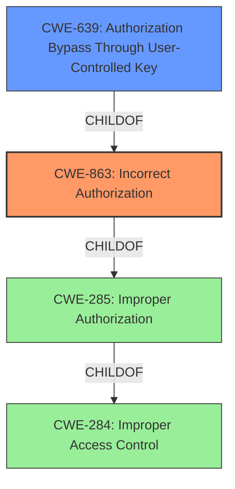

# Enhanced Analysis for CVE-2021-4026

# Summary
| CWE ID  | CWE Name                                          | Confidence | CWE Abstraction Level | CWE Vulnerability Mapping Label | CWE-Vulnerability Mapping Notes |
| :------- | :------------------------------------------------ | :--------- | :---------------------- | :------------------------------ | :------------------------------ |
| CWE-863  | Incorrect Authorization                           | 0.9        | Class                   | Primary                         | Allowed-with-Review           |
| CWE-639  | Authorization Bypass Through User-Controlled Key | 0.7        | Base                    | Secondary                       | Allowed                       |

## Evidence and Confidence

*   **Confidence Score:** 0.8
*   **Evidence Strength:** HIGH

## Relationship Analysis
The primary CWE, CWE-863 (Incorrect Authorization), is a Class-level CWE that falls under the broader category of CWE-285 (Improper Authorization) and CWE-284 (Improper Access Control). CWE-639 (Authorization Bypass Through User-Controlled Key) is a Base-level CWE and a child of CWE-863, representing a more specific case of incorrect authorization. Selecting CWE-863 as primary and CWE-639 as secondary reflects that the vulnerability involves an authorization check performed incorrectly, potentially due to a user-controlled key.



## Vulnerability Chain
The vulnerability chain starts with **Improper Access Control**, leading to **Incorrect Authorization** in the query logic and finally to **Information Disclosure** due to unauthorized access to draft page attachments.
- The root cause is an **Improper Access Control**, specifically in the permission checks for draft pages.
- The weakness is **Incorrect Authorization**, as the system performs an authorization check, but it's flawed and does not properly filter out related items of draft pages.
- This leads to the impact of **Information Disclosure**, where an attacker can access attachments of draft pages they shouldn't have access to.

## Summary of Analysis
Initially, the primary CWE match was suggested as CWE-NVD-Other. However, after analyzing the provided evidence, including the root cause, weaknesses, and impacts, a more specific CWE is needed. The analysis shows that the **root cause** is related to **Improper Access Control** with **insufficient permission checks** when querying related items of pages, specifically draft pages. The original query logic did not consider the visibility status of page drafts. This led to **Inadequate Access Control** that fails to properly filter out related items of draft pages and a logic error in the filtering logic. The impact of exploitation is **Information Disclosure**, where an attacker could view attachments or other related data linked to draft pages that are not intended to be public or accessible.

Given this evidence, CWE-863 (Incorrect Authorization) and CWE-639 (Authorization Bypass Through User-Controlled Key) were selected as the most appropriate CWEs. CWE-863 reflects that the system attempts to perform authorization but does so incorrectly. CWE-639 captures the possibility of an attacker manipulating a key to bypass authorization. Both CWEs are at appropriate levels of abstraction (Class and Base, respectively) and align with the vulnerability's root cause and impact.

Relevant CWE Information:

*   **CWE-863: Incorrect Authorization:** This CWE is a Class-level weakness describing that the product performs an authorization check, but it does not correctly perform the check. This aligns with the vulnerability description indicating that the system's permission checks are insufficient for draft pages. The usage is ALLOWED-WITH-REVIEW, suggesting to look for more specific children, but it's a strong candidate given the provided details.
*   **CWE-639: Authorization Bypass Through User-Controlled Key:** This CWE is a Base-level weakness where the system's authorization functionality does not prevent one user from gaining access to another user's data by modifying the key value identifying the data. This aligns with the potential manipulation of API requests and queries to access draft page attachments. The usage is ALLOWED.
*   **CWE-284: Improper Access Control:** This CWE is a Pillar-level weakness and is too general for this vulnerability. The mapping guidance discourages its use.
*   **CWE-285: Improper Authorization:** This CWE is a Class-level weakness, but the mapping guidance discourages its use and suggests using its children, such as CWE-863.
*   **CWE-425: Direct Request ('Forced Browsing'):** This CWE is a Base-level weakness, but it focuses on direct requests without proper authorization. While related, it doesn't fully capture the incorrect authorization logic within the query itself.


## CWE Relationship Analysis

Current CWEs represent these abstraction levels: .


### Vulnerability Chain Analysis

**Chain starting from CWE-284:**
- 284 (Improper Access Control) - ROOT


**Chain starting from CWE-285:**
- 285 (Improper Authorization) - ROOT


### CWE Relationship Diagram

```mermaid
graph TD
    classDef primary fill:#f96,stroke:#333,stroke-width:2px
    classDef secondary fill:#69f,stroke:#333
    classDef tertiary fill:#9e9,stroke:#333
```