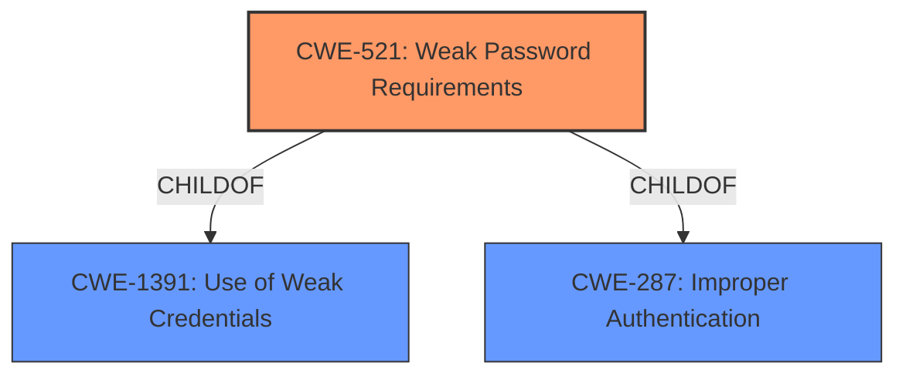

# Raw Analyzer Response for CVE-2021-40333

# Summary
| CWE ID | CWE Name | Confidence | CWE Abstraction Level | CWE Vulnerability Mapping Label | CWE-Vulnerability Mapping Notes |
|---|---|---|---|---|---|
| CWE-521 | Weak Password Requirements | 1.0 | Base | Allowed | Primary CWE |

## Evidence and Confidence

*   **Confidence Score:** 1.0
*   **Evidence Strength:** HIGH

## Relationship Analysis
The primary relationship that influenced my decision was the direct match of the vulnerability description to CWE-521. CWE-521 is a base level CWE, which is the preferred level of abstraction. It is also a child of CWE-1391 (Use of Weak Credentials) and CWE-287 (Improper Authentication).

## Vulnerability Chain
The vulnerability chain starts with the **weak password requirements** (CWE-521), which leads to a higher likelihood of account compromise and subsequent unauthorized access to the Data Communication Network (DCN) routing configuration.

## Summary of Analysis
The analysis is based on the provided evidence, specifically the phrase "**weak password requirements**" in the "Vulnerability Description Key Phrases." This directly aligns with the description of CWE-521 (Weak Password Requirements), which states: "The product does not require that users should have strong passwords, which makes it easier for attackers to compromise user accounts."

The graph relationships influenced the decision by confirming that CWE-521 is a base-level CWE, which is the preferred level of specificity.

CWE-521 is selected because it precisely describes the **root cause** of the vulnerability. It is at the optimal level of specificity (Base) and directly reflects the **weakness** identified in the vulnerability description.

Relevant CWE Information:

# Enhanced Context (25 CWEs)

## CWE-521: Weak Password Requirements
**Abstraction:** Base
**Status:** Draft

### Description
The product does not require that users should have strong passwords, which makes it easier for attackers to compromise user accounts.

### Extended Description
Authentication mechanisms often rely on a memorized secret (also known as a password) to provide an assertion of identity for a user of a system. It is therefore important that this password be of sufficient complexity and impractical for an adversary to guess. The specific requirements around how complex a password needs to be depends on the type of system being protected. Selecting the correct password requirements and enforcing them through implementation are critical to the overall success of the authentication mechanism.

### Alternative Terms
None

### Relationships
ChildOf -> CWE-1391
ChildOf -> CWE-287

### Mapping Guidance
**Usage:** Allowed
**Rationale:** This CWE entry is at the Base level of abstraction, which is a preferred level of abstraction for mapping to the root causes of vulnerabilities.
**Comments:** Carefully read both the name and description to ensure that this mapping is an appropriate fit. Do not try to 'force' a mapping to a lower-level Base/Variant simply to comply with this preferred level of abstraction.
**Reasons:**
- Acceptable-Use

### Observed Examples
- **CVE-2020-4574:** key server application does not require strong passwords

### Explanation of other CWEs Considered but Not Used:

*   **CWE-431 (Missing Handler):** This CWE is not applicable as the vulnerability is related to weak password requirements, not missing handlers.
*   **CWE-326 (Inadequate Encryption Strength):** This CWE is not applicable because the description doesn't mention anything about encryption.
*   **CWE-274 (Improper Handling of Insufficient Privileges):** This CWE is related to privilege handling, which is not the primary issue in this vulnerability.
*   **CWE-288 (Authentication Bypass Using an Alternate Path or Channel):** This CWE describes a bypass using an alternate path, not weak password requirements.
*   **CWE-916 (Use of Password Hash With Insufficient Computational Effort):** While related to password security, this CWE focuses on the hashing algorithm used, not the requirements for password complexity.
*   **CWE-433 (Unparsed Raw Web Content Delivery):** This CWE is about serving raw web content, which is not relevant to the described vulnerability.
*   **CWE-209 (Generation of Error Message Containing Sensitive Information):** This CWE deals with error messages, which is not related to the **root cause** of the vulnerability.
*   **CWE-266 (Incorrect Privilege Assignment):** This CWE is about incorrect privilege assignments, not related to weak password requirements.
*   **CWE-522 (Insufficiently Protected Credentials):** This CWE relates to how the credentials are being protected or transmitted, not that there is a **weakness** in the password requirements.