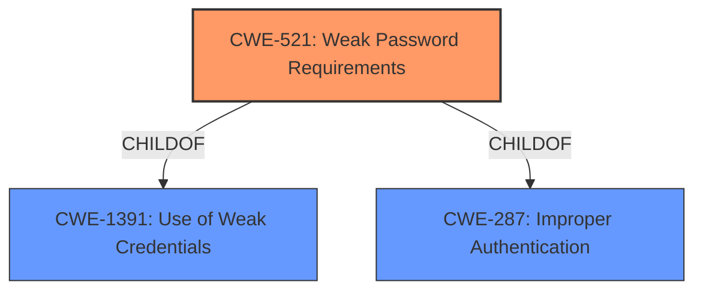

# Analysis for CVE-2021-40333

# Summary
| CWE ID | CWE Name | Confidence | CWE Abstraction Level | CWE Vulnerability Mapping Label | CWE-Vulnerability Mapping Notes |
|---|---|---|---|---|---|
| CWE-521 | Weak Password Requirements | 1.0 | Base | Allowed | Primary CWE |

## Evidence and Confidence

*   **Confidence Score:** 1.0
*   **Evidence Strength:** HIGH

## Relationship Analysis
The primary relationship that influenced my decision was the direct match of the vulnerability description to CWE-521. CWE-521 is a base level CWE, which is the preferred level of abstraction. It is also a child of CWE-1391 (Use of Weak Credentials) and CWE-287 (Improper Authentication).

## Vulnerability Chain
The vulnerability chain starts with the **weak password requirements** (CWE-521), which leads to a higher likelihood of account compromise and subsequent unauthorized access to the Data Communication Network (DCN) routing configuration.

## Summary of Analysis
The analysis is based on the provided evidence, specifically the phrase "**weak password requirements**" in the "Vulnerability Description Key Phrases." This directly aligns with the description of CWE-521 (Weak Password Requirements), which states: "The product does not require that users should have strong passwords, which makes it easier for attackers to compromise user accounts."

The graph relationships influenced the decision by confirming that CWE-521 is a base-level CWE, which is the preferred level of specificity.

CWE-521 is selected because it precisely describes the **root cause** of the vulnerability. It is at the optimal level of specificity (Base) and directly reflects the **weakness** identified in the vulnerability description.

Relevant CWE Information:

# Enhanced Context (25 CWEs)

## CWE-521: Weak Password Requirements
**Abstraction:** Base
**Status:** Draft

### Description
The product does not require that users should have strong passwords, which makes it easier for attackers to compromise user accounts.

### Extended Description
Authentication mechanisms often rely on a memorized secret (also known as a password) to provide an assertion of identity for a user of a system. It is therefore important that this password be of sufficient complexity and impractical for an adversary to guess. The specific requirements around how complex a password needs to be depends on the type of system being protected. Selecting the correct password requirements and enforcing them through implementation are critical to the overall success of the authentication mechanism.

### Alternative Terms
None

### Relationships
ChildOf -> CWE-1391
ChildOf -> CWE-287

### Mapping Guidance
**Usage:** Allowed
**Rationale:** This CWE entry is at the Base level of abstraction, which is a preferred level of abstraction for mapping to the root causes of vulnerabilities.
**Comments:** Carefully read both the name and description to ensure that this mapping is an appropriate fit. Do not try to 'force' a mapping to a lower-level Base/Variant simply to comply with this preferred level of abstraction.
**Reasons:**
- Acceptable-Use

### Observed Examples
- **CVE-2020-4574:** key server application does not require strong passwords

### Explanation of other CWEs Considered but Not Used:

*   **CWE-431 (Missing Handler):** This CWE is not applicable as the vulnerability is related to weak password requirements, not missing handlers.
*   **CWE-326 (Inadequate Encryption Strength):** This CWE is not applicable because the description doesn't mention anything about encryption.
*   **CWE-274 (Improper Handling of Insufficient Privileges):** This CWE is related to privilege handling, which is not the primary issue in this vulnerability.
*   **CWE-288 (Authentication Bypass Using an Alternate Path or Channel):** This CWE describes a bypass using an alternate path, not weak password requirements.
*   **CWE-916 (Use of Password Hash With Insufficient Computational Effort):** While related to password security, this CWE focuses on the hashing algorithm used, not the requirements for password complexity.
*   **CWE-433 (Unparsed Raw Web Content Delivery):** This CWE is about serving raw web content, which is not relevant to the described vulnerability.
*   **CWE-209 (Generation of Error Message Containing Sensitive Information):** This CWE deals with error messages, which is not related to the **root cause** of the vulnerability.
*   **CWE-266 (Incorrect Privilege Assignment):** This CWE is about incorrect privilege assignments, not related to weak password requirements.
*   **CWE-522 (Insufficiently Protected Credentials):** This CWE relates to how the credentials are being protected or transmitted, not that there is a **weakness** in the password requirements.

# Enhanced Query for CVE-2021-40333

## Vulnerability Description
Weak Password Requirements vulnerability in Hitachi Energy FOX61x, XCM20 allows an attacker to gain unauthorized access to the Data Communication Network (DCN) routing configuration. This issue affects Hitachi Energy FOX61x versions prior to R15A. Hitachi Energy XCM20 versions prior to R15A.

### Vulnerability Description Key Phrases
- **rootcause:** **weak password requirements**
- **impact:** unauthorized access to Data Communication Network (DCN) routing configuration
- **attacker:** attacker
- **product:** Hitachi Energy FOX61x and Hitachi Energy XCM20
- **version:** prior to R15A

## Retriever Results

### Top Combined Results

| Rank | CWE ID | Name | Abstraction | Usage  | Retrievers | Individual Scores |
|------|--------|------|-------------|-------|------------|-------------------|
| 1 | 521 | Weak Password Requirements | Base | Allowed | sparse | 0.626 |
| 2 | 431 | Missing Handler | Base | Allowed | sparse | 0.448 |
| 3 | 326 | Inadequate Encryption Strength | Class | Allowed-with-Review | sparse | 0.295 |
| 4 | 274 | Improper Handling of Insufficient Privileges | Base | Discouraged | sparse | 0.279 |
| 5 | 288 | Authentication Bypass Using an Alternate Path or Channel | Base | Allowed | sparse | 0.231 |
| 6 | 916 | Use of Password Hash With Insufficient Computational Effort | Base | Allowed | dense | 0.632 |
| 7 | 433 | Unparsed Raw Web Content Delivery | Variant | Allowed | graph | 0.002 |
| 8 | 209 | Generation of Error Message Containing Sensitive Information | Base | Allowed | sparse | 0.228 |
| 9 | 266 | Incorrect Privilege Assignment | Base | Allowed | sparse | 0.219 |
| 10 | 522 | Insufficiently Protected Credentials | Class | Allowed-with-Review | sparse | 0.218 |

# Complete CWE Specifications

## CWE-521: Weak Password Requirements
**Abstraction:** Base
**Status:** Draft

### Description
The product does not require that users should have strong passwords, which makes it easier for attackers to compromise user accounts.

### Extended Description
Authentication mechanisms often rely on a memorized secret (also known as a password) to provide an assertion of identity for a user of a system. It is therefore important that this password be of sufficient complexity and impractical for an adversary to guess. The specific requirements around how complex a password needs to be depends on the type of system being protected. Selecting the correct password requirements and enforcing them through implementation are critical to the overall success of the authentication mechanism.

### Alternative Terms
None

### Relationships
ChildOf -> CWE-1391
ChildOf -> CWE-287

### Mapping Guidance
**Usage:** Allowed
**Rationale:** This CWE entry is at the Base level of abstraction, which is a preferred level of abstraction for mapping to the root causes of vulnerabilities.
**Comments:** Carefully read both the name and description to ensure that this mapping is an appropriate fit. Do not try to 'force' a mapping to a lower-level Base/Variant simply to comply with this preferred level of abstraction.
**Reasons:**
- Acceptable-Use

### Observed Examples
- **CVE-2020-4574:** key server application does not require strong passwords

## CWE-431: Missing Handler
**Abstraction:** Base
**Status:** Draft

### Description
A handler is not available or implemented.

### Extended Description
When an exception is thrown and not caught, the process has given up an opportunity to decide if a given failure or event is worth a change in execution.

### Alternative Terms
None

### Relationships
ChildOf -> CWE-691
CanPrecede -> CWE-433

### Mapping Guidance
**Usage:** Allowed
**Rationale:** This CWE entry is at the Base level of abstraction, which is a preferred level of abstraction for mapping to the root causes of vulnerabilities.
**Comments:** Carefully read both the name and description to ensure that this mapping is an appropriate fit. Do not try to 'force' a mapping to a lower-level Base/Variant simply to comply with this preferred level of abstraction.
**Reasons:**
- Acceptable-Use

### Observed Examples
- **CVE-2022-25302:** SDK for OPC Unified Architecture (OPC UA) is missing a handler for when a cast fails, allowing for a crash

## CWE-326: Inadequate Encryption Strength
**Abstraction:** Class
**Status:** Draft

### Description
The product stores or transmits sensitive data using an encryption scheme that is theoretically sound, but is not strong enough for the level of protection required.

### Extended Description
A weak encryption scheme can be subjected to brute force attacks that have a reasonable chance of succeeding using current attack methods and resources.

### Alternative Terms
None

### Relationships
ChildOf -> CWE-693

### Mapping Guidance
**Usage:** Allowed-with-Review
**Rationale:** This CWE entry is a Class and might have Base-level children that would be more appropriate
**Comments:** Examine children of this entry to see if there is a better fit
**Reasons:**
- Abstraction

### Observed Examples
- **CVE-2001-1546:** Weak encryption
- **CVE-2004-2172:** Weak encryption (chosen plaintext attack)
- **CVE-2002-1682:** Weak encryption

## CWE-274: Improper Handling of Insufficient Privileges
**Abstraction:** Base
**Status:** Draft

### Description
The product does not handle or incorrectly handles when it has insufficient privileges to perform an operation, leading to resultant weaknesses.

### Extended Description
Not provided

### Alternative Terms
None

### Relationships
ChildOf -> CWE-755
ChildOf -> CWE-269
PeerOf -> CWE-271
CanAlsoBe -> CWE-280

### Mapping Guidance
**Usage:** Discouraged
**Rationale:** This CWE entry could be deprecated in a future version of CWE.
**Comments:** See maintenance notes.
**Reasons:**
- Potential Deprecation
- CWE Overlap

### Additional Notes
**[Maintenance]** CWE-280 and CWE-274 are too similar. It is likely that CWE-274 will be deprecated in the future.

**[Relationship]** Overlaps dropped privileges, insufficient permissions.

**[Theoretical]** This has a layering relationship with Unchecked Error Condition and Unchecked Return Value.

**[Theoretical]** Within the context of vulnerability theory, privileges and permissions are two sides of the same coin. Privileges are associated with actors, and permissions are associated with resources. To perform access control, at some point the product makes a decision about whether the actor (and the privileges that have been assigned to that actor) is allowed to access the resource (based on the permissions that have been specified for that resource).

### Observed Examples
- **CVE-2001-1564:** System limits are not properly enforced after privileges are dropped.
- **CVE-2005-3286:** Firewall crashes when it can't read a critical memory block that was protected by a malicious process.
- **CVE-2005-1641:** Does not give admin sufficient privileges to overcome otherwise legitimate user actions.

## CWE-288: Authentication Bypass Using an Alternate Path or Channel
**Abstraction:** Base
**Status:** Incomplete

### Description
The product requires authentication, but the product has an alternate path or channel that does not require authentication.

### Extended Description
Not provided

### Alternative Terms
None

### Relationships
ChildOf -> CWE-306
ChildOf -> CWE-284
PeerOf -> CWE-420

### Mapping Guidance
**Usage:** Allowed
**Rationale:** This CWE entry is at the Base level of abstraction, which is a preferred level of abstraction for mapping to the root causes of vulnerabilities.
**Comments:** Carefully read both the name and description to ensure that this mapping is an appropriate fit. Do not try to 'force' a mapping to a lower-level Base/Variant simply to comply with this preferred level of abstraction.
**Reasons:**
- Acceptable-Use

### Additional Notes
**[Relationship]** overlaps Unprotected Alternate Channel

### Observed Examples
- **CVE-2000-1179:** Router allows remote attackers to read system logs without authentication by directly connecting to the login screen and typing certain control characters.
- **CVE-1999-1454:** Attackers with physical access to the machine may bypass the password prompt by pressing the ESC (Escape) key.
- **CVE-1999-1077:** OS allows local attackers to bypass the password protection of idled sessions via the programmer's switch or CMD-PWR keyboard sequence, which brings up a debugger that the attacker can use to disable the lock.

## CWE-916: Use of Password Hash With Insufficient Computational Effort
**Abstraction:** Base
**Status:** Incomplete

### Description
The product generates a hash for a password, but it uses a scheme that does not provide a sufficient level of computational effort that would make password cracking attacks infeasible or expensive.

### Extended Description

Many password storage mechanisms compute a hash and store the hash, instead of storing the original password in plaintext. In this design, authentication involves accepting an incoming password, computing its hash, and comparing it to the stored hash.

Many hash algorithms are designed to execute quickly with minimal overhead, even cryptographic hashes. However, this efficiency is a problem for password storage, because it can reduce an attacker's workload for brute-force password cracking. If an attacker can obtain the hashes through some other method (such as SQL injection on a database that stores hashes), then the attacker can store the hashes offline and use various techniques to crack the passwords by computing hashes efficiently. Without a built-in workload, modern attacks can compute large numbers of hashes, or even exhaust the entire space of all possible passwords, within a very short amount of time, using massively-parallel computing (such as cloud computing) and GPU, ASIC, or FPGA hardware. In such a scenario, an efficient hash algorithm helps the attacker.

There are several properties of a hash scheme that are relevant to its strength against an offline, massively-parallel attack:

  - The amount of CPU time required to compute the hash ("stretching")

  - The amount of memory required to compute the hash ("memory-hard" operations)

  - Including a random value, along with the password, as input to the hash computation ("salting")

  - Given a hash, there is no known way of determining an input (e.g., a password) that produces this hash value, other than by guessing possible inputs ("one-way" hashing)

  - Relative to the number of all possible hashes that can be generated by the scheme, there is a low likelihood of producing the same hash for multiple different inputs ("collision resistance")

Note that the security requirements for the product may vary depending on the environment and the value of the passwords. Different schemes might not provide all of these properties, yet may still provide sufficient security for the environment. Conversely, a solution might be very strong in preserving one property, which still being very weak for an attack against another property, or it might not be able to significantly reduce the efficiency of a massively-parallel attack.

### Alternative Terms
None

### Relationships
ChildOf -> CWE-328
ChildOf -> CWE-327

### Mapping Guidance
**Usage:** Allowed
**Rationale:** This CWE entry is at the Base level of abstraction, which is a preferred level of abstraction for mapping to the root causes of vulnerabilities.
**Comments:** Carefully read both the name and description to ensure that this mapping is an appropriate fit. Do not try to 'force' a mapping to a lower-level Base/Variant simply to comply with this preferred level of abstraction.
**Reasons:**
- Acceptable-Use

### Observed Examples
- **CVE-2008-1526:** Router does not use a salt with a hash, making it easier to crack passwords.
- **CVE-2006-1058:** Router does not use a salt with a hash, making it easier to crack passwords.
- **CVE-2008-4905:** Blogging software uses a hard-coded salt when calculating a password hash.

## CWE-433: Unparsed Raw Web Content Delivery
**Abstraction:** Variant
**Status:** Incomplete

### Description
The product stores raw content or supporting code under the web document root with an extension that is not specifically handled by the server.

### Extended Description
If code is stored in a file with an extension such as ".inc" or ".pl", and the web server does not have a handler for that extension, then the server will likely send the contents of the file directly to the requester without the pre-processing that was expected. When that file contains sensitive information such as database credentials, this may allow the attacker to compromise the application or associated components.

### Alternative Terms
None

### Relationships
ChildOf -> CWE-219

### Mapping Guidance
**Usage:** Allowed
**Rationale:** This CWE entry is at the Variant level of abstraction, which is a preferred level of abstraction for mapping to the root causes of vulnerabilities.
**Comments:** Carefully read both the name and description to ensure that this mapping is an appropriate fit. Do not try to 'force' a mapping to a lower-level Base/Variant simply to comply with this preferred level of abstraction.
**Reasons:**
- Acceptable-Use

### Additional Notes
**[Relationship]** This overlaps direct requests (CWE-425), alternate path (CWE-424), permissions (CWE-275), and sensitive file under web root (CWE-219).

### Observed Examples
- **CVE-2002-1886:** ".inc" file stored under web document root and returned unparsed by the server
- **CVE-2002-2065:** ".inc" file stored under web document root and returned unparsed by the server
- **CVE-2005-2029:** ".inc" file stored under web document root and returned unparsed by the server

## CWE-209: Generation of Error Message Containing Sensitive Information
**Abstraction:** Base
**Status:** Draft

### Description
The product generates an error message that includes sensitive information about its environment, users, or associated data.

### Extended Description

The sensitive information may be valuable information on its own (such as a password), or it may be useful for launching other, more serious attacks. The error message may be created in different ways:

  - self-generated: the source code explicitly constructs the error message and delivers it

  - externally-generated: the external environment, such as a language interpreter, handles the error and constructs its own message, whose contents are not under direct control by the programmer

An attacker may use the contents of error messages to help launch another, more focused attack. For example, an attempt to exploit a path traversal weakness (CWE-22) might yield the full pathname of the installed application. In turn, this could be used to select the proper number of ".." sequences to navigate to the targeted file. An attack using SQL injection (CWE-89) might not initially succeed, but an error message could reveal the malformed query, which would expose query logic and possibly even passwords or other sensitive information used within the query.

### Alternative Terms
None

### Relationships
ChildOf -> CWE-200
ChildOf -> CWE-200
ChildOf -> CWE-755

### Mapping Guidance
**Usage:** Allowed
**Rationale:** This CWE entry is at the Base level of abstraction, which is a preferred level of abstraction for mapping to the root causes of vulnerabilities.
**Comments:** Carefully read both the name and description to ensure that this mapping is an appropriate fit. Do not try to 'force' a mapping to a lower-level Base/Variant simply to comply with this preferred level of abstraction.
**Reasons:**
- Acceptable-Use

### Observed Examples
- **CVE-2008-2049:** POP3 server reveals a password in an error message after multiple APOP commands are sent. Might be resultant from another weakness.
- **CVE-2007-5172:** Program reveals password in error message if attacker can trigger certain database errors.
- **CVE-2008-4638:** Composite: application running with high privileges (CWE-250) allows user to specify a restricted file to process, which generates a parsing error that leaks the contents of the file (CWE-209).

## CWE-266: Incorrect Privilege Assignment
**Abstraction:** Base
**Status:** Draft

### Description
A product incorrectly assigns a privilege to a particular actor, creating an unintended sphere of control for that actor.

### Extended Description
Not provided

### Alternative Terms
None

### Relationships
ChildOf -> CWE-269
CanAlsoBe -> CWE-286

### Mapping Guidance
**Usage:** Allowed
**Rationale:** This CWE entry is at the Base level of abstraction, which is a preferred level of abstraction for mapping to the root causes of vulnerabilities.
**Comments:** Carefully read both the name and description to ensure that this mapping is an appropriate fit. Do not try to 'force' a mapping to a lower-level Base/Variant simply to comply with this preferred level of abstraction.
**Reasons:**
- Acceptable-Use

### Observed Examples
- **CVE-1999-1193:** untrusted user placed in unix "wheel" group
- **CVE-2005-2741:** Product allows users to grant themselves certain rights that can be used to escalate privileges.
- **CVE-2005-2496:** Product uses group ID of a user instead of the group, causing it to run with different privileges. This is resultant from some other unknown issue.

## CWE-522: Insufficiently Protected Credentials
**Abstraction:** Class
**Status:** Incomplete

### Description
The product transmits or stores authentication credentials, but it uses an insecure method that is susceptible to unauthorized interception and/or retrieval.

### Extended Description
Not provided

### Alternative Terms
None

### Relationships
ChildOf -> CWE-1390
ChildOf -> CWE-287
ChildOf -> CWE-668

### Mapping Guidance
**Usage:** Allowed-with-Review
**Rationale:** This CWE entry is a Class and might have Base-level children that would be more appropriate
**Comments:** Examine children of this entry to see if there is a better fit
**Reasons:**
- Abstraction

### Observed Examples
- **CVE-2022-30018:** A messaging platform serializes all elements of User/Group objects, making private information available to adversaries
- **CVE-2022-29959:** Initialization file contains credentials that can be decoded using a "simple string transformation"
- **CVE-2022-35411:** Python-based RPC framework enables pickle functionality by default, allowing clients to unpickle untrusted data.

