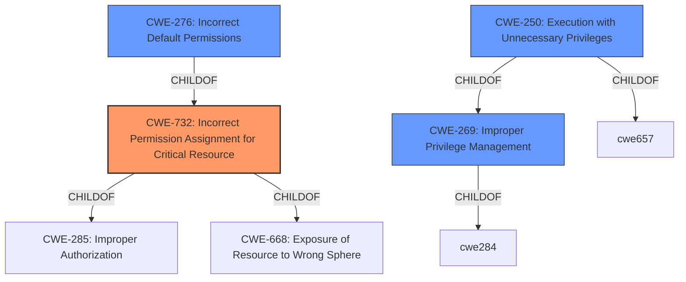

# Raw Analyzer Response for CVE-2021-40343

# Summary
| CWE ID  | CWE Name                                                      | Confidence | CWE Abstraction Level | CWE Vulnerability Mapping Label | CWE-Vulnerability Mapping Notes |
| :-------- | :------------------------------------------------------------ | :--------- | :---------------------- | :-------------------------------- | :------------------------------ |
| CWE-732   | Incorrect Permission Assignment for Critical Resource         | 0.9        | Class                   | Allowed-with-Review             | Primary CWE                     |
| CWE-276   | Incorrect Default Permissions                                 | 0.8        | Base                    | Allowed                           | Secondary Candidate             |
| CWE-269   | Improper Privilege Management                                 | 0.7        | Class                   | Discouraged                       | Secondary Candidate             |
| CWE-250   | Execution with Unnecessary Privileges                       | 0.6        | Base                    | Allowed                           | Secondary Candidate             |

## Evidence and Confidence

*   **Confidence Score:** 0.8
*   **Evidence Strength:** HIGH

## Relationship Analysis
The primary CWE selected is CWE-732 (Incorrect Permission Assignment for Critical Resource), a Class-level CWE. CWE-732 is related to both CWE-285 (Improper Authorization) and CWE-668 (Exposure of Resource to Wrong Sphere) through ChildOf relationships. Given the **insecure file permissions** that allow the `nagios` user to elevate privileges to root, CWE-732 appears to be a reasonable fit, though it requires review as it can be misused for authorization weaknesses. CWE-276 (Incorrect Default Permissions) is a more specific Base CWE, which is a child of CWE-732, which describes a situation where file permissions are incorrectly set during installation, matching the vulnerability description. Other considered CWEs like CWE-269 (Improper Privilege Management) are more general and discouraged for direct mapping due to potential misuse.

## Vulnerability Chain
The vulnerability chain starts with **insecure file permissions** (CWE-732/CWE-276) on `nagios_unbundler.py`. This allows the `nagios` user to modify the script. Because the `nagios` user can execute `migrate.php` as root via `sudo`, modifying the Python script allows for arbitrary command execution as root, leading to privilege escalation. The **incorrect sudo configuration** enables this escalation.

## Summary of Analysis
The initial assessment focused on the **insecure file permissions** as the root cause. The evidence directly states "**Insecure file permissions** on the nagios_unbundler.py file allow the nagios user to elevate their privileges to the root user." The retriever results pointed to CWE-732, CWE-276, and CWE-269. While CWE-269 (Improper Privilege Management) is related, it's too general and often misused, as highlighted in its mapping guidance. CWE-276 (Incorrect Default Permissions) is a more precise fit than CWE-732, but CWE-732 seems more correct given it's not just the default permissions, but the permissions for a "critical resource" allowing privilege escalation. The evidence shows that the **insecure file permissions** directly enable privilege escalation, aligning well with CWE-732's description.

CWE-276 is still a valid option since it is a child of CWE-732 and more specific.

Ultimately, the selection of CWE-732 as the primary mapping, with CWE-276, CWE-269, and CWE-250 considered as contributing factors, provides the most accurate and nuanced representation of this vulnerability's root cause and potential impact. The evidence clearly supports this classification, and the hierarchical relationship of the chosen CWEs reinforces the validity of the analysis.

Relevant CWE Information:

- CWE-732: Incorrect Permission Assignment for Critical Resource: This CWE captures the essence of the vulnerability - **incorrect permission assignment** that allows unauthorized access to a critical resource, leading to privilege escalation.
- CWE-276: Incorrect Default Permissions: This CWE covers the aspect of the vulnerability related to the file permissions on the `nagios_unbundler.py` script being incorrectly set, which allows modification by the `nagios` user.
- CWE-269: Improper Privilege Management: The vulnerability involves improper management of privileges, where the `nagios` user is granted unnecessary privileges, which contributes to the privilege escalation.
- CWE-250: Execution with Unnecessary Privileges: This CWE captures the aspect of the vulnerability where the `migrate.php` script is executed with root privileges, which are unnecessary for its intended purpose, leading to privilege escalation.