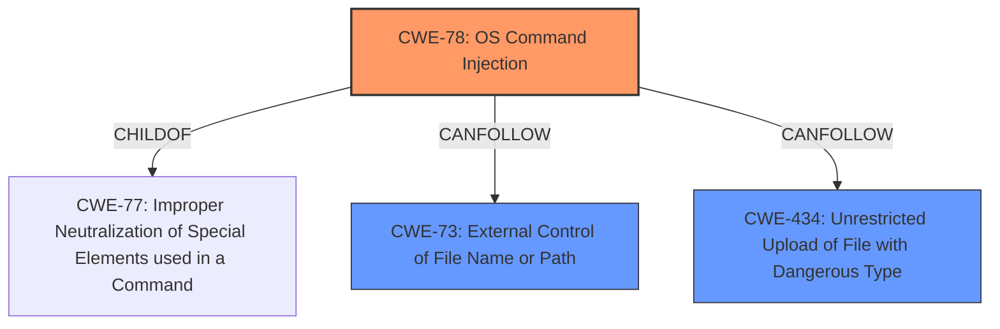

# Analysis Report for CVE-2021-40345

# Vulnerability Analysis Report: CVE-2021-40345

## Description


## Analysis (with Relationship Data)

# Summary
| CWE ID | CWE Name | Confidence | CWE Abstraction Level | CWE Vulnerability Mapping Label | CWE-Vulnerability Mapping Notes |
|---|---|---|---|---|---|
| CWE-78 | Improper Neutralization of Special Elements used in an OS Command ('OS Command Injection') | 1.0 | Base | Allowed | Primary CWE |
| CWE-73 | External Control of File Name or Path | 0.7 | Base | Allowed | Secondary Candidate|
| CWE-434 | Unrestricted Upload of File with Dangerous Type | 0.6 | Base | Allowed | Secondary Candidate |

## Evidence and Confidence

*   **Confidence Score:** 0.9
*   **Evidence Strength:** HIGH

## Relationship Analysis
The primary CWE is CWE-78, which is a Base level CWE, indicating it is at the right level of abstraction.
CWE-78 is a child of CWE-77, which is a more general Class level CWE. The analysis determined that the vulnerability was specific to OS commands, so the more specific CWE-78 was appropriate.
CWE-73 and CWE-434 were considered as secondary contributing factors, as the filename and file type were external controlled, leading to the **command injection**.


## Vulnerability Chain
The vulnerability chain begins with the external control of the filename (CWE-73) and the ability to upload arbitrary file types (CWE-434). This leads to the main vulnerability, which is the **improper neutralization of special elements used in an OS command** (CWE-78), resulting in arbitrary command execution on the system.
The chain of events is:
1.  External Control of Filename (CWE-73)
2.  Unrestricted Upload of File with Dangerous Type (CWE-434)
3.  Improper Neutralization of Special Elements used in an OS Command (CWE-78)
4.  Arbitrary Command Execution (Impact)

## Summary of Analysis
The initial assessment identified the core issue as **command injection** due to the lack of proper sanitization of the filename when constructing the OS command. The retriever results and the vulnerability description strongly supported CWE-78 as the primary weakness.
The final decision was based on the evidence from the vulnerability description, which clearly states that a **command injection** vulnerability exists in the Manage Dashlets section of the Admin panel, allowing an attacker to execute system commands.
The supporting evidence from the "CVE Reference Links Content Summary" section states:
   - **Root Cause:** The vulnerability stems from a **command injection** flaw within the "Manage Dashlets" functionality in the Nagios XI admin panel. Specifically, a user-controlled filename is concatenated into a command string, which is then executed by the `system()` function without proper sanitization.
   - **Weaknesses/Vulnerabilities:**
      - **Command Injection:** The core issue is the lack of proper input sanitization, allowing an attacker to inject arbitrary shell commands via a crafted filename.
      - **Insecure Use of `system()`:** The `system()` function in PHP executes shell commands, which when used with unsanitized user-controlled data, creates a direct path for **command injection**.
      - **Insufficient Input Validation:** The code doesn't properly validate the filename, allowing an attacker to insert malicious characters and commands.
The CWE-78 is at the optimal level of specificity because it directly describes the **improper neutralization of special elements used in an OS command**, which aligns perfectly with the vulnerability description. The relationships in the graph also influenced the selection, showing that CWE-78 is a child of CWE-77, making it a more specific and appropriate choice. CWE-73 (External Control of File Name or Path) and CWE-434 (Unrestricted Upload of File with Dangerous Type) were considered as contributing factors, but the primary issue remains the command injection itself.

Relevant CWE Information:

# Enhanced Context (25 CWEs)
The following CWEs were identified as potentially relevant to this vulnerability:

## CWE-23: Relative Path Traversal
**Abstraction Level**: Base
**Similarity Score**: 0.79
**Source**: dense

**Description**:
The product uses external input to construct a pathname that should be within a restricted directory, but it does not properly neutralize sequences such as ".." that can resolve to a location that is outside of that directory.

**Mapping Guidance**:
- Usage: Allowed
- Rationale: This CWE entry is at the Base level of abstraction, which is a preferred level of abstraction for mapping to the root causes of vulnerabilities.

## CWE-184: Incomplete List of Disallowed Inputs
**Abstraction Level**: Base
**Similarity Score**: 0.78
**Source**: dense

**Description**:
The product implements a protection mechanism that relies on a list of inputs (or properties of inputs) that are not allowed by policy or otherwise require other action to neutralize before additional processing takes place, but the list is incomplete.

**Mapping Guidance**:
- Usage: Allowed
- Rationale: This CWE entry is at the Base level of abstraction, which is a preferred level of abstraction for mapping to the root causes of vulnerabilities.

## CWE-74: Improper Neutralization of Special Elements in Output Used by a Downstream Component ('Injection')
**Abstraction Level**: Class
**Similarity Score**: 0.78
**Source**: dense

**Description**:
The product constructs all or part of a command, data structure, or record using externally-influenced input from an upstream component, but it does not neutralize or incorrectly neutralizes special elements that could modify how it is parsed or interpreted when it is sent to a downstream component.

**Mapping Guidance**:
- Usage: Discouraged
- Rationale: CWE-74 is high-level and often misused when lower-level weaknesses are more appropriate.

## CWE-434: Unrestricted Upload of File with Dangerous Type
**Abstraction Level**: Base
**Similarity Score**: 0.78
**Source**: dense

**Description**:
The product allows the upload or transfer of dangerous file types that are automatically processed within its environment.

**Mapping Guidance**:
- Usage: Allowed
- Rationale: This CWE entry is at the Base level of abstraction, which is a preferred level of abstraction for mapping to the root causes of vulnerabilities.

## CWE-41: Improper Resolution of Path Equivalence
**Abstraction Level**: Base
**Similarity Score**: 0.77
**Source**: dense

**Description**:
The product is vulnerable to file system contents disclosure through path equivalence. Path equivalence involves the use of special characters in file and directory names. The associated manipulations are intended to generate multiple names for the same object.

**Mapping Guidance**:
- Usage: Allowed
- Rationale: This CWE entry is at the Base level of abstraction, which is a preferred level of abstraction for mapping to the root causes of vulnerabilities.

## CWE-73: External Control of File Name or Path
**Abstraction Level**: Base
**Similarity Score**: 0.77
**Source**: dense

**Description**:
The product allows user input to control or influence paths or file names that are used in filesystem operations.

**Mapping Guidance**:
- Usage: Allowed
- Rationale: This CWE entry is at the Base level of abstraction, which is a preferred level of abstraction for mapping to the root causes of vulnerabilities.

## CWE-59: Improper Link Resolution Before File Access ('Link Following')
**Abstraction Level**: Base
**Similarity Score**: 0.76
**Source**: dense

**Description**:
The product attempts to access a file based on the filename, but it does not properly prevent that filename from identifying a link or shortcut that resolves to an unintended resource.

**Mapping Guidance**:
- Usage: Allowed
- Rationale: This CWE entry is at the Base level of abstraction, which is a preferred level of abstraction for mapping to the root causes of vulnerabilities.

## CWE-552: Files or Directories Accessible to External Parties
**Abstraction Level**: Base
**Similarity Score**: 0.76
**Source**: dense

**Description**:
The product makes files or directories accessible to unauthorized actors, even though they should not be.

**Mapping Guidance**:
- Usage: Allowed
- Rationale: This CWE entry is at the Base level of abstraction, which is a preferred level of abstraction for mapping to the root causes of vulnerabilities.

## CWE-138: Improper Neutralization of Special Elements
**Abstraction Level**: Class
**Similarity Score**: 0.76
**Source**: dense


## CWE Relationship Analysis

Current CWEs represent these abstraction levels: .


### Vulnerability Chain Analysis

**Chain starting from CWE-73:**
- 73 (External Control of File Name or Path) - ROOT


**Chain starting from CWE-41:**
- 41 (Improper Resolution of Path Equivalence) - ROOT


### CWE Relationship Diagram

```mermaid
graph TD
    classDef primary fill:#f96,stroke:#333,stroke-width:2px
    classDef secondary fill:#69f,stroke:#333
    classDef tertiary fill:#9e9,stroke:#333
```


*Report generated on 2025-04-02 04:55:19*
