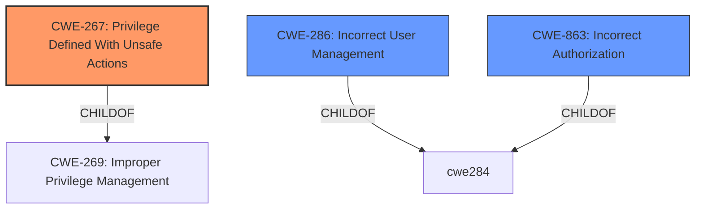

# Analysis Report for CVE-2021-40354

# Vulnerability Analysis Report: CVE-2021-40354

## Description


## Analysis (with Relationship Data)

# Summary
| CWE ID | CWE Name | Confidence | CWE Abstraction Level | CWE Vulnerability Mapping Label | CWE-Vulnerability Mapping Notes |
|---|---|---|---|---|---|
| CWE-267 | Privilege Defined With Unsafe Actions | 0.9 | Base | Allowed | Primary CWE |
| CWE-286 | Incorrect User Management | 0.6 | Class | Allowed-with-Review | Secondary Candidate |
| CWE-863 | Incorrect Authorization | 0.5 | Class | Allowed-with-Review | Secondary Candidate |

## Evidence and Confidence

*   **Confidence Score:** 0.9
*   **Evidence Strength:** HIGH

## Relationship Analysis
The primary relationship that influenced the CWE selection was the parent-child relationship between CWE-269 (Improper Privilege Management) and CWE-267 (**Privilege Defined With Unsafe Actions**). CWE-267 is a more specific Base level CWE and therefore a better fit than its parent.



## Vulnerability Chain
The vulnerability chain starts with **insufficient access control** in the surrogate functionality, leading to **incorrect privilege assignment** and ultimately resulting in **account takeover** and unauthorized access to assigned tasks.

## Summary of Analysis
The initial analysis identified CWE-267 (**Privilege Defined With Unsafe Actions**) as the primary candidate due to the **insufficient access control** in the surrogate functionality that leads to an account takeover. The analysis also considered CWE-286 (Incorrect User Management) and CWE-863 (Incorrect Authorization) as secondary candidates because the vulnerability involves **incorrect privilege assignment** that bypasses authorization checks.

The "Vulnerability Description Key Phrases" section states the **rootcause** is **insufficient access control**.
The "CVE Reference Links Content Summary" section states the "Incorrect Privilege Assignment: The vulnerability stems from the application not properly restricting access to the "surrogate" functionality, leading to privilege escalation." and "Insufficient Access Control: The application does not sufficiently verify user permissions before allowing access to surrogate tasks."

The retriever results listed CWE-267 (**Privilege Defined With Unsafe Actions**) as the top candidate with a score of 0.755 and CWE-286 (Incorrect User Management) coming in 6th, and CWE-863 (Incorrect Authorization) not in the top 10.

CWE-267 (**Privilege Defined With Unsafe Actions**) is selected as the primary CWE because it directly addresses the core issue of a privilege (surrogate functionality) being used to perform unsafe actions (account takeover) due to **insufficient access control**. The vulnerability description and CVE summary evidence point to the application not properly restricting access, leading to privilege escalation.

CWE-286 (Incorrect User Management) and CWE-863 (Incorrect Authorization) are considered secondary candidates because they represent related aspects of the vulnerability. However, they are less specific than CWE-267.

The selected CWEs are at the optimal level of specificity. CWE-267 is a Base level CWE that accurately reflects the root cause of the vulnerability. The other CWEs are more general.

CWE-20 (Improper Input Validation), CWE-120 (Buffer Copy without Checking Size of Input ('Classic Buffer Overflow')), CWE-770 (Allocation of Resources Without Limits or Throttling), and other CWEs were considered but deemed less relevant as the primary issue does not stem from input validation failures or resource management problems but from incorrect privilege handling.


## CWE Relationship Analysis

Current CWEs represent these abstraction levels: .


### Vulnerability Chain Analysis

**Chain starting from CWE-286:**
- 286 (Incorrect User Management) - ROOT


**Chain starting from CWE-770:**
- 770 (Allocation of Resources Without Limits or Throttling) - ROOT


### CWE Relationship Diagram

```mermaid
graph TD
    classDef primary fill:#f96,stroke:#333,stroke-width:2px
    classDef secondary fill:#69f,stroke:#333
    classDef tertiary fill:#9e9,stroke:#333
```


*Report generated on 2025-04-02 15:12:52*
