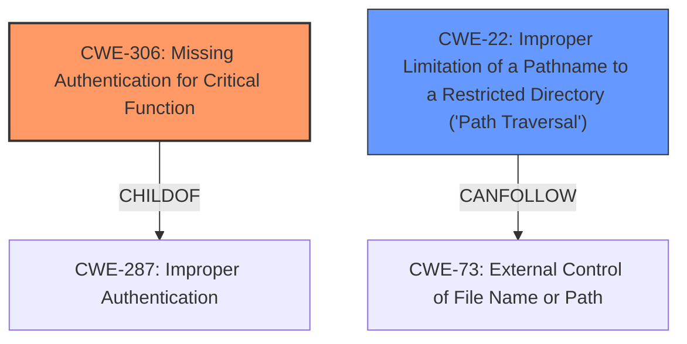

# Enhanced Analysis for CVE-2021-40376

# Summary
| CWE ID    | CWE Name                                                               | Confidence | CWE Abstraction Level | CWE Vulnerability Mapping Label | CWE-Vulnerability Mapping Notes |
| :-------- | :--------------------------------------------------------------------- | :--------- | :---------------------- | :------------------------------ | :------------------------------ |
| CWE-306   | Missing Authentication for Critical Function                          | 0.9        | Base                    | Allowed                         |                                 |
| CWE-22    | Improper Limitation of a Pathname to a Restricted Directory ('Path Traversal') | 0.9        | Base                    | Allowed                         |                                 |

## Evidence and Confidence

*   **Confidence Score:** 0.9
*   **Evidence Strength:** HIGH

## Relationship Analysis
The primary CWE is CWE-306, which reflects the **lack of authentication** for a critical function. CWE-306 is a child of CWE-287 (Improper Authentication), but CWE-306 is more specific and therefore preferred. CWE-22, **Path Traversal**, is related to the **improper input validation** that allows writing outside the intended directory via ZIP Slip.



## Vulnerability Chain
1.  **Missing Authentication (CWE-306):** The Update Manager component lacks authentication for local connections.
2.  **Improper Input Validation:** The component does not adequately validate the extraction path of ZIP files.
3.  **Path Traversal (CWE-22):** The component is vulnerable to ZIP Slip, allowing an attacker to extract files outside the intended directory.
4.  **Arbitrary File Overwrite:** An attacker can overwrite any files accessible to the SYSTEM account.
5.  **Code Execution:** Overwriting executables can lead to code execution with SYSTEM privileges.

## Summary of Analysis
The analysis is based on the provided vulnerability description and the CVE reference links content summary. The primary weakness is the **lack of authentication (CWE-306)**, which allows unauthenticated calls to exposed interfaces. The secondary weakness is the **Path Traversal vulnerability (CWE-22)**, which enables writing files to arbitrary locations due to **improper input validation**.

The evidence supporting these mappings is as follows:

*   **CWE-306:** "The vulnerability stems from a **lack of authentication**...in the 'Update Manager' software component when handling local connections via .NET named pipes."
*   **CWE-22:** "The `saveUpdateFiles` function...allows an attacker to control the extraction path of ZIP files...this can be circumvented using the ZIP Slip vulnerability to write files to arbitrary locations."

The selected CWEs are at the optimal level of specificity, with CWE-306 being a Base CWE and CWE-22 being a Base CWE that directly relates to the ZIP Slip vulnerability.

Relevant CWE Information:

# Enhanced Context (25 CWEs)

## CWE-1289: Improper Validation of Unsafe Equivalence in Input
**Abstraction Level**: Base
**Similarity Score**: 0.78
Not Selected: While input validation is a factor, this CWE is too generic compared to CWE-22 which describes the path traversal issue specifically.

## CWE-807: Reliance on Untrusted Inputs in a Security Decision
**Abstraction Level**: Base
**Similarity Score**: 0.75
Not Selected: This CWE is not specific enough. The vulnerability is more about the **lack of authentication** and **improper path validation**.

## CWE-297: Improper Validation of Certificate with Host Mismatch
**Abstraction Level**: Variant
**Similarity Score**: 0.73
Not Selected: This CWE is specific to certificate validation, which is not relevant to the described vulnerability.

## CWE-115: Misinterpretation of Input
**Abstraction Level**: Base
**Similarity Score**: 0.73
Not Selected: The issue isn't about misinterpreting input, but rather about a **lack of authentication** and a **path traversal vulnerability**.

## CWE-1288: Improper Validation of Consistency within Input
**Abstraction Level**: Base
**Similarity Score**: 0.73
Not Selected: This CWE is too general. The identified vulnerability is more specifically related to path traversal.

## CWE-179: Incorrect Behavior Order: Early Validation
**Abstraction Level**: Base
**Similarity Score**: 0.73
Not Selected: Order of validation is not relevant.

## CWE-184: Incomplete List of Disallowed Inputs
**Abstraction Level**: Base
**Similarity Score**: 0.73
Not Selected: This CWE is about an incomplete list of disallowed inputs, which isn't the primary issue. The main issue is path traversal.

## CWE-74: Improper Neutralization of Special Elements in Output Used by a Downstream Component ('Injection')
**Abstraction Level**: Class
**Similarity Score**: 0.72
Not Selected: Injection is not the primary issue; path traversal is more specific.

## CWE-345: Insufficient Verification of Data Authenticity
**Abstraction Level**: Class
**Similarity Score**: 0.72
Not Selected: While data authenticity is related, the core issue is **missing authentication** and **path traversal**.

## CWE-941: Incorrectly Specified Destination in a Communication Channel
**Abstraction Level**: Base
**Similarity Score**: 0.72
Not Selected: Incorrect communication channel destination is not relevant to the vulnerability description.

## CWE-923: Improper Restriction of Communication Channel to Intended Endpoints
**Abstraction Level**: Class
**Similarity Score**: 6843.36
Not Selected: The vulnerability does involve a communication channel, but the **lack of authentication** is a more direct cause than improper restriction of the channel.

## CWE-502: Deserialization of Untrusted Data
**Abstraction Level**: Base
**Similarity Score**: 6721.69
Not Selected: Deserialization is not mentioned in the vulnerability description.

## CWE-287: Improper Authentication
**Abstraction Level**: Class
**Similarity Score**: 6719.06
Not Selected: While related to CWE-306, it is less specific. CWE-306 (Missing Authentication) is a better fit.

## CWE-863: Incorrect Authorization
**Abstraction Level**: Class
**Similarity Score**: 6699.47
Not Selected: Authorization isn't the primary issue; it's the **lack of authentication**.

## CWE-322: Key Exchange without Entity Authentication
**Abstraction Level**: base
**Similarity Score**: 5.03
Not Selected: Key exchange is not relevant.

## CWE-190: Integer Overflow or Wraparound
**Abstraction Level**: base
**Similarity Score**: 4.33
Not Selected: Integer overflow is not relevant.

## CWE-770: Allocation of Resources Without Limits or Throttling
**Abstraction Level**: base
**Similarity Score**: 4.33
Not Selected: Resource allocation is not the primary concern.

## CWE-410: Insufficient Resource Pool
**Abstraction Level**: base
**Similarity Score**: 4.33
Not Selected: Resource pool is not relevant.

## CWE-1284: Improper Validation of Specified Quantity in Input
**Abstraction Level**: base
**Similarity Score**: 4.33
Not Selected: Quantity validation is not relevant.

## CWE-73: External Control of File Name or Path
**Abstraction Level**: base
**Similarity Score**: 4.33
Not Selected: Related to CWE-22, but CWE-22 is a better fit as it specifically addresses path traversal.

## CWE-789: Memory Allocation with Excessive Size Value
**Abstraction Level**: variant
**Similarity Score**: 3.88
Not Selected: Memory allocation size is not relevant.

## CWE-915: Improperly Controlled Modification of Dynamically-Determined Object Attributes
**Abstraction Level**: base
**Similarity Score**: 3.64
Not Selected: Dynamic object attribute modification is not relevant.


## CWE Relationship Analysis

Current CWEs represent these abstraction levels: .


### Vulnerability Chain Analysis

**Chain starting from CWE-502:**
- 502 (Deserialization of Untrusted Data) - ROOT


**Chain starting from CWE-115:**
- 115 (Misinterpretation of Input) - ROOT


### CWE Relationship Diagram

```mermaid
graph TD
    classDef primary fill:#f96,stroke:#333,stroke-width:2px
    classDef secondary fill:#69f,stroke:#333
    classDef tertiary fill:#9e9,stroke:#333
```