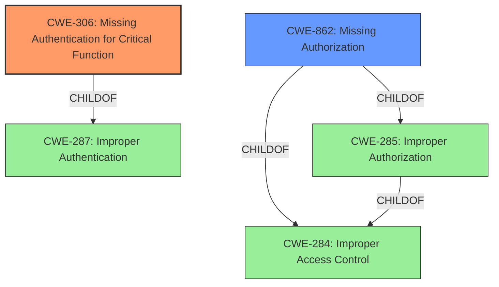

# Analysis Report for CVE-2021-40379

# Vulnerability Analysis Report: CVE-2021-40379

## Description


## Analysis (with Relationship Data)

# Summary
| CWE ID | CWE Name | Confidence | CWE Abstraction Level | CWE Vulnerability Mapping Label | CWE-Vulnerability Mapping Notes |
|---|---|---|---|---|---|
| CWE-306 | Missing Authentication for Critical Function | 1.0 | Base | Allowed | Primary CWE |
| CWE-862 | Missing Authorization | 0.7 | Class | Allowed-with-Review | Secondary Candidate |

## Evidence and Confidence

*   **Confidence Score:** 0.9
*   **Evidence Strength:** HIGH

## Relationship Analysis
The primary CWE is CWE-306, which is a base-level CWE and a child of CWE-287 (Improper Authentication). CWE-862 is a class-level CWE and a child of both CWE-285 (Improper Authorization) and CWE-284 (Improper Access Control). The hierarchical relationship shows that CWE-306 is more specific than CWE-862, which aligns with the goal of selecting the most specific CWE.



## Vulnerability Chain
The vulnerability involves a missing security mechanism, specifically authentication, which directly leads to unauthorized access to a resource. The chain consists of the missing authentication as the root cause, resulting in the ability to access the `rstp//.../medias2` endpoint without proper authorization.

## Summary of Analysis
The initial assessment identified CWE-306 as the primary weakness due to the **missing authentication** requirement for accessing a specific resource. This aligns with the vulnerability description stating that `rstp//.../medias2 does not require authorization.` The retriever results also listed CWE-306 as a highly relevant CWE.

The analysis considered CWE-862 (Missing Authorization) as a secondary candidate. While authorization is indeed missing, the more fundamental issue is the lack of authentication, which should precede authorization. The vulnerability description explicitly states the absence of authorization for the specified resource, making CWE-306 more directly applicable.

The selection of CWE-306 is based on the evidence that the resource `rstp//.../medias2` **does not require authorization**, indicating a **missing authentication** mechanism. This aligns with the CWE-306 description: "The product does not perform any authentication for functionality that requires a provable user identity or consumes a significant amount of resources."

CWE-306 is at the optimal level of specificity (Base) as it directly addresses the root cause: **missing authentication**. While CWE-862 is related, it represents a higher-level concern (Class) about missing authorization, which is a consequence of the missing authentication. Therefore, CWE-306 is the more precise and informative classification.

Relevant CWE Information:

## CWE-306: Missing Authentication for Critical Function
**Technical Explanation:** The Compro IP70, IP570, IP60, and TN540 devices do not require authentication to access the `rstp//.../medias2` endpoint. This allows anyone to access this endpoint without proving their identity.
**Security Implications:** Unauthorized access to the `rstp//.../medias2` endpoint could allow attackers to view sensitive information or control device functions.
**Relationship:** CWE-306 is a child of CWE-287 (Improper Authentication).
**Mapping Guidance Influence:** The MITRE mapping guidance recommends using Base-level CWEs, which aligns with selecting CWE-306.

## CWE-862: Missing Authorization
**Technical Explanation:** Although authorization is missing, it is secondary to the fact that authentication is missing. If authentication were present, then authorization would likely be required.
**Security Implications:** An attacker can directly request the resource without any checks.
**Relationship:** CWE-862 is a child of CWE-285 (Improper Authorization) and CWE-284 (Improper Access Control).
**Mapping Guidance Influence:** The MITRE mapping guidance recommends reviewing children of this entry to see if there is a better fit, which led to the selection of CWE-306.


## CWE Relationship Analysis

Current CWEs represent these abstraction levels: .


### Vulnerability Chain Analysis

**Chain starting from CWE-306:**
- 306 (Missing Authentication for Critical Function) - ROOT


**Chain starting from CWE-862:**
- 862 (Missing Authorization) - ROOT


### CWE Relationship Diagram

```mermaid
graph TD
    classDef primary fill:#f96,stroke:#333,stroke-width:2px
    classDef secondary fill:#69f,stroke:#333
    classDef tertiary fill:#9e9,stroke:#333
```


*Report generated on 2025-04-02 08:08:14*
