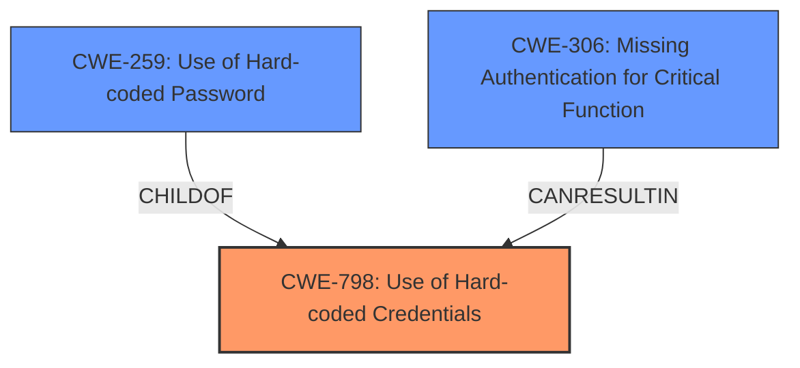

# Raw Analyzer Response for CVE-2021-40390

# Summary
| CWE ID  | CWE Name                                                                                             | Confidence | CWE Abstraction Level | CWE Vulnerability Mapping Label | CWE-Vulnerability Mapping Notes |
| :-------- | :----------------------------------------------------------------------------------------------------- | :----------- | :---------------------- | :------------------------------ | :------------------------------ |
| CWE-798   | Use of Hard-coded Credentials                                                                        | 1          | Base                    | Primary                         | Allowed                       |
| CWE-259   | Use of Hard-coded Password                                                                           | 0.9          | Variant                 | Secondary                       | Allowed                       |
| CWE-306   | Missing Authentication for Critical Function                                                           | 0.7          | Base                    | Secondary                       | Allowed                       |

## Evidence and Confidence

*   **Confidence Score:** 0.9
*   **Evidence Strength:** HIGH

## Relationship Analysis
The primary CWE is CWE-798, representing the root cause, the use of hardcoded credentials. CWE-259 is a more specific variant of CWE-798, focusing on hardcoded passwords. CWE-306 is included because the hardcoded credentials lead to a missing authentication for a critical function. The relationship between CWE-798 and CWE-259 is a parent-child relationship (CWE-259 is a ChildOf CWE-798). The relationship between CWE-798 and CWE-306 shows that **use of hardcoded credentials** can lead to **missing authentication**.

## Vulnerability Chain
The chain of events is as follows:
1.  **Root Cause:** **CWE-798 Use of Hard-coded Credentials** exists within the application.
2.  **CWE-259:** Specifically, the hardcoded credential is a password.
3.  **CWE-306:** Because of the hardcoded credentials, authentication is bypassed for critical functions.
4.  **Impact:** Unauthorized access to the MXView application's functionality.

## Summary of Analysis
The initial assessment identified **CWE-798 Use of Hard-coded Credentials** as the primary weakness due to the root cause described in the CVE details. The CVE states "The vulnerability stems from the use of hardcoded credentials in an undocumented service...". This statement clearly points to CWE-798 as the most relevant CWE.

The retriever results also list CWE-798 as a strong candidate.

The relationship graph shows how the different CWEs relate to each other, especially how the more specific **CWE-259 Use of Hard-coded Password** is related to the broader **CWE-798 Use of Hard-coded Credentials**.

**CWE-259 Use of Hard-coded Password** is chosen as a secondary CWE because the vulnerability specifically involves a hardcoded password, making this variant a relevant detail.

**CWE-306 Missing Authentication for Critical Function** is included because the **hardcoded credentials** effectively bypass normal authentication mechanisms, leading to a **lack of authentication** for critical functions. This is further supported by the vulnerability description stating "An **authentication bypass** vulnerability exists...".

The selected CWEs are at the optimal level of specificity because they accurately reflect the root cause and the immediate consequences of the vulnerability. CWE-798 captures the general issue, CWE-259 specifies the type of credential, and CWE-306 highlights the resulting lack of authentication.

CWEs considered but not selected:

*   **CWE-89 Improper Neutralization of Special Elements used in an SQL Command ('SQL Injection')**: While the retriever results list this CWE, there is no evidence in the vulnerability description or CVE details to suggest that SQL injection is involved.
*   **CWE-1287 Improper Validation of Specified Type of Input**: Similar to SQL Injection, there is no evidence to suggest this is the vulnerability.
*   **CWE-290 Authentication Bypass by Spoofing**: The vulnerability relies on hardcoded credentials, not spoofing.
*   **CWE-291 Reliance on IP Address for Authentication**: This is not relevant because the authentication bypass relies on **hardcoded credentials**, not IP address spoofing.