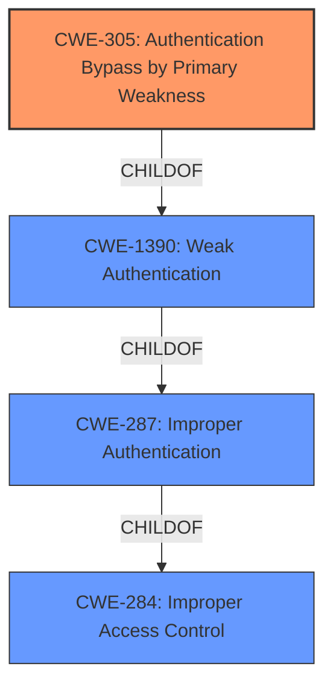

# Analysis for CVE-2021-40404

# Summary
| CWE ID | CWE Name | Confidence | CWE Abstraction Level | CWE Vulnerability Mapping Label | CWE-Vulnerability Mapping Notes |
|---|---|---|---|---|---|
| CWE-305 | Authentication Bypass by Primary Weakness | 0.9 | Base | Allowed | Primary CWE |
| CWE-284 | Improper Access Control | 0.7 | Class | Discouraged | Secondary CWE |

## Evidence and Confidence

*   **Confidence Score:** 0.9
*   **Evidence Strength:** HIGH

## Relationship Analysis
The primary relationship that influenced the decision was the hierarchical structure, particularly how CWE-305 (Authentication Bypass by Primary Weakness) is a child of CWE-1390 (Weak Authentication), which in turn is a child of CWE-287 (Improper Authentication) and CWE-284 (Improper Access Control). The retriever results also showed these relationships. The decision favored CWE-305 because it directly captures the essence of the vulnerability, which is an **authentication bypass** due to a primary weakness (flawed logic in handling API requests). CWE-284 represents the broader category of access control issues, but CWE-305 is more specific.

## Vulnerability Chain
The vulnerability chain starts with **flawed logic** in the `cgiserver.cgi` binary, leading to the **authentication bypass**, which ultimately results in unauthorized API execution.

## Summary of Analysis
The initial analysis focused on identifying the root cause of the vulnerability. The provided evidence clearly indicates that the **authentication bypass** is due to **flawed logic** in handling API requests, where the system incorrectly separates the URL's `cmd` parameter check from the processing of commands in the request body.

The primary CWE selected is CWE-305 (Authentication Bypass by Primary Weakness), which accurately describes the vulnerability's core issue. The vulnerability allows an attacker to bypass the authentication check and execute arbitrary API functions without prior login.

The evidence from the "CVE Reference Links Content Summary" section supports this decision:
"The vulnerability stems from the `cgiserver.cgi` binary's **flawed logic** in handling API requests... This allows an attacker to bypass the authentication check and execute arbitrary API functions without prior login."

The decision to select CWE-305 is further supported by the retriever results, where CWE-305 is listed as a relevant CWE.

CWE-287 (Improper Authentication) was considered but not chosen as the primary CWE because it is a more general class of weakness. CWE-305 provides a more precise description of the specific **authentication bypass** mechanism in this vulnerability. The MITRE mapping guidance discourages using CWE-287 when more specific CWEs are available.

CWE-284 (Improper Access Control) was considered as a secondary weakness because the **authentication bypass** leads to unauthorized access to API functions. However, the primary issue is the **bypass** itself, making CWE-305 the more appropriate primary classification.

The selection of CWE-305 is at the optimal level of specificity, as it directly addresses the root cause of the vulnerability – the **authentication bypass** due to **flawed logic**. Other CWEs, such as CWE-287, are more general and do not capture the specific nature of this vulnerability.

Relevant CWE Information:

# Enhanced Context (25 CWEs)
The following CWEs were identified as potentially relevant to this vulnerability:

## CWE-305: Authentication Bypass by Primary Weakness
**Abstraction Level**: Base
**Similarity Score**: 0.80
**Source**: dense

**Description**:
The **authentication algorithm is sound, but the implemented mechanism can be bypassed as the result of a separate weakness that is primary to the authentication error.**

**Mapping Guidance**:
- Usage: Allowed
- Rationale: This CWE entry is at the Base level of abstraction, which is a preferred level of abstraction for mapping to the root causes of vulnerabilities.