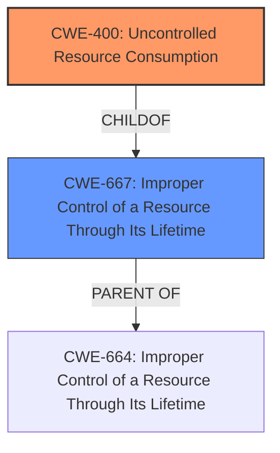

# Analysis Report for CVE-2021-40406

# Vulnerability Analysis Report: CVE-2021-40406

## Description


## Analysis (with Relationship Data)

# Summary
| CWE ID | CWE Name | Confidence | CWE Abstraction Level | CWE Vulnerability Mapping Label | CWE-Vulnerability Mapping Notes |
|---|---|---|---|---|---|
| CWE-400 | Uncontrolled Resource Consumption | 1.0 | Base | Primary | Allowed |
| CWE-667 | Improper Control of a Resource Through its Lifetime | 0.7 | Class | Secondary | Allowed-with-Review |

## Evidence and Confidence

*   **Confidence Score:** 0.9
*   **Evidence Strength:** HIGH

## Relationship Analysis
The primary relationship influencing the analysis is the hierarchical structure with CWE-400 (Uncontrolled Resource Consumption) being at the base level. The secondary relationship is CWE-667 (Improper Control of a Resource Through Its Lifetime), which is a Class. Selecting CWE-400 provides a more specific and accurate representation of the vulnerability.



## Vulnerability Chain
The vulnerability chain starts with the **logic flaw** in the API, specifically how it handles `Login` commands with empty JSON arrays. This leads to **improper session management**, where uninitialized sessions are created but never cleaned up. The final result is **uncontrolled resource consumption**, which leads to a denial of service.

## Summary of Analysis
The initial analysis focused on the detailed vulnerability description and the CVE Reference Links Content Summary. The key evidence lies in the description of the **unhandled logic case** in the `Login` API execution flow that leads to an accumulation of unremovable sessions in memory, ultimately causing a denial of service.

The primary CWE selected is CWE-400 (Uncontrolled Resource Consumption). This is supported by the "CVE Reference Links Content Summary" section, which states: "**Uncontrolled Resource Consumption (CWE-400):** The lack of proper handling for sessions created with empty command lists leads to an accumulation of unremovable sessions in memory."

CWE-667 (Improper Control of a Resource Through its Lifetime) was considered as a secondary candidate because the issue involves the lifecycle management of sessions. However, CWE-400 is more specific to the actual impact and observed behavior.

The selection of CWE-400 is at the optimal level of specificity because it directly addresses the root cause of the denial-of-service vulnerability, which stems from the uncontrolled consumption of memory due to the accumulation of invalid sessions.

Relevant CWE Information:

# Enhanced Context (25 CWEs)

## Vulnerability Description
A denial of service vulnerability exists in the cgiserver.cgi session creation functionality of reolink RLC-410W v3.0.0.136_20121102. A specially-crafted HTTP request can lead to prevent users from logging in. An attacker can send an HTTP request to trigger this vulnerability.

### Vulnerability Description Key Phrases
- **impact:** denial of service
- **vector:** specially-crafted HTTP request
- **product:** Reolink RLC-410W
- **version:** v3.0.0.136_20121102
- **component:** cgiserver.cgi session creation functionality

## CVE Reference Links Content Summary
Based on the provided content, here's a breakdown of the vulnerability:

**CVE ID:** CVE-2021-40406

**Root Cause:**
The vulnerability stems from an unhandled logic case in the `Login` API execution flow within the `cgiserver.cgi` of the Reolink RLC-410W camera. Specifically, if a `Login` command is sent with an empty JSON array as the request body, a session is created, but it's not properly initialized with a `VALID` or `INVALID` status. The session management function only removes sessions with these two states, causing the uninitialized session to remain in memory.

**Weaknesses/Vulnerabilities:**
*   **Uncontrolled Resource Consumption (CWE-400):** The lack of proper handling for sessions created with empty command lists leads to an accumulation of unremovable sessions in memory.
*   **Improper Session Management:**  Sessions are created but not properly initialized, leading to a state where they are never cleaned up by the session management routine.
*   **Logic flaw in API:** The API logic doesn't account for the case where a `Login` command might have an empty command list body, leading to an invalid session creation.

**Impact of Exploitation:**
*   **Denial of Service (DoS):** An attacker can send specially crafted HTTP requests with empty command list bodies to create numerous invalid sessions. This fills the session list, preventing legitimate users from logging into the camera, effectively denying access to the device.

**Attack Vectors:**
*   **HTTP Request:** The attack is carried out by sending a specially crafted HTTP request to the `cgiserver.cgi` endpoint.
*   **JSON Body Manipulation:** The vulnerability exploits the parsing of JSON data in the request body where it provides an empty array.
*   **Login API:**  The specific API affected is the `Login` API.

**Required Attacker Capabilities/Position:**
*   **Network Access:** The attacker must have network access to the Reolink RLC-410W camera.
*   **HTTP Request Sending:** The attacker needs the ability to send HTTP requests to the target device.
*   **No Authentication Required:** The vulnerability can be exploited without authentication.

**Additional Details:**
*   The vulnerability exists in `cgiserver.cgi` and specifically involves how sessions are created and managed.
*   The `parse_incoming_and_check_command` function parses the request, and `associate_session_to_request` creates the session.
*   The `manage_existing_sessions` function is responsible for cleaning up sessions but fails to handle sessions with an unknown status.
*   The vulnerability was discovered by Francesco Benvenuto of Cisco Talos.

This vulnerability report provides significantly more detail than the standard CVE description, outlining the vulnerable code logic, the **root cause** of the issue, and a comprehensive understanding of the exploitation process.

## Retriever Results

### Top Combined Results

| Rank | CWE ID | Name | Abstraction | Usage  | Retrievers | Individual Scores |
|------|--------|------|-------------|-------|------------|-------------------|
| 1 | 1287 | Improper Validation of Specified Type of Input | Base | Allowed | sparse | 0.175 |
| 2 | 772 | Missing Release of Resource after Effective Lifetime | Base | Allowed | sparse | 0.135 |
| 3 | 134 | Use of Externally-Controlled Format String | Base | Allowed | sparse | 0.098 |
| 4 | 306 | Missing Authentication for Critical Function | Base | Allowed | sparse | 0.096 |
| 5 | 80 | Improper Neutralization of Script-Related HTML Tags in a Web Page (Basic XSS) | Variant | Allowed | sparse | 0.090 |
| 6 | 291 | Reliance on IP Address for Authentication | Variant | Allowed | dense | 0.485 |
| 7 | 79 | Improper Neutralization of Input During Web Page Generation ('Cross-site Scripting') | Base | Allowed | graph | 0.002 |
| 8 | 89 | Improper Neutralization of Special Elements used in an SQL Command ('SQL Injection') | Base | Allowed | sparse | 0.090 |
| 9 | 787 | Out-of-bounds Write | Base | Allowed | sparse | 0.089 |
| 10 | 120 | Buffer Copy without Checking Size of Input ('Classic Buffer Overflow') | Base | Allowed-with-Review | sparse | 0.088 |

## CWE-400: Uncontrolled Resource Consumption
**Abstraction:** Base
**Description:** The software does not properly control the allocation, management, or consumption of resources, or it does not sufficiently limit the amount of resources that are available to an actor. This can lead to a denial of service, or to the consumption of unexpected resources.

The vulnerability matches this CWE because the **logic flaw** in the API leads to the **uncontrolled accumulation** of unremovable sessions, resulting in a denial of service.

## CWE-667: Improper Control of a Resource Through its Lifetime
**Abstraction:** Class
**Description:** The software manages a resource throughout its lifetime, but it does not do so correctly.

This CWE is a higher-level abstraction that encompasses the session management issue. While relevant, it is not as specific as CWE-40


## CWE Relationship Analysis

Current CWEs represent these abstraction levels: .


### Vulnerability Chain Analysis

**Chain starting from CWE-667:**
- 667 (Improper Locking) - ROOT


**Chain starting from CWE-400:**
- 400 (Uncontrolled Resource Consumption) - ROOT


### CWE Relationship Diagram

```mermaid
graph TD
    classDef primary fill:#f96,stroke:#333,stroke-width:2px
    classDef secondary fill:#69f,stroke:#333
    classDef tertiary fill:#9e9,stroke:#333
```


*Report generated on 2025-04-01 18:30:10*
