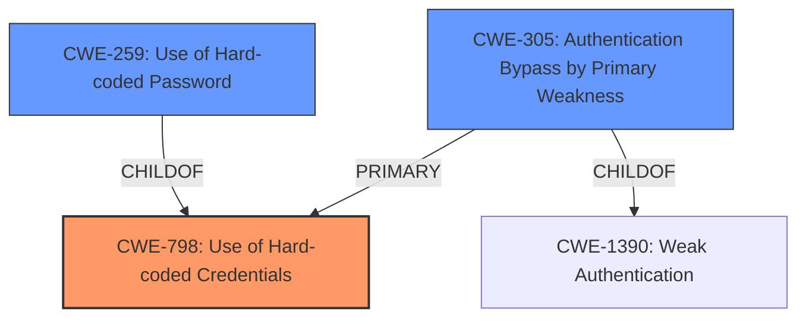

# Analysis for CVE-2021-40422

# Summary
| CWE ID | CWE Name | Confidence | CWE Abstraction Level | CWE Vulnerability Mapping Label | CWE-Vulnerability Mapping Notes |
|---|---|---|---|---|---|
| CWE-798 | Use of Hard-coded Credentials | 1.0 | Base | Primary | Allowed |
| CWE-259 | Use of Hard-coded Password | 0.9 | Variant | Secondary | Allowed |
| CWE-305 | Authentication Bypass by Primary Weakness | 0.8 | Base | Secondary | Allowed |

## Evidence and Confidence

*   **Confidence Score:** 0.9
*   **Evidence Strength:** HIGH

## Relationship Analysis
The primary relationship is that CWE-259 (Use of Hard-coded Password) is a variant of CWE-798 (Use of Hard-coded Credentials). The vulnerability description clearly states that the device password is derived from the publicly visible "Gateway ID" which is then used in a substitution and encoding process. This essentially means the password is not truly hardcoded, but rather generated from a predictable identifier. However, since the "Gateway ID" is publicly visible and the generation mechanism is known, it is effectively the same as using a hard-coded password. CWE-305 (Authentication Bypass by Primary Weakness) is included to highlight that the **authentication bypass** is a direct result of the **hard-coded credentials**.

## Vulnerability Chain
The vulnerability chain starts with the **use of a predictable identifier (Gateway ID)**, which leads to **hard-coded credentials (CWE-798)**, which then results in **authentication bypass (CWE-305)**, ultimately leading to **remote code execution**.

## Summary of Analysis
The initial assessment identified several potential CWEs, including CWE-340, CWE-120, CWE-259, CWE-89, and CWE-306. After reviewing the vulnerability description and the CVE Reference Links Content Summary, it became clear that the root cause is the **use of hard-coded credentials (CWE-798)**. The "Gateway ID" is used to generate the password, making it predictable and effectively hard-coded. The **authentication bypass (CWE-305)** is a direct consequence of this weakness. CWE-259 is a variant of CWE-798, indicating that a hard-coded password is being used.

The evidence supporting this decision comes directly from the CVE Reference Links Content Summary:

*   "The vulnerability stems from a flawed password generation mechanism. The device password for SSH access is derived from the publicly visible "Gateway ID" printed on the device."
*   "Hard-coded credentials: The password generation mechanism is predictable and based on a device-specific, but publicly visible, identifier."
*   "Authentication bypass: An attacker can calculate the SSH password using the "Gateway ID" and bypass normal authentication."

The hierarchical relationships between CWEs influenced the selection, with CWE-259 being a variant of CWE-798. The primary weakness is CWE-798, and CWE-259 provides more specific details.

The selected CWEs are at the optimal level of specificity because they accurately reflect the root cause and the resulting **authentication bypass**. CWE-798 captures the essence of using hard-coded credentials, while CWE-259 specifies that it's a password. CWE-305 highlights the resulting **authentication bypass**.

Relevant CWE Information:

# Enhanced Context (25 CWEs)
The following CWEs were identified as potentially relevant to this vulnerability:

## CWE-305: Authentication Bypass by Primary Weakness
**Abstraction Level**: Base
**Similarity Score**: 0.78
**Source**: dense

**Description**:
The authentication algorithm is sound, but the implemented mechanism can be bypassed as the result of a separate weakness that is primary to the authentication error.

**Mapping Guidance**:
- Usage: Allowed
- Rationale: This CWE entry is at the Base level of abstraction, which is a preferred level of abstraction for mapping to the root causes of vulnerabilities.

## CWE-259: Use of Hard-coded Password
**Abstraction Level**: Variant
**Similarity Score**: 5615.52
**Source**: sparse

**Description**:
The product contains a hard-coded password, which it uses for its own inbound authentication or for outbound communication to external components.

**Mapping Guidance**:
- Usage: Allowed
- Rationale: This CWE entry is at the Variant level of abstraction, which is a preferred level of abstraction for mapping to the root causes of vulnerabilities.

## CWE-798: Use of Hard-coded Credentials
**Abstraction Level**: Base
**Similarity Score**: 5581.91
**Source**: sparse

**Description**:
The product contains hard-coded credentials, such as a password or cryptographic key.

**Mapping Guidance**:
- Usage: Allowed
- Rationale: This CWE entry is at the Base level of abstraction, which is a preferred level of abstraction for mapping to the root causes of vulnerabilities.