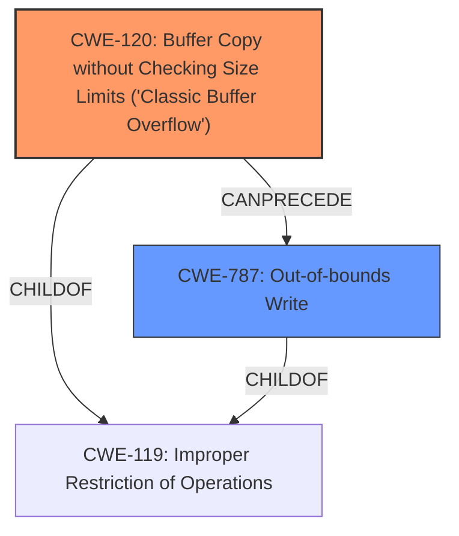

# Analysis Report for CVE-2021-40444

# Vulnerability Analysis Report: CVE-2021-40444

## Description


## Analysis (with Relationship Data)

# Summary
| CWE ID  | CWE Name                                                                  | Confidence | CWE Abstraction Level | CWE Vulnerability Mapping Label | CWE-Vulnerability Mapping Notes |
| :-------- | :------------------------------------------------------------------------ | :--------- | :---------------------- | :------------------------------ | :------------------------------ |
| CWE-120   | Buffer Copy without Checking Size Limits ('Classic Buffer Overflow')       | 0.8        | Base                    | Primary                         | Allowed                       |
| CWE-787   | Out-of-bounds Write                                                       | 0.7        | Base                    | Secondary                       | Allowed                       |

## Evidence and Confidence

*   **Confidence Score:** 0.75
*   **Evidence Strength:** MEDIUM

## Relationship Analysis
The primary CWE is CWE-120, which is a base level CWE. CWE-120 is a child of CWE-119 (Improper Restriction of Operations Within the Bounds of a Memory Buffer). CWE-787 (Out-of-bounds Write) is also a child of CWE-119 and can follow CWE-120. These relationships help to understand the connection between writing beyond buffer boundaries and the more general issue of improper memory buffer restrictions.



## Vulnerability Chain
The vulnerability chain starts with the use of a specially-crafted Microsoft Office document containing a malicious ActiveX control. The **lack of proper size checking** during the buffer copy operation (CWE-120) leads to an out-of-bounds write (CWE-787), ultimately resulting in remote code execution.

## Summary of Analysis
The vulnerability description highlights a **remote code execution** issue exploitable through specially-crafted Microsoft Office documents that use a malicious ActiveX control. The core of the vulnerability lies in how MSHTML handles these documents. I've concluded that the most relevant CWE is CWE-120 because the vulnerability involves a **buffer copy without checking size limits**, which is a common cause of buffer overflows leading to code execution.

The evidence supporting this decision comes from the vulnerability description itself, which mentions specially-crafted documents, ActiveX controls, and the potential for remote code execution. While the description doesn't explicitly mention a buffer overflow, the use of "specially-crafted" documents and ActiveX controls suggests a technique to inject more data into a buffer than it can hold, leading to a buffer overflow.

The Retriever Results list several CWEs, including CWE-23 (Relative Path Traversal), CWE-427 (Uncontrolled Search Path Element), CWE-502 (Deserialization of Untrusted Data), and CWE-918 (Server-Side Request Forgery), but these don't directly address the **root cause** of the vulnerability, which is the **improper handling of buffer sizes** during data processing.

CWE-787 (Out-of-bounds Write) is included as a secondary CWE because it often follows from a buffer overflow (CWE-120). When a buffer is overflowed (CWE-120), it results in data being written beyond the intended buffer boundaries (CWE-787).

The decision to use CWE-120 is based on the understanding that buffer overflows are a classic and well-known method for achieving remote code execution, especially when exploiting vulnerabilities in software that handles external data, such as document processing applications.

The selection of CWE-120 is at the base level of specificity. The vulnerability description does not give enough information to select a more specific variant.

Relevant CWE Information:

# Enhanced Context (25 CWEs)

## CWE-538: Insertion of Sensitive Information into Externally-Accessible File or Directory
**Abstraction Level**: Base
**Similarity Score**: 0.79
**Source**: dense

**Description**:
The product places sensitive information into files or directories that are accessible to actors who are allowed to have access to the files, but not to the sensitive information.

**Mapping Guidance**:
- Usage: Allowed
- Rationale: This CWE entry is at the Base level of abstraction, which is a preferred level of abstraction for mapping to the root causes of vulnerabilities.

## CWE-226: Sensitive Information in Resource Not Removed Before Reuse
**Abstraction Level**: Base
**Similarity Score**: 0.78
**Source**: dense

**Description**:
The product releases a resource such as memory or a file so that it can be made available for reuse, but it does not clear or "zeroize" the information contained in the resource before the product performs a critical state transition or makes the resource available for reuse by other entities.

**Mapping Guidance**:
- Usage: Allowed
- Rationale: This CWE entry is at the Base level of abstraction, which is a preferred level of abstraction for mapping to the root causes of vulnerabilities.

## CWE-497: Exposure of Sensitive System Information to an Unauthorized Control Sphere
**Abstraction Level**: Base
**Similarity Score**: 0.77
**Source**: dense

**Description**:
The product does not properly prevent sensitive system-level information from being accessed by unauthorized actors who do not have the same level of access to the underlying system as the product does.

**Mapping Guidance**:
- Usage: Allowed
- Rationale: This CWE entry is at the Base level of abstraction, which is a preferred level of abstraction for mapping to the root causes of vulnerabilities.

## CWE-668: Exposure of Resource to Wrong Sphere
**Abstraction Level**: Class
**Similarity Score**: 0.77
**Source**: dense

**Description**:
The product exposes a resource to the wrong control sphere, providing unintended actors with inappropriate access to the resource.

**Mapping Guidance**:
- Usage: Discouraged
- Rationale: CWE-668 is high-level and is often misused as a catch-all when lower-level CWE IDs might be applicable. It is sometimes used for low-information vulnerability reports [REF-1287]. It is a level-1 Class (i.e., a child of a Pillar). It is not useful for trend analysis.

## CWE-212: Improper Removal of Sensitive Information Before Storage or Transfer
**Abstraction Level**: Base
**Similarity Score**: 0.77
**Source**: dense

**Description**:
The product stores, transfers, or shares a resource that contains sensitive information, but it does not properly remove that information before the product makes the resource available to unauthorized actors.

**Mapping Guidance**:
- Usage: Allowed
- Rationale: This CWE entry is at the Base level of abstraction, which is a preferred level of abstraction for mapping to the root causes of vulnerabilities.

## CWE-41: Improper Resolution of Path Equivalence
**Abstraction Level**: Base
**Similarity Score**: 0.76
**Source**: dense

**Description**:
The product is vulnerable to file system contents disclosure through path equivalence. Path equivalence involves the use of special characters in file and directory names. The associated manipulations are intended to generate multiple names for the same object.

**Mapping Guidance**:
- Usage: Allowed
- Rationale: This CWE entry is at the Base level of abstraction, which is a preferred level of abstraction for mapping to the root causes of vulnerabilities.

## CWE-552: Files or Directories Accessible to External Parties
**Abstraction Level**: Base
**Similarity Score**: 0.75
**Source**: dense

**Description**:
The product makes files or directories accessible to unauthorized actors, even though they should not be.

**Mapping Guidance**:
- Usage: Allowed
- Rationale: This CWE entry is at the Base level of abstraction, which is a preferred level of abstraction for mapping to the root causes of vulnerabilities.

## CWE-213: Exposure of Sensitive Information Due to Incompatible Policies
**Abstraction Level**: Base
**Similarity Score**: 0.75
**Source**: dense

**Description**:
The product's intended functionality exposes information to certain actors in accordance with the developer's security policy, but this information is regarded as sensitive according to the intended security policies of other stakeholders such as the product's administrator, users, or others whose information is being processed.

**Mapping Guidance**:
- Usage: Allowed
- Rationale: This CWE entry is at the Base level of abstraction, which is a preferred level of abstraction for mapping to the root causes of vulnerabilities.

## CWE-23: Relative Path Traversal
**Abstraction Level**: Base
**Similarity Score**: 0.75
**Source**: dense

**Description**:
The product uses external input to construct a pathname that should be within a restricted directory, but it does not properly neutralize sequences such as ".." that can resolve to a location that is outside of


## CWE Relationship Analysis

Current CWEs represent these abstraction levels: .


### Vulnerability Chain Analysis

**Chain starting from CWE-502:**
- 502 (Deserialization of Untrusted Data) - ROOT


**Chain starting from CWE-787:**
- 787 (Out-of-bounds Write) - ROOT


### CWE Relationship Diagram

```mermaid
graph TD
    classDef primary fill:#f96,stroke:#333,stroke-width:2px
    classDef secondary fill:#69f,stroke:#333
    classDef tertiary fill:#9e9,stroke:#333
```


*Report generated on 2025-04-01 16:27:45*
