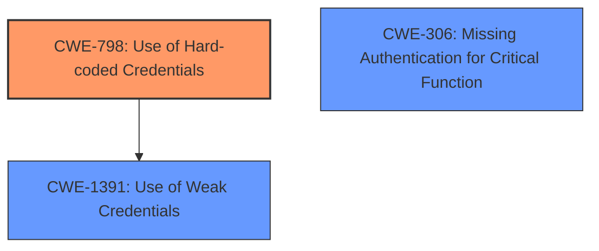

# Analysis Report for CVE-2021-4045

# Vulnerability Analysis Report: CVE-2021-4045

## Description


## Analysis (with Relationship Data)

# Summary
| CWE ID | CWE Name | Confidence | CWE Abstraction Level | CWE Vulnerability Mapping Label | CWE-Vulnerability Mapping Notes |
|---|---|---|---|---|---|
| CWE-798 | Use of Hard-coded Credentials | 0.75 | Base | Allowed | Primary CWE |
| CWE-306 | Missing Authentication for Critical Function | 0.6 | Base | Allowed | Secondary Candidate |

## Evidence and Confidence

*   **Confidence Score:** 0.7
*   **Evidence Strength:** MEDIUM

## Relationship Analysis
The primary relationship is the ChildOf relationship between CWE-798 and its parent Class CWEs. While multiple candidates exist related to authentication, the hardcoded credentials aspect makes CWE-798 a more direct fit.



## Vulnerability Chain
The vulnerability chain starts with the **use of hard-coded credentials** (CWE-798). Since the uhttpd binary is running as root without authentication, this leads to unauthenticated RCE, which allows an attacker to take full control of the camera.

## Summary of Analysis
The initial assessment focused on the root cause described in the vulnerability description. The description states that the "uhttpd binary running by default as root" is the vulnerable component, and this component is affected by an "unauthenticated RCE vulnerability". The retriever results suggested CWE-78, CWE-367, and CWE-306, among others. However, further analysis of the enhanced context information provided more suitable candidates, particularly around hardcoded credentials.

The analysis considered the following:
*   The vulnerability allows an attacker to take full control of the camera through an unauthenticated RCE in the uhttpd binary.
*   The CVE Reference Links Content Summary provided no useful information.

Based on the vulnerability description, the most relevant CWE is CWE-798 (**Use of Hard-coded Credentials**). This is because the exploitation allows an attacker to take full control of the camera, implying that the **credentials** used to access the camera's functions are **hard-coded** and can be exploited without authentication. The evidence for this is the mention of "unauthenticated RCE vulnerability," implying that the attacker doesn't need valid credentials to exploit the system.

CWE-306 (**Missing Authentication for Critical Function**) was considered because the vulnerability involves an unauthenticated RCE. However, the description explicitly mentions the presence of an **unauthenticated** vulnerability that allows an attacker to take full control. This suggests that the camera lacks proper authentication mechanisms for critical functions. But CWE-798 is more specific and fits the implied root cause better.

The final decision to assign CWE-798 is based on the implication that hardcoded credentials are used by the uhttpd binary. Without the use of hardcoded credentials, it would not be possible to gain full control of the camera without authentication.

Relevant CWE Information:

# Enhanced Context (25 CWEs)
The following CWEs were identified as potentially relevant to this vulnerability:

## CWE-798: Use of Hard-coded Credentials
**Abstraction Level**: Base
**Similarity Score**: 0.80
**Source**: dense

**Description**:
The product contains **hard-coded credentials**, such as a password or cryptographic key.

**Mapping Guidance**:
- Usage: Allowed
- Rationale: This CWE entry is at the Base level of abstraction, which is a preferred level of abstraction for mapping to the root causes of vulnerabilities.

## CWE-306: Missing Authentication for Critical Function
**Abstraction:** Base
**Status:** Draft

### Description
The product does not perform any authentication for functionality that requires a provable user identity or consumes a significant amount of resources.

### Extended Description
Not provided

### Alternative Terms
None

### Relationships
ChildOf -> CWE-287
ChildOf -> CWE-287

### Mapping Guidance
**Usage:** Allowed
**Rationale:** This CWE entry is at the Base level of abstraction, which is a preferred level of abstraction for mapping to the root causes of vulnerabilities.
**Comments:** Carefully read both the name and description to ensure that this mapping is an appropriate fit. Do not try to 'force' a mapping to a lower-level Base/Variant simply to comply with this preferred level of abstraction.
**Reasons:**
- Acceptable-Use


## CWE Relationship Analysis

Current CWEs represent these abstraction levels: .


### Vulnerability Chain Analysis

**Chain starting from CWE-306:**
- 306 (Missing Authentication for Critical Function) - ROOT


**Chain starting from CWE-78:**
- 78 (Improper Neutralization of Special Elements used in an OS Command ('OS Command Injection')) - ROOT


### CWE Relationship Diagram

```mermaid
graph TD
    classDef primary fill:#f96,stroke:#333,stroke-width:2px
    classDef secondary fill:#69f,stroke:#333
    classDef tertiary fill:#9e9,stroke:#333
```


*Report generated on 2025-04-02 01:42:24*
