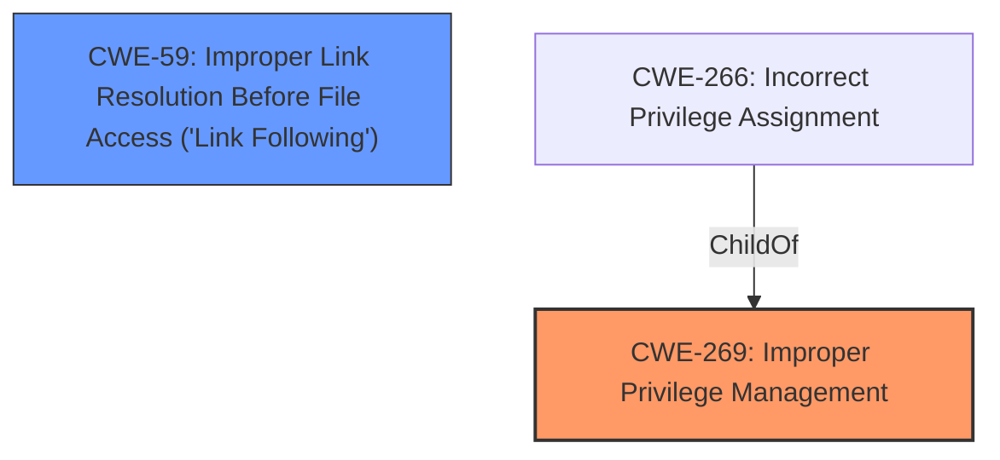

# Analysis Report for CVE-2021-40476

# Vulnerability Analysis Report: CVE-2021-40476

## Description


## Analysis (with Relationship Data)

# Summary
| CWE ID | CWE Name | Confidence | CWE Abstraction Level | CWE Vulnerability Mapping Label | CWE-Vulnerability Mapping Notes |
|---|---|---|---|---|---|
| CWE-269 | Improper Privilege Management | 0.7 | Class | Primary | Allowed-with-Review |
| CWE-59 | Improper Link Resolution Before File Access ('Link Following') | 0.4 | Base | Secondary | Allowed |

## Evidence and Confidence

*   **Confidence Score:** 0.7
*   **Evidence Strength:** LOW

## Relationship Analysis
The primary CWE selected is CWE-269, which is a parent of CWE-266, "Incorrect Privilege Assignment". The vulnerability involves an elevation of privilege in Windows AppContainer, which aligns with the broad scope of privilege management issues covered by CWE-269. CWE-59 is added as a secondary weakness, as it involves the ability to follow links to unintended resources.



## Vulnerability Chain
The chain of events for this vulnerability starts with an unspecified **weakness** within the Windows AppContainer that leads to an **improper** privilege management, culminating in an elevation of privilege.

## Summary of Analysis
The analysis is based on the limited evidence provided in the vulnerability description. The primary indicator is the "Elevation Of Privilege" **impact** within the Windows AppContainer.

The initial assessment considered CWE-NVD-noinfo as the primary match, given its high frequency in similar CVE descriptions. However, this CWE provides no specific information and is not helpful. The next most frequent CWE was CWE-269, "Improper Privilege Management", which is a more descriptive and useful classification. Given that the vulnerability leads to an elevation of privilege, **improper** privilege management is a reasonable root cause.

CWE-59, "Improper Link Resolution Before File Access ('Link Following')", was also considered based on the retriever results, as well as CWE-1386, "Insecure Operation on Windows Junction / Mount Point". These were considered because file access controls are often related to privilege management. However, there is no direct evidence of file access issues, so CWE-59 is only included as a secondary consideration, and CWE-1386 is not included at all.

The selected CWEs are at the optimal level of specificity based on the available evidence. CWE-269 is a Class-level CWE, but it accurately reflects the **improper** privilege management aspect of the vulnerability.

Relevant CWE Information:

# Enhanced Context (25 CWEs)

## CWE-824: Access of Uninitialized Pointer
**Abstraction Level**: Base
**Similarity Score**: 0.81
**Source**: dense

**Description**:
The product accesses or uses a pointer that has not been initialized.

**Mapping Guidance**:
- Usage: Allowed
- Rationale: This CWE entry is at the Base level of abstraction, which is a preferred level of abstraction for mapping to the root causes of vulnerabilities.

*Rationale for not selecting:* This CWE is not relevant because there is no mention of pointers in the vulnerability description.

## CWE-59: Improper Link Resolution Before File Access ('Link Following')
**Abstraction Level**: Base
**Similarity Score**: 0.81
**Source**: dense

**Description**:
The product attempts to access a file based on the filename, but it does not properly prevent that filename from identifying a link or shortcut that resolves to an unintended resource.

**Mapping Guidance**:
- Usage: Allowed
- Rationale: This CWE entry is at the Base level of abstraction, which is a preferred level of abstraction for mapping to the root causes of vulnerabilities.

*Rationale for selecting as secondary:* While the primary issue is privilege management, the use of link following could potentially be a contributing factor in some elevation of privilege scenarios, hence the secondary mapping.

## CWE-667: Improper Locking
**Abstraction Level**: Class
**Similarity Score**: 0.81
**Source**: dense

**Description**:
The product does not properly acquire or release a lock on a resource, leading to unexpected resource state changes and behaviors.

**Mapping Guidance**:
- Usage: Allowed-with-Review
- Rationale: This CWE entry is a Class and might have Base-level children that would be more appropriate

*Rationale for not selecting:* This CWE is not relevant because there is no mention of locking mechanisms in the vulnerability description.

## CWE-822: Untrusted Pointer Dereference
**Abstraction Level**: Base
**Similarity Score**: 0.80
**Source**: dense

**Description**:
The product obtains a value from an untrusted source, converts this value to a pointer, and dereferences the resulting pointer.

**Mapping Guidance**:
- Usage: Allowed
- Rationale: This CWE entry is at the Base level of abstraction, which is a preferred level of abstraction for mapping to the root causes of vulnerabilities.

*Rationale for not selecting:* This CWE is not relevant because there is no mention of pointers in the vulnerability description.

## CWE-41: Improper Resolution of Path Equivalence
**Abstraction Level**: Base
**Similarity Score**: 0.80
**Source**: dense

**Description**:
The product is vulnerable to file system contents disclosure through path equivalence. Path equivalence involves the use of special characters in file and directory names. The associated manipulations are intended to generate multiple names for the same object.

**Mapping Guidance**:
- Usage: Allowed
- Rationale: This CWE entry is at the Base level of abstraction, which is a preferred level of abstraction for mapping to the root causes of vulnerabilities.

*Rationale for not selecting:* This CWE is not relevant because the vulnerability description focuses on privilege escalation rather than path equivalence issues.

## CWE-665: Improper Initialization
**Abstraction Level**: Class
**Similarity Score**: 0.80
**Source**: dense

**Description**:
The product does not initialize or incorrectly initializes a resource, which might leave the resource in an unexpected state when it is accessed or used.

**Mapping Guidance**:
- Usage: Discouraged
- Rationale: This CWE entry is a level-1 Class (i.e., a child of a Pillar). It might have lower-level children that would be more appropriate

*Rationale for not selecting:* While **improper** initialization can lead to privilege escalation, there's no specific mention of initialization issues in the description.

## CWE-404: Improper Resource Shutdown or Release
**Abstraction Level**: Class
**Similarity Score**: 0.80
**Source**: dense

**Description**:
The product does not release or incorrectly releases a resource before it is made available for re-use.

**Mapping Guidance**:
- Usage: Allowed-with-Review
- Rationale: This CWE entry is a Class and might have Base-level children that would be more appropriate

*Rationale for not selecting:* This CWE is not relevant because there is no mention of resource shutdown or release issues in the vulnerability description.

## CWE-226: Sensitive Information in Resource Not Removed Before Reuse
**Abstraction Level**: Base
**Similarity Score**: 0.79
**Source**: dense

**Description**:
The product releases a resource such as memory or a file so that it can be made available for reuse, but it does not clear or "zeroize" the information contained in the resource before the product performs a critical state transition or makes the resource available for reuse by other entities.

*Rationale for not selecting:* This CWE is not relevant because there is no mention of resource re-use issues in the vulnerability description.

## CWE-252: Unchecked Return Value
**Abstraction Level**: Base
**Similarity Score**: 0.79
**Source**: dense

**Description**:
The product does not check the return value from a method or function, which can prevent it from detecting unexpected states and conditions.

*Rationale for not selecting:* This CWE is not relevant because there is no mention of unchecked return values in the vulnerability description.

## CWE-131: Incorrect Calculation of Buffer Size
**Abstraction Level**: Base
**Similarity Score**: 0.79
**Source**: dense

**Description**:
The product does not correctly calculate the size to be used when allocating a buffer, which could lead to a buffer overflow.

*Rationale for not selecting:* This CWE is not relevant because there is no mention of buffer size calculation issues in the vulnerability description.

## CWE-1386: Insecure Operation on Windows Junction / Mount Point
**Abstraction Level**: Base
**Similarity Score**: 4511.65
**Source**: sparse

**Description**:
The product opens a file or directory, but it does not properly prevent the name from being associated with a junction or mount point to a destination that is outside of the intended control sphere.

*Rationale for not selecting:* There is no specific evidence of a Windows Junction/Mount Point


## CWE Relationship Analysis

Current CWEs represent these abstraction levels: .


### Vulnerability Chain Analysis

**Chain starting from CWE-667:**
- 667 (Improper Locking) - ROOT


**Chain starting from CWE-404:**
- 404 (Improper Resource Shutdown or Release) - ROOT


### CWE Relationship Diagram

```mermaid
graph TD
    classDef primary fill:#f96,stroke:#333,stroke-width:2px
    classDef secondary fill:#69f,stroke:#333
    classDef tertiary fill:#9e9,stroke:#333
```


*Report generated on 2025-04-01 21:15:26*
