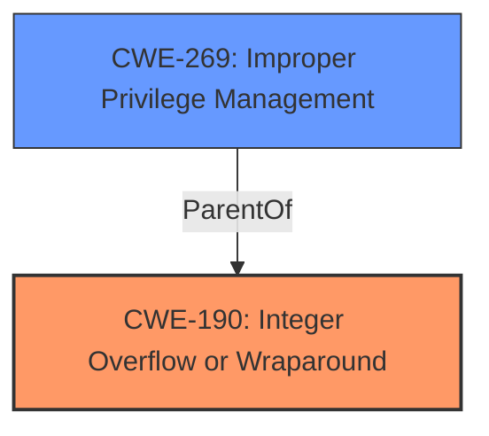

# Raw Analyzer Response for CVE-2021-40488

# Summary
| CWE ID | CWE Name | Confidence | CWE Abstraction Level | CWE Vulnerability Mapping Label | CWE-Vulnerability Mapping Notes |
|---|---|---|---|---|---|
| CWE-190 | Integer Overflow or Wraparound | 0.9 | Base | Primary | Allowed |
| CWE-269 | Improper Privilege Management | 0.7 | Class | Secondary | Allowed-with-Review |

## Evidence and Confidence

*   **Confidence Score:** 0.8
*   **Evidence Strength:** HIGH

## Relationship Analysis
The primary CWE, CWE-190 **(Integer Overflow or Wraparound)**, is a **Base** level CWE that directly addresses the **root cause** described in the vulnerability. While CWE-269 **(Improper Privilege Management)** is a **Class** level CWE, it is related to the **impact** of the vulnerability (Elevation of Privilege).

## Vulnerability Chain
The vulnerability chain starts with the **lack of proper validation** of user-supplied data, leading to an **integer overflow** (CWE-190). This overflow allows an attacker to **escalate privileges** (CWE-269) and potentially execute arbitrary code.

## Summary of Analysis
The analysis is primarily based on the provided evidence, specifically the "CVE Reference Links Content Summary," which indicates that the **root cause** of the vulnerability is an **integer overflow** due to the driver not adequately validating user-supplied data.

> The vulnerability stems from a **lack of proper validation** of user-supplied data within the `storport.sys` driver. This leads to an **integer overflow** before writing to memory.

The selection of CWE-190 is further supported by the fact that it is a **Base** level CWE, which is generally preferred for mapping to the **root cause** of vulnerabilities.

The "Vulnerability Description Key Phrases" also indicates that the impact is "Elevation of Privilege" which is related to CWE-269.

I considered CWE-269 **(Improper Privilege Management)** because the vulnerability leads to privilege escalation. However, since the **root cause** is the **integer overflow**, CWE-190 is a more accurate primary classification. CWE-269 is a class-level CWE which makes it less preferable to the base level CWE-190.

Relevant CWE Information:

# Enhanced Context (25 CWEs)

## CWE-312: Cleartext Storage of Sensitive Information
**Abstraction Level**: Base

This CWE was considered but not selected because the vulnerability does not involve the storage of sensitive information in cleartext.

## CWE-319: Cleartext Transmission of Sensitive Information
**Abstraction Level**: Base

This CWE was considered but not selected because the vulnerability does not involve the transmission of sensitive information in cleartext.

## CWE-538: Insertion of Sensitive Information into Externally-Accessible File or Directory
**Abstraction Level**: Base

This CWE was considered but not selected because the vulnerability does not involve the insertion of sensitive information into an externally accessible file or directory.

## CWE-1391: Use of Weak Credentials
**Abstraction Level**: Class

This CWE was considered but not selected because the vulnerability does not involve the use of weak credentials.

## CWE-311: Missing Encryption of Sensitive Data
**Abstraction Level**: Class

This CWE was considered but not selected because the vulnerability does not involve missing encryption of sensitive data.

## CWE-59: Improper Link Resolution Before File Access ('Link Following')
**Abstraction Level**: Base

This CWE was considered but not selected because the vulnerability does not involve improper link resolution before file access.

## CWE-212: Improper Removal of Sensitive Information Before Storage or Transfer
**Abstraction Level**: Base

This CWE was considered but not selected because the vulnerability does not involve the improper removal of sensitive information before storage or transfer.

## CWE-73: External Control of File Name or Path
**Abstraction Level**: Base

This CWE was considered but not selected because the vulnerability does not involve external control of file name or path.

## CWE-552: Files or Directories Accessible to External Parties
**Abstraction Level**: Base

This CWE was considered but not selected because the vulnerability does not involve files or directories accessible to external parties.

## CWE-313: Cleartext Storage in a File or on Disk
**Abstraction Level**: Variant

This CWE was considered but not selected because the vulnerability does not involve cleartext storage in a file or on disk.

## CWE-59: Improper Link Resolution Before File Access ('Link Following')
**Abstraction Level**: Base

This CWE was considered but not selected because the vulnerability does not involve improper link resolution before file access.

## CWE-1386: Insecure Operation on Windows Junction / Mount Point
**Abstraction Level**: Base

This CWE was considered but not selected because the vulnerability does not involve insecure operation on Windows Junction / Mount Point.

## CWE-312: Cleartext Storage of Sensitive Information
**Abstraction Level**: Base

This CWE was considered but not selected because the vulnerability does not involve the cleartext storage of sensitive information.

## CWE-367: Time-of-check Time-of-use (TOCTOU) Race Condition
**Abstraction Level**: Base

This CWE was considered but not selected because the vulnerability does not involve a Time-of-check Time-of-use (TOCTOU) Race Condition.

## CWE-61: UNIX Symbolic Link (Symlink) Following
**Abstraction Level**: Compound

This CWE was considered but not selected because the vulnerability does not involve UNIX Symbolic Link (Symlink) Following.

## CWE-363: Race Condition Enabling Link Following
**Abstraction Level**: base

This CWE was considered but not selected because the vulnerability does not involve a Race Condition Enabling Link Following.

## CWE-266: Incorrect Privilege Assignment
**Abstraction Level**: base

This CWE was considered but not selected because the vulnerability is more directly related to an integer overflow than to incorrect privilege assignment.

## CWE-386: Symbolic Name not Mapping to Correct Object
**Abstraction Level**: base

This CWE was considered but not selected because the vulnerability does not involve a Symbolic Name not Mapping to Correct Object.

## CWE-61: UNIX Symbolic Link (Symlink) Following
**Abstraction Level**: compound

This CWE was considered but not selected because the vulnerability does not involve UNIX Symbolic Link (Symlink) Following.

## CWE-59: Improper Link Resolution Before File Access ('Link Following')
**Abstraction Level**: Base

This CWE was considered but not selected because the vulnerability does not involve Improper Link Resolution Before File Access ('Link Following').

## CWE-804: Guessable CAPTCHA
**Abstraction Level**: base

This CWE was considered but not selected because the vulnerability does not involve a Guessable CAPTCHA.

## CWE-367: Time-of-check Time-of-use (TOCTOU) Race Condition
**Abstraction Level**: base

This CWE was considered but not selected because the vulnerability does not involve Time-of-check Time-of-use (TOCTOU) Race Condition.

## CWE-362: Concurrent Execution using Shared Resource with Improper Synchronization ('Race Condition')
**Abstraction Level**: class

This CWE was considered but not selected because the vulnerability does not involve Concurrent Execution using Shared Resource with Improper Synchronization ('Race Condition').

## CWE-434: Unrestricted Upload of File with Dangerous Type
**Abstraction Level**: base

This CWE was considered but not selected because the vulnerability does not involve an Unrestricted Upload of File with Dangerous Type.

## CWE-1386: Insecure Operation on Windows Junction / Mount Point
**Abstraction Level**: base

This CWE was considered but not selected because the vulnerability does not involve an Insecure Operation on Windows Junction / Mount Point.