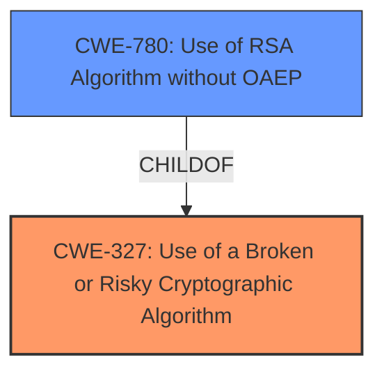

# Analysis for CVE-2021-40528

# Summary
| CWE ID | CWE Name | Confidence | CWE Abstraction Level | CWE Vulnerability Mapping Label | CWE-Vulnerability Mapping Notes |
|---|---|---|---|---|---|
| CWE-327 | Use of a Broken or Risky Cryptographic Algorithm | 1.0 | Class | Allowed-with-Review | Primary CWE |
| CWE-780 | Use of RSA Algorithm without OAEP | 0.6 | Variant | Allowed | Secondary Candidate |

## Evidence and Confidence

*   **Confidence Score:** 0.8
*   **Evidence Strength:** HIGH

## Relationship Analysis
The primary CWE, CWE-327, is a Class-level CWE, with several Base and Variant level children. This indicates a broad category of cryptographic weaknesses. The vulnerability description points to the ElGamal implementation using **dangerous combinations** of parameters which could be considered a **risky cryptographic algorithm**. The child CWE-780, Use of RSA Algorithm without OAEP, is a Variant that describes a padding issue with RSA, which is not directly applicable to ElGamal, but indicates that padding and algorithm parameter issues are common cryptographic problems.

## Vulnerability Chain
The vulnerability chain begins with the **incorrect implementation of the ElGamal algorithm**, specifically related to **inconsistent ElGamal parameter choices** and the use of **short ephemeral exponents**, leading to a **cross-configuration vulnerability**. This allows for **plaintext recovery**.

## Summary of Analysis
The initial assessment, based on the "**CWE for similar CVE Descriptions**" and "**Retriever Results**", suggested CWE-327 (Use of a Broken or Risky Cryptographic Algorithm) as the primary candidate. The "**CVE Reference Links Content Summary**" confirms this by stating that the vulnerability stems from a combination of factors in the implementation of ElGamal encryption, particularly related to **inconsistent ElGamal parameter choices**.

The relationship analysis further supports this, as CWE-327 is a Class-level CWE with more specific children. While a more specific child CWE isn't a perfect fit, the root cause lies in the usage of ElGamal with **dangerous combinations** of parameters.

CWE-780 was considered due to the mention of cryptographic parameters, but the issue isn't with padding, making CWE-327 the more appropriate choice.

Therefore, the selection of CWE-327 is based on the provided evidence and relationship analysis. It identifies the **root cause** as a **broken or risky cryptographic algorithm** due to **inconsistent parameter choices**. While more specific CWEs exist, they don't fully capture the core issue.

Relevant CWE Information:

# Enhanced Context (25 CWEs)

## CWE-327: Use of a Broken or Risky Cryptographic Algorithm
**Abstraction:** Class
**Status:** Draft

### Description
The product uses a **broken or risky cryptographic algorithm** or protocol.

### Extended Description
Cryptographic algorithms are the methods by which data is scrambled to prevent observation or influence by unauthorized actors. Insecure cryptography can be exploited to expose sensitive information, modify data in unexpected ways, spoof identities of other users or devices, or other impacts.

**Evidence:** The vulnerability description indicates that the ElGamal implementation, when interacting with other libraries, allows **plaintext recovery** due to a **dangerous combination** of parameters, making it a **risky cryptographic algorithm**.

## CWE-780: Use of RSA Algorithm without OAEP
**Abstraction:** Variant
**Status:** Incomplete

### Description
The product uses the RSA algorithm but does not incorporate Optimal Asymmetric Encryption Padding (OAEP), which might weaken the encryption.

### Extended Description
Padding schemes are often used with cryptographic algorithms to make the plaintext less predictable and complicate attack efforts. The OAEP scheme is often used with RSA to nullify the impact of predictable common text.

**Evidence:** This was considered because the vulnerability deals with cryptographic parameters. However, the vulnerability does not pertain to padding issues in RSA, so it is not the best fit.