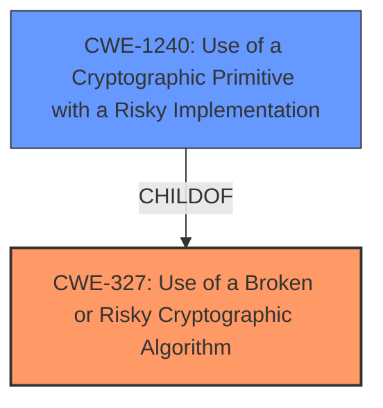

# Analysis for CVE-2021-40529

# Summary
| CWE ID | CWE Name | Confidence | CWE Abstraction Level | CWE Vulnerability Mapping Label | CWE-Vulnerability Mapping Notes |
|---|---|---|---|---|---|
| CWE-327 | Use of a Broken or Risky Cryptographic Algorithm | 0.9 | Class | Primary | Allowed-with-Review |
| CWE-1240 | Use of a Cryptographic Primitive with a Risky Implementation | 0.8 | Base | Secondary | Allowed |

## Evidence and Confidence

*   **Confidence Score:** 0.85
*   **Evidence Strength:** HIGH

## Relationship Analysis
The analysis revealed a hierarchical relationship where CWE-1240 (Use of a Cryptographic Primitive with a Risky Implementation) is a child of CWE-327 (Use of a Broken or Risky Cryptographic Algorithm). The vulnerability involves a specific risky implementation within a cryptographic algorithm, thus relating the two. The choice of CWE-327 as the primary is due to its broader scope, encompassing the usage of a broken or risky algorithm in general, while CWE-1240 is more specific to the implementation aspect.

## Vulnerability Chain
The vulnerability chain starts with the **insufficient handling of ephemeral exponents** in the ElGamal implementation, leading to the **potential for plaintext recovery**. This is exacerbated by specific public key parameters that make the discrete logarithm problem easier to solve. The final impact is **plaintext recovery** by an attacker.

## Summary of Analysis
The initial assessment focused on the fact that the ElGamal implementation **allows plaintext recovery**. The evidence from "CVE Reference Links Content Summary" points to the root cause being related to the **usage of short ephemeral exponents**, and **vulnerable public key parameters**. Retriever results suggest CWE-327 (Use of a Broken or Risky Cryptographic Algorithm) and CWE-1240 (Use of a Cryptographic Primitive with a Risky Implementation) as potential matches.

The relationship graph confirms the hierarchical relationship between CWE-327 and CWE-1240. The vulnerability is primarily categorized as CWE-327 because it is a more general classification for a broken/risky algorithm, with the specific implementation details falling under CWE-1240.

The selection of CWE-327 is at the Class level, which requires review according to MITRE guidance, but it serves as the best starting point due to the overall weakness lying in the choice of the algorithm/implementation, making it the primary issue. CWE-1240, a Base level CWE, adds more specific details of the implementation aspect and is therefore a secondary candidate.

Relevant CWE Information:

# Enhanced Context (25 CWEs)

## CWE-327: Use of a Broken or Risky Cryptographic Algorithm
**Abstraction:** Class
The product uses a broken or risky cryptographic algorithm or protocol. The CVE description states "The ElGamal implementation in Botan through 2.18.1... **allows plaintext recovery**...". The summary states the **insufficent Ephemeral Exponent Size** and **Vulnerable Public Key Parameters** are weaknesses, leading to a risk in the cryptographic algorithm.
**Confidence:** 0.9

## CWE-1240: Use of a Cryptographic Primitive with a Risky Implementation
**Abstraction:** Base
To fulfill the need for a cryptographic primitive, the product implements a cryptographic algorithm using a non-standard, unproven, or disallowed/non-compliant cryptographic implementation. The "CVE Reference Links Content Summary" indicates that the vulnerability stems from implementation choices and a lack of care regarding interoperability between implementations, not from a flaw in the math of ElGamal itself. This aligns with CWE-1240, which focuses on risky implementations of cryptographic primitives.
**Confidence:** 0.8

## CWE-312: Cleartext Storage of Sensitive Information
**Abstraction:** Base
This CWE is not relevant because the vulnerability does not involve storing sensitive information in cleartext. It involves a weakness in the cryptographic algorithm or its implementation.
**Confidence:** 0.1

## CWE-208: Observable Timing Discrepancy
**Abstraction:** Base
While the "CVE Reference Links Content Summary" mentions a related side-channel vulnerability within the modular exponentiation routine of Libgcrypt, this is not the core issue in CVE-2021-40529. The primary vulnerability is about plaintext recovery due to weak key parameters and exponent handling, not timing discrepancies.
**Confidence:** 0.2

## CWE-203: Observable Discrepancy
**Abstraction:** Base
Similar to CWE-208, this CWE is not the primary issue. While discrepancies might be observable, they are not the root cause of the vulnerability. The vulnerability is about plaintext recovery due to weak key parameters and exponent handling.
**Confidence:** 0.2

## CWE-780: Use of RSA Algorithm without OAEP
**Abstraction:** Variant
This CWE is not relevant because the vulnerability is in the ElGamal implementation, not RSA.
**Confidence:** 0.1

## CWE-385: Covert Timing Channel
**Abstraction:** Base
While a side-channel vulnerability is mentioned, it is not the core issue.
**Confidence:** 0.1

## CWE-522: Insufficiently Protected Credentials
**Abstraction:** Class
This CWE is not relevant as the vulnerability does not deal with the protection of credentials, but rather the algorithm used to protect the data.
**Confidence:** 0.1

## CWE-321: Use of Hard-coded Cryptographic Key
**Abstraction:** Variant
This CWE is not relevant because the vulnerability does not involve hard-coded cryptographic keys.
**Confidence:** 0.1

## CWE-1204: Generation of Weak Initialization Vector (IV)
**Abstraction:** Base
This CWE is not the primary weakness as it focuses on the generation of weak Initialization Vectors, which is not the root cause of this vulnerability.
**Confidence:** 0.1

# Enhanced Query for CVE-2021-40529

## Vulnerability Description
The ElGamal implementation in Botan through 2.18.1, as used in Thunderbird and other products, **allows plaintext recovery** because, during interaction between two cryptographic libraries, a certain dangerous combination of the prime defined by the receivers public key, the generator defined by the receivers public key, and the senders ephemeral exponents can lead to a cross-configuration attack against OpenPGP.

### Vulnerability Description Key Phrases
- **weakness:** **allows plaintext recovery**
- **product:** Botan
- **version:** through 2.18.1
- **component:** ElGamal implementation

## CVE Reference Links Content Summary
Based on the provided content, here's an analysis of CVE-2021-40529:

**Root Cause of Vulnerability:**

The vulnerability stems from the ElGamal implementation in Botan, specifically how it handles ephemeral exponents during encryption. Certain combinations of a receiver's public key parameters (prime *p* and generator *g*) and a sender's ephemeral exponents can lead to a cross-configuration attack when interacting with different cryptographic libraries within the OpenPGP ecosystem. In particular, the vulnerability occurs when a sender uses a short ephemeral exponent *y* and the receiver uses a prime *p* where *p-1* contains small factors, and *g* generates a subgroup with small factors.

**Weaknesses/Vulnerabilities Present:**

*   **Insufficient Ephemeral Exponent Size:**  The core weakness lies in the usage of short ephemeral exponents during ElGamal encryption in some implementations.  When combined with specific public keys, it becomes possible to recover the ephemeral exponent, and therefore the plaintext.
*   **Vulnerable Public Key Parameters:** The vulnerability is exacerbated when the receiver's public key uses a prime *p* such that *p-1* has small factors, and the chosen generator *g* does not generate the subgroup of order *q*, resulting in a discrete logarithm problem that is easier to solve.
*   **Interoperability Issues:** The attack occurs when different PGP implementations (e.g., Crypto++ as the sender and a vulnerable key as receiver) are used together, highlighting the risk of inconsistent implementations and cross-configuration attacks in OpenPGP.
*   **Side Channel Leakage:** A related side-channel vulnerability exists within the modular exponentiation routine of Libgcrypt. While this is not the core issue in CVE-2021-40529, it contributes to the overall risk by making key recovery attacks more practical, when combined with short exponents.

**Impact of Exploitation:**

*   **Plaintext Recovery:** An attacker can recover the plaintext message without needing the receiver's private key.
*   **Key Recovery:** The side-channel attacks can lead to full recovery of the victim's secret key, when combined with the insufficient ephemeral exponent size.

**Attack Vectors:**

*   **Network Interception:** The primary attack vector involves capturing encrypted messages during transmission (network eavesdropping).
*   **Co-location:** Side-channel attacks can be achieved via co-location, where attacker code runs on the same host as the victim, allowing for cache-based timing attacks.

**Required Attacker Capabilities/Position:**

*   **Network Access:** An attacker needs the ability to intercept communication between sender and receiver to obtain the encrypted message.
*   **Co-location (for side-channel):** For side-channel attacks, the attacker needs to execute code on the same hardware as the target system (e.g., same physical machine, or same VM).
*   **Cryptanalytic skills:** To exploit the vulnerability, the attacker needs to apply discrete logarithm solving techniques.
*   **Computational Resources:** While some attacks can be executed in a few hours, certain key recovery requires more substantial computational resources.

**Additional Notes:**
*   The vulnerability does not stem from a flaw in the math of ElGamal itself, but from implementation choices and a lack of care regarding interoperability between implementations.
*   The vulnerability is not limited to specific implementations, but depends on the interaction between implementations. 
*   The provided links contain research papers describing the vulnerability in detail, along with patches and mitigation information.
*   Several vendors (e.g. Fedora, Gentoo) have released patches for the vulnerability.

## Retriever Results

### Top Combined Results

| Rank | CWE ID | Name | Abstraction | Usage  | Retrievers | Individual Scores |
|------|--------|------|-------------|-------|------------|-------------------|
| 1 | 327 | Use of a Broken or Risky Cryptographic Algorithm | Class | Allowed-with-Review | sparse | 0.433 |
| 2 | 1240 | Use of a Cryptographic Primitive with a Risky Implementation | Base | Allowed | sparse | 0.321 |
| 3 | 312 | Cleartext Storage of Sensitive Information | Base | Allowed | sparse | 0.291 |
| 4 | 208 | Observable Timing Discrepancy | Base | Allowed | sparse | 0.291 |
| 5 | 203 | Observable Discrepancy | Base | Allowed | sparse | 0.290 |
| 6 | 780 | Use of RSA Algorithm without OAEP | Variant | Allowed | dense | 0.452 |
| 7 | 385 | Covert Timing Channel | Base | Allowed | graph | 0.002 |
| 8 | 522 | Insufficiently Protected Credentials | Class | Allowed-with-Review | sparse | 0.279 |
| 9 | 321 | Use of Hard-coded Cryptographic Key | Variant | Allowed | sparse | 0.278 |
| 10 | 1204 | Generation of Weak Initialization Vector (IV) | Base | Allowed | sparse | 0.277 |

# Complete CWE Specifications

## CWE-327: Use of a Broken or Risky Cryptographic Algorithm
**Abstraction:** Class
**Status:** Draft

### Description
The product uses a broken or risky cryptographic algorithm or protocol.

### Extended Description

Cryptographic algorithms are the methods by which data is scrambled to prevent observation or influence by unauthorized actors. Insecure cryptography can be exploited to expose sensitive information, modify data in unexpected ways, spoof identities of other users or devices, or other impacts.

It is very difficult to produce a secure algorithm, and even high-profile algorithms by accomplished cryptographic experts have been broken. Well-known techniques exist to break or weaken various kinds of cryptography. Accordingly, there are a small number of well-understood and heavily studied algorithms that should be used by most products. Using a non-standard or known-insecure algorithm is dangerous because a determined adversary may be able to break the algorithm and compromise whatever data has been protected.

Since the state of cryptography advances so rapidly, it is common for an algorithm to be considered "unsafe" even if it was once thought to be strong. This can happen when new attacks are discovered, or if computing power increases so much that the cryptographic algorithm no longer provides the amount of protection that was originally thought.

For a number of reasons, this weakness is even more challenging to manage with hardware deployment of cryptographic algorithms as opposed to software implementation. First, if a flaw is discovered with hardware-implemented cryptography, the flaw cannot be fixed in most cases without a recall of the product, because hardware is not easily replaceable like software. Second, because the hardware product is expected to work for years, the adversary's computing power will only increase over time.

### Alternative Terms
None

### Relationships
ChildOf -> CWE-693
PeerOf -> CWE-311

### Mapping Guidance
**Usage:** Allowed-with-Review
**Rationale:** This CWE entry is a Class and might have Base-level children that would be more appropriate
**Comments:** Examine children of this entry to see if there is a better fit
**Reasons:**
- Abstraction

### Additional Notes
**[Maintenance]** Since CWE 4.4, various cryptography-related entries, including CWE-327 and CWE-1240, have been slated for extensive research, analysis, and community consultation to define consistent terminology, improve relationships, and reduce overlap or duplication. As of CWE 4.6, this work is still ongoing.

**[Maintenance]** The Taxonomy_Mappings to ISA/IEC 62443 were added in CWE 4.10, but they are still under review and might change in future CWE versions. These draft mappings were performed by members of the "Mapping CWE to 62443" subgroup of the CWE-CAPEC ICS/OT Special Interest Group (SIG), and their work is incomplete as of CWE 4.10. The mappings are included to facilitate discussion and review by the broader ICS/OT community, and they are likely to change in future CWE versions.

### Observed Examples
- **CVE-2022-30273:** SCADA-based protocol supports a legacy encryption mode that uses Tiny Encryption Algorithm (TEA) in ECB mode, which leaks patterns in messages and cannot protect integrity
- **CVE-2022-30320:** Programmable Logic Controller (PLC) uses a protocol with a cryptographically insecure hashing algorithm for passwords.
- **CVE-2008-3775:** Product uses "ROT-25" to obfuscate the password in the registry.

## CWE-1240: Use of a Cryptographic Primitive with a Risky Implementation
**Abstraction:** Base
**Status:** Draft

### Description
To fulfill the need for a cryptographic primitive, the product implements a cryptographic algorithm using a non-standard, unproven, or disallowed/non-compliant cryptographic implementation.

### Extended Description

Cryptographic protocols and systems depend on cryptographic primitives (and associated algorithms) as their basic building blocks. Some common examples of primitives are digital signatures, one-way hash functions, ciphers, and public key cryptography; however, the notion of "primitive" can vary depending on point of view. See "Terminology Notes" for further explanation of some concepts.

Cryptographic primitives are defined to accomplish one very specific task in a precisely defined and mathematically reliable fashion. For example, suppose that for a specific cryptographic primitive (such as an encryption routine), the consensus is that the primitive can only be broken after trying out N different inputs (where the larger the value of N, the stronger the cryptography). For an encryption scheme like AES-256, one would expect N to be so large as to be infeasible to execute in a reasonable amount of time.

If a vulnerability is ever found that shows that one can break a cryptographic primitive in significantly less than the expected number of attempts, then that primitive is considered weakened (or sometimes in extreme cases, colloquially it is "broken"). As a result, anything using this cryptographic primitive would now be considered insecure or risky. Thus, even breaking or weakening a seemingly small cryptographic primitive has the potential to render the whole system vulnerable, due to its reliance on the primitive. A historical example can be found in TLS when using DES. One would colloquially call DES the cryptographic primitive for transport encryption in this version of TLS. In the past, DES was considered strong, because no weaknesses were found in it; importantly, DES has a key length of 56 bits. Trying N=2^56 keys was considered impractical for most actors. Unfortunately, attacking a system with 56-bit keys is now practical via brute force, which makes defeating DES encryption practical. It is now practical for an adversary to read any information sent under this version of TLS and use this information to attack the system. As a result, it can be claimed that this use of TLS is weak, and that any system depending on TLS with DES could potentially render the entire system vulnerable to attack.

Cryptographic primitives and associated algorithms are only considered safe after extensive research and review from experienced cryptographers from academia, industry, and government entities looking for any possible flaws. Furthermore, cryptographic primitives and associated algorithms are frequently reevaluated for safety when new mathematical and attack techniques are discovered. As a result and over time, even well-known cryptographic primitives can lose their compliance status with the discovery of novel attacks that might either defeat the algorithm or reduce its robustness significantly.

If ad-hoc cryptographic primitives are implemented, it is almost certain that the implementation will be vulnerable to attacks that are well understood by cryptographers, resulting in the exposure of sensitive information and other consequences.

This weakness is even more difficult to manage for hardware-implemented deployment of cryptographic algorithms. First, because hardware is not patchable as easily as software, any flaw discovered after release and production typically cannot be fixed without a recall of the product. Secondly, the hardware product is often expected to work for years, during which time computation power available to the attacker only increases. Therefore, for hardware implementations of cryptographic primitives, it is absolutely essential that only strong, proven cryptographic primitives are used.

### Alternative Terms
None

### Relationships
ChildOf -> CWE-327

### Mapping Guidance
**Usage:** Allowed
**Rationale:** This CWE entry is at the Base level of abstraction, which is a preferred level of abstraction for mapping to the root causes of vulnerabilities.
**Comments:** Carefully read both the name and description to ensure that this mapping is an appropriate fit. Do not try to 'force' a mapping to a lower-level Base/Variant simply to comply with this preferred level of abstraction.
**Reasons:**
- Acceptable-Use

### Additional Notes
**[Terminology]** 

 Terminology for cryptography varies widely, from informal and colloquial to mathematically-defined, with different precision and formalism depending on whether the stakeholder is a developer, cryptologist, etc. Yet there is a need for CWE to be self-consistent while remaining understandable and acceptable to multiple audiences.

As of CWE 4.6, CWE terminology around "primitives" and "algorithms" is emerging as shown by the following example, subject to future consultation and agreement within the CWE and cryptography communities. Suppose one wishes to send encrypted data using a CLI tool such as OpenSSL. One might choose to use AES with a 256-bit key and require tamper protection (GCM mode, for instance). For compatibility's sake, one might also choose the ciphertext to be formatted to the PKCS#5 standard. In this case, the "cryptographic system" would be AES-256-GCM with PKCS#5 formatting. The "cryptographic function" would be AES-256 in the GCM mode of operation, and the "algorithm" would be AES. Colloquially, one would say that AES (and sometimes AES-256) is the "cryptographic primitive," because it is the algorithm that realizes the concept of symmetric encryption (without modes of operation or other protocol related modifications). In practice, developers and architects typically refer to base cryptographic algorithms (AES, SHA, etc.) as cryptographic primitives.

**[Maintenance]** Since CWE 4.4, various cryptography-related entries, including CWE-327 and CWE-1240, have been slated for extensive research, analysis, and community consultation to define consistent terminology, improve relationships, and reduce overlap or duplication. As of CWE 4.6, this work is still ongoing.

### Observed Examples
- **CVE-2020-4778:** software uses MD5, which is less safe than the default SHA-256 used by related products
- **CVE-2005-2946:** Default configuration of product uses MD5 instead of stronger algorithms that are available, simplifying forgery of certificates.
- **CVE-2019-3907:** identity card uses MD5 hash of a salt and password

## CWE-312: Cleartext Storage of Sensitive Information
**Abstraction:** Base
**Status:** Draft

### Description
The product stores sensitive information in cleartext within a resource that might be accessible to another control sphere.

### Extended Description

Because the information is stored in cleartext (i.e., unencrypted), attackers could potentially read it. Even if the information is encoded in a way that is not human-readable, certain techniques could determine which encoding is being used, then decode the information.

When organizations adopt cloud services, it can be easier for attackers to access the data from anywhere on the Internet.

In some systems/environments such as cloud, the use of "double encryption" (at both the software and hardware layer) might be required, and the developer might be solely responsible for both layers, instead of shared responsibility with the administrator of the broader system/environment.

### Alternative Terms
None

### Relationships
ChildOf -> CWE-311
ChildOf -> CWE-311
ChildOf -> CWE-922

### Mapping Guidance
**Usage:** Allowed
**Rationale:** This CWE entry is at the Base level of abstraction, which is a preferred level of abstraction for mapping to the root causes of vulnerabilities.
**Comments:** Carefully read both the name and description to ensure that this mapping is an appropriate fit. Do not try to 'force' a mapping to a lower-level Base/Variant simply to comply with this preferred level of abstraction.
**Reasons:**
- Acceptable-Use

### Additional Notes
**[Terminology]** Different people use "cleartext" and "plaintext" to mean the same thing: the lack of encryption. However, within cryptography, these have more precise meanings. Plaintext is the information just before it is fed into a cryptographic algorithm, including already-encrypted text. Cleartext is any information that is unencrypted, although it might be in an encoded form that is not easily human-readable (such as base64 encoding).

### Observed Examples
- **CVE-2022-30275:** Remote Terminal Unit (RTU) uses a driver that relies on a password stored in plaintext.
- **CVE-2009-2272:** password and username stored in cleartext in a cookie
- **CVE-2009-1466:** password stored in cleartext in a file with insecure permissions

## CWE-208: Observable Timing Discrepancy
**Abstraction:** Base
**Status:** Incomplete

### Description
Two separate operations in a product require different amounts of time to complete, in a way that is observable to an actor and reveals security-relevant information about the state of the product, such as whether a particular operation was successful or not.

### Extended Description
In security-relevant contexts, even small variations in timing can be exploited by attackers to indirectly infer certain details about the product's internal operations. For example, in some cryptographic algorithms, attackers can use timing differences to infer certain properties about a private key, making the key easier to guess. Timing discrepancies effectively form a timing side channel.

### Alternative Terms
None

### Relationships
ChildOf -> CWE-203
CanPrecede -> CWE-385
CanPrecede -> CWE-327

### Mapping Guidance
**Usage:** Allowed
**Rationale:** This CWE entry is at the Base level of abstraction, which is a preferred level of abstraction for mapping to the root causes of vulnerabilities.
**Comments:** Carefully read both the name and description to ensure that this mapping is an appropriate fit. Do not try to 'force' a mapping to a lower-level Base/Variant simply to comply with this preferred level of abstraction.
**Reasons:**
- Acceptable-Use

### Additional Notes
**[Relationship]** Often primary in cryptographic applications and algorithms.

**[Maintenance]** CWE 4.16 removed a demonstrative example for a hardware module because it was inaccurate and unable to be adapted. The CWE team is developing an alternative.

### Observed Examples
- **CVE-2019-10071:** Java-oriented framework compares HMAC signatures using String.equals() instead of a constant-time algorithm, causing timing discrepancies
- **CVE-2019-10482:** Smartphone OS uses comparison functions that are not in constant time, allowing side channels
- **CVE-2014-0984:** Password-checking function in router terminates validation of a password entry when it encounters the first incorrect character, which allows remote attackers to obtain passwords via a brute-force attack that relies on timing differences in responses to incorrect password guesses, aka a timing side-channel attack.

## CWE-203: Observable Discrepancy
**Abstraction:** Base
**Status:** Incomplete

### Description
The product behaves differently or sends different responses under different circumstances in a way that is observable to an unauthorized actor, which exposes security-relevant information about the state of the product, such as whether a particular operation was successful or not.

### Extended Description
Discrepancies can take many forms, and variations may be detectable in timing, control flow, communications such as replies or requests, or general behavior. These discrepancies can reveal information about the product's operation or internal state to an unauthorized actor. In some cases, discrepancies can be used by attackers to form a side channel.

### Alternative Terms
Side Channel Attack: Observable Discrepancies are at the root of side channel attacks.

### Relationships
ChildOf -> CWE-200
ChildOf -> CWE-200

### Mapping Guidance
**Usage:** Allowed
**Rationale:** This CWE entry is at the Base level of abstraction, which is a preferred level of abstraction for mapping to the root causes of vulnerabilities.
**Comments:** Carefully read both the name and description to ensure that this mapping is an appropriate fit. Do not try to 'force' a mapping to a lower-level Base/Variant simply to comply with this preferred level of abstraction.
**Reasons:**
- Acceptable-Use

### Observed Examples
- **CVE-2020-8695:** Observable discrepancy in the RAPL interface for some Intel processors allows information disclosure.
- **CVE-2019-14353:** Crypto hardware wallet's power consumption relates to total number of pixels illuminated, creating a side channel in the USB connection that allows attackers to determine secrets displayed such as PIN numbers and passwords
- **CVE-2019-10071:** Java-oriented framework compares HMAC signatures using String.equals() instead of a constant-time algorithm, causing timing discrepancies

## CWE-780: Use of RSA Algorithm without OAEP
**Abstraction:** Variant
**Status:** Incomplete

### Description
The product uses the RSA algorithm but does not incorporate Optimal Asymmetric Encryption Padding (OAEP), which might weaken the encryption.

### Extended Description
Padding schemes are often used with cryptographic algorithms to make the plaintext less predictable and complicate attack efforts. The OAEP scheme is often used with RSA to nullify the impact of predictable common text.

### Alternative Terms
None

### Relationships
ChildOf -> CWE-327

### Mapping Guidance
**Usage:** Allowed
**Rationale:** This CWE entry is at the Variant level of abstraction, which is a preferred level of abstraction for mapping to the root causes of vulnerabilities.
**Comments:** Carefully read both the name and description to ensure that this mapping is an appropriate fit. Do not try to 'force' a mapping to a lower-level Base/Variant simply to comply with this preferred level of abstraction.
**Reasons:**
- Acceptable-Use

### Additional Notes
**[Maintenance]** This entry could probably have a new parent related to improper padding, however the role of padding in cryptographic algorithms can vary, such as hiding the length of the plaintext and providing additional random bits for the cipher. In general, cryptographic problems in CWE are not well organized and further research is needed.

## CWE-385: Covert Timing Channel
**Abstraction:** Base
**Status:** Incomplete

### Description
Covert timing channels convey information by modulating some aspect of system behavior over time, so that the program receiving the information can observe system behavior and infer protected information.

### Extended Description

In some instances, knowing when data is transmitted between parties can provide a malicious user with privileged information. Also, externally monitoring the timing of operations can potentially reveal sensitive data. For example, a cryptographic operation can expose its internal state if the time it takes to perform the operation varies, based on the state.

Covert channels are frequently classified as either storage or timing channels. Some examples of covert timing channels are the system's paging rate, the time a certain transaction requires to execute, and the time it takes to gain access to a shared bus.

### Alternative Terms
None

### Relationships
ChildOf -> CWE-514

### Mapping Guidance
**Usage:** Allowed
**Rationale:** This CWE entry is at the Base level of abstraction, which is a preferred level of abstraction for mapping to the root causes of vulnerabilities.
**Comments:** Carefully read both the name and description to ensure that this mapping is an appropriate fit. Do not try to 'force' a mapping to a lower-level Base/Variant simply to comply with this preferred level of abstraction.
**Reasons:**
- Acceptable-Use

### Additional Notes
**[Maintenance]** As of CWE 4.9, members of the CWE Hardware SIG are working to improve CWE's coverage of transient execution weaknesses, which include issues related to Spectre, Meltdown, and other attacks that create or exploit covert channels. As a result of that work, this entry might change in CWE 4.10.

## CWE-522: Insufficiently Protected Credentials
**Abstraction:** Class
**Status:** Incomplete

### Description
The product transmits or stores authentication credentials, but it uses an insecure method that is susceptible to unauthorized interception and/or retrieval.

### Extended Description
Not provided

### Alternative Terms
None

### Relationships
ChildOf -> CWE-1390
ChildOf -> CWE-287
ChildOf -> CWE-668

### Mapping Guidance
**Usage:** Allowed-with-Review
**Rationale:** This CWE entry is a Class and might have Base-level children that would be more appropriate
**Comments:** Examine children of this entry to see if there is a better fit
**Reasons:**
- Abstraction

### Observed Examples
- **CVE-2022-30018:** A messaging platform serializes all elements of User/Group objects, making private information available to adversaries
- **CVE-2022-29959:** Initialization file contains credentials that can be decoded using a "simple string transformation"
- **CVE-2022-35411:** Python-based RPC framework enables pickle functionality by default, allowing clients to unpickle untrusted data.

## CWE-321: Use of Hard-coded Cryptographic Key
**Abstraction:** Variant
**Status:** Draft

### Description
The use of a hard-coded cryptographic key significantly increases the possibility that encrypted data may be recovered.

### Extended Description
Not provided

### Alternative Terms
None

### Relationships
ChildOf -> CWE-798
ChildOf -> CWE-798
ChildOf -> CWE-798

### Mapping Guidance
**Usage:** Allowed
**Rationale:** This CWE entry is at the Variant level of abstraction, which is a preferred level of abstraction for mapping to the root causes of vulnerabilities.
**Comments:** Carefully read both the name and description to ensure that this mapping is an appropriate fit. Do not try to 'force' a mapping to a lower-level Base/Variant simply to comply with this preferred level of abstraction.
**Reasons:**
- Acceptable-Use

### Additional Notes
**[Other]** The main difference between the use of hard-coded passwords and the use of hard-coded cryptographic keys is the false sense of security that the former conveys. Many people believe that simply hashing a hard-coded password before storage will protect the information from malicious users. However, many hashes are reversible (or at least vulnerable to brute force attacks) -- and further, many authentication protocols simply request the hash itself, making it no better than a password.

**[Maintenance]** The Taxonomy_Mappings to ISA/IEC 62443 were added in CWE 4.10, but they are still under review and might change in future CWE versions. These draft mappings were performed by members of the "Mapping CWE to 62443" subgroup of the CWE-CAPEC ICS/OT Special Interest Group (SIG), and their work is incomplete as of CWE 4.10. The mappings are included to facilitate discussion and review by the broader ICS/OT community, and they are likely to change in future CWE versions.

### Observed Examples
- **CVE-2022-29960:** Engineering Workstation uses hard-coded cryptographic keys that could allow for unathorized filesystem access and privilege escalation
- **CVE-2022-30271:** Remote Terminal Unit (RTU) uses a hard-coded SSH private key that is likely to be used by default.
- **CVE-2020-10884:** WiFi router service has a hard-coded encryption key, allowing root access

## CWE-1204: Generation of Weak Initialization Vector (IV)
**Abstraction:** Base
**Status:** Incomplete

### Description
The product uses a cryptographic primitive that uses an Initialization
			Vector (IV), but the product does not generate IVs that are
			sufficiently unpredictable or unique according to the expected
			cryptographic requirements for that primitive.
			

### Extended Description
By design, some cryptographic primitives (such as block ciphers) require that IVs must have certain properties for the uniqueness and/or unpredictability of an IV. Primitives may vary in how important these properties are. If these properties are not maintained, e.g. by a bug in the code, then the cryptography may be weakened or broken by attacking the IVs themselves.

### Alternative Terms
None

### Relationships
ChildOf -> CWE-330

### Mapping Guidance
**Usage:** Allowed
**Rationale:** This CWE entry is at the Base level of abstraction, which is a preferred level of abstraction for mapping to the root causes of vulnerabilities.
**Comments:** Carefully read both the name and description to ensure that this mapping is an appropriate fit. Do not try to 'force' a mapping to a lower-level Base/Variant simply to comply with this preferred level of abstraction.
**Reasons:**
- Acceptable-Use

### Additional Notes
**[Maintenance]** As of CWE 4.5, terminology related to randomness, entropy, and predictability can vary widely. Within the developer and other communities, "randomness" is used heavily. However, within cryptography, "entropy" is distinct, typically implied as a measurement. There are no commonly-used definitions, even within standards documents and cryptography papers. Future versions of CWE will attempt to define these terms and, if necessary, distinguish between them in ways that are appropriate for different communities but do not reduce the usability of CWE for mapping, understanding, or other scenarios.

### Observed Examples
- **CVE-2020-1472:** ZeroLogon vulnerability - use of a static IV of all zeroes in AES-CFB8 mode
- **CVE-2011-3389:** BEAST attack in SSL 3.0 / TLS 1.0. In CBC mode, chained initialization vectors are non-random, allowing decryption of HTTPS traffic using a chosen plaintext attack.
- **CVE-2001-0161:** wireless router does not use 6 of the 24 bits for WEP encryption, making it easier for attackers to decrypt traffic

