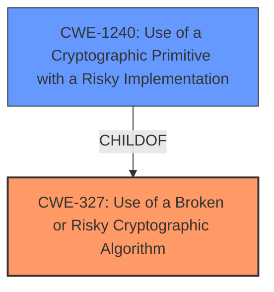

# Analysis Report for CVE-2021-40529

# Vulnerability Analysis Report: CVE-2021-40529

## Description


## Analysis (with Relationship Data)

# Summary
| CWE ID | CWE Name | Confidence | CWE Abstraction Level | CWE Vulnerability Mapping Label | CWE-Vulnerability Mapping Notes |
|---|---|---|---|---|---|
| CWE-327 | Use of a Broken or Risky Cryptographic Algorithm | 0.9 | Class | Primary | Allowed-with-Review |
| CWE-1240 | Use of a Cryptographic Primitive with a Risky Implementation | 0.8 | Base | Secondary | Allowed |

## Evidence and Confidence

*   **Confidence Score:** 0.85
*   **Evidence Strength:** HIGH

## Relationship Analysis
The analysis revealed a hierarchical relationship where CWE-1240 (Use of a Cryptographic Primitive with a Risky Implementation) is a child of CWE-327 (Use of a Broken or Risky Cryptographic Algorithm). The vulnerability involves a specific risky implementation within a cryptographic algorithm, thus relating the two. The choice of CWE-327 as the primary is due to its broader scope, encompassing the usage of a broken or risky algorithm in general, while CWE-1240 is more specific to the implementation aspect.



## Vulnerability Chain
The vulnerability chain starts with the **insufficient handling of ephemeral exponents** in the ElGamal implementation, leading to the **potential for plaintext recovery**. This is exacerbated by specific public key parameters that make the discrete logarithm problem easier to solve. The final impact is **plaintext recovery** by an attacker.

## Summary of Analysis
The initial assessment focused on the fact that the ElGamal implementation **allows plaintext recovery**. The evidence from "CVE Reference Links Content Summary" points to the root cause being related to the **usage of short ephemeral exponents**, and **vulnerable public key parameters**. Retriever results suggest CWE-327 (Use of a Broken or Risky Cryptographic Algorithm) and CWE-1240 (Use of a Cryptographic Primitive with a Risky Implementation) as potential matches.

The relationship graph confirms the hierarchical relationship between CWE-327 and CWE-1240. The vulnerability is primarily categorized as CWE-327 because it is a more general classification for a broken/risky algorithm, with the specific implementation details falling under CWE-1240.

The selection of CWE-327 is at the Class level, which requires review according to MITRE guidance, but it serves as the best starting point due to the overall weakness lying in the choice of the algorithm/implementation, making it the primary issue. CWE-1240, a Base level CWE, adds more specific details of the implementation aspect and is therefore a secondary candidate.

Relevant CWE Information:

# Enhanced Context (25 CWEs)

## CWE-327: Use of a Broken or Risky Cryptographic Algorithm
**Abstraction:** Class
The product uses a broken or risky cryptographic algorithm or protocol. The CVE description states "The ElGamal implementation in Botan through 2.18.1... **allows plaintext recovery**...". The summary states the **insufficent Ephemeral Exponent Size** and **Vulnerable Public Key Parameters** are weaknesses, leading to a risk in the cryptographic algorithm.
**Confidence:** 0.9

## CWE-1240: Use of a Cryptographic Primitive with a Risky Implementation
**Abstraction:** Base
To fulfill the need for a cryptographic primitive, the product implements a cryptographic algorithm using a non-standard, unproven, or disallowed/non-compliant cryptographic implementation. The "CVE Reference Links Content Summary" indicates that the vulnerability stems from implementation choices and a lack of care regarding interoperability between implementations, not from a flaw in the math of ElGamal itself. This aligns with CWE-1240, which focuses on risky implementations of cryptographic primitives.
**Confidence:** 0.8

## CWE-312: Cleartext Storage of Sensitive Information
**Abstraction:** Base
This CWE is not relevant because the vulnerability does not involve storing sensitive information in cleartext. It involves a weakness in the cryptographic algorithm or its implementation.
**Confidence:** 0.1

## CWE-208: Observable Timing Discrepancy
**Abstraction:** Base
While the "CVE Reference Links Content Summary" mentions a related side-channel vulnerability within the modular exponentiation routine of Libgcrypt, this is not the core issue in CVE-2021-40529. The primary vulnerability is about plaintext recovery due to weak key parameters and exponent handling, not timing discrepancies.
**Confidence:** 0.2

## CWE-203: Observable Discrepancy
**Abstraction:** Base
Similar to CWE-208, this CWE is not the primary issue. While discrepancies might be observable, they are not the root cause of the vulnerability. The vulnerability is about plaintext recovery due to weak key parameters and exponent handling.
**Confidence:** 0.2

## CWE-780: Use of RSA Algorithm without OAEP
**Abstraction:** Variant
This CWE is not relevant because the vulnerability is in the ElGamal implementation, not RSA.
**Confidence:** 0.1

## CWE-385: Covert Timing Channel
**Abstraction:** Base
While a side-channel vulnerability is mentioned, it is not the core issue.
**Confidence:** 0.1

## CWE-522: Insufficiently Protected Credentials
**Abstraction:** Class
This CWE is not relevant as the vulnerability does not deal with the protection of credentials, but rather the algorithm used to protect the data.
**Confidence:** 0.1

## CWE-321: Use of Hard-coded Cryptographic Key
**Abstraction:** Variant
This CWE is not relevant because the vulnerability does not involve hard-coded cryptographic keys.
**Confidence:** 0.1

## CWE-1204: Generation of Weak Initialization Vector (IV)
**Abstraction:** Base
This CWE is not the primary weakness as it focuses on the generation of weak Initialization Vectors, which is not the root cause of this vulnerability.
**Confidence:** 0.1


## CWE Relationship Analysis

Current CWEs represent these abstraction levels: .


### Vulnerability Chain Analysis

**Chain starting from CWE-321:**
- 321 (Use of Hard-coded Cryptographic Key) - ROOT


**Chain starting from CWE-312:**
- 312 (Cleartext Storage of Sensitive Information) - ROOT


### CWE Relationship Diagram

```mermaid
graph TD
    classDef primary fill:#f96,stroke:#333,stroke-width:2px
    classDef secondary fill:#69f,stroke:#333
    classDef tertiary fill:#9e9,stroke:#333
```


*Report generated on 2025-04-02 02:25:52*
