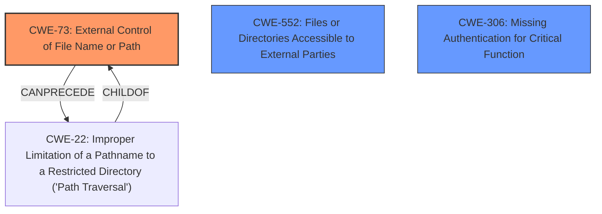

# Analysis for CVE-2021-40639

# Summary
| CWE ID | CWE Name | Confidence | CWE Abstraction Level | CWE Vulnerability Mapping Label | CWE-Vulnerability Mapping Notes |
|---|---|---|---|---|---|
| CWE-73 | External Control of File Name or Path | 0.9 | Base | Allowed | Primary CWE |
| CWE-552 | Files or Directories Accessible to External Parties | 0.7 | Base | Allowed | Secondary Candidate |
| CWE-306 | Missing Authentication for Critical Function | 0.6 | Base | Allowed | Secondary Candidate |

## Evidence and Confidence

*   **Confidence Score:** 0.8
*   **Evidence Strength:** HIGH

## Relationship Analysis
The primary CWE selected is CWE-73, which represents the root cause of the vulnerability where user input influences file system operations. This CWE has relationships with other CWEs, particularly those related to path traversal and file inclusion. CWE-22 (Improper Limitation of a Pathname to a Restricted Directory) is a child of CWE-73, representing a more specific case of path traversal. However, the description emphasizes the general external control of the file name/path rather than specific traversal attempts.

CWE-552 represents the vulnerability of files or directories accessible to unauthorized actors. This CWE is chosen to represent that the `/classes/conf/db.properties` file and `filemanager.config.js` is accessible to external parties.

CWE-306, Missing Authentication for Critical Function, is considered since the vulnerability description mentions that the filemanager functionality appears to be accessible without authentication.

## Vulnerability Chain
The vulnerability chain starts with **improper access control** (CWE-73), allowing attackers to access sensitive information via file path manipulation. The ability to influence the file path leads to direct access to sensitive files (CWE-552), and potentially, since it is accessible without authentication it also involves (CWE-306).
  - Initial Flaw: CWE-73 External Control of File Name or Path
  - Consequence 1: CWE-552 Files or Directories Accessible to External Parties.
  - Consequence 2: CWE-306 Missing Authentication for Critical Function
  - Final Impact: Access to sensitive information

## Summary of Analysis
The initial assessment identifies **improper access control** as the root cause, aligning with CWE-73. The vulnerability description and the CVE Reference Links Content Summary provide sufficient evidence for this classification. The relationship analysis further supports this decision, as CWE-73 is a base-level CWE with clear connections to path traversal vulnerabilities.

The provided evidence clearly indicates that the application allows user input to control file paths, leading to unauthorized access. The "CVE Reference Links Content Summary" explicitly states that the application "allows users to specify the file path to be accessed via the `path` parameter in the URL" and "does not properly sanitize or validate this parameter before using it to access files." This directly supports the selection of CWE-73. CWE-552 and CWE-306 is added to represent the unauthorized access and missing authentication.

The selection of CWE-73 is at the optimal level of specificity because it directly addresses the root cause of the vulnerability, which is the external control of the file name or path. While CWE-22 is a more specific type of path traversal, the initial vulnerability lies in the ability to control the path itself, making CWE-73 the most appropriate choice.

CWE-22 was considered but not used as the primary CWE because the initial flaw is the ability to externally control the file path, not necessarily a specific path traversal attempt. However, path traversal is a potential consequence of CWE-73.

CWE-922 was considered but not used because while sensitive information is accessed, the root cause is not the insecure storage itself but rather the ability to access the files due to external control of the file path.

CWE-425 was considered but not used. The vulnerability description does not clearly indicate a "forced browsing" scenario. While the access control is **improper**, it is more directly related to the external control of the file name/path rather than a general lack of authorization enforcement.

Relevant CWE Information:

# Enhanced Context (25 CWEs)

## CWE-472: External Control of Assumed-Immutable Web Parameter
**Abstraction Level**: Base
**Similarity Score**: 0.79
**Source**: dense

**Description**:
The web application does not sufficiently verify inputs that are assumed to be immutable but are actually externally controllable, such as hidden form fields.

**Mapping Guidance**:
- Usage: Allowed
- Rationale: This CWE entry is at the Base level of abstraction, which is a preferred level of abstraction for mapping to the root causes of vulnerabilities.

## CWE-807: Reliance on Untrusted Inputs in a Security Decision
**Abstraction Level**: Base
**Similarity Score**: 0.79
**Source**: dense

**Description**:
The product uses a protection mechanism that relies on the existence or values of an input, but the input can be modified by an untrusted actor in a way that bypasses the protection mechanism.

**Mapping Guidance**:
- Usage: Allowed
- Rationale: This CWE entry is at the Base level of abstraction, which is a preferred level of abstraction for mapping to the root causes of vulnerabilities.

## CWE-552: Files or Directories Accessible to External Parties
**Abstraction Level**: Base
**Similarity Score**: 0.78
**Source**: dense

**Description**:
The product makes files or directories accessible to unauthorized actors, even though they should not be.

**Mapping Guidance**:
- Usage: Allowed
- Rationale: This CWE entry is at the Base level of abstraction, which is a preferred level of abstraction for mapping to the root causes of vulnerabilities.

## CWE-23: Relative Path Traversal
**Abstraction Level**: Base
**Similarity Score**: 0.78
**Source**: dense

**Description**:
The product uses external input to construct a pathname that should be within a restricted directory, but it does not properly neutralize sequences such as ".." that can resolve to a location that is outside of that directory.

**Mapping Guidance**:
- Usage: Allowed
- Rationale: This CWE entry is at the Base level of abstraction, which is a preferred level of abstraction for mapping to the root causes of vulnerabilities.

## CWE-73: External Control of File Name or Path
**Abstraction Level**: Base
**Similarity Score**: 0.78
**Source**: dense

**Description**:
The product allows user input to control or influence paths or file names that are used in filesystem operations.

**Mapping Guidance**:
- Usage: Allowed
- Rationale: This CWE entry is at the Base level of abstraction, which is a preferred level of abstraction for mapping to the root causes of vulnerabilities.

## CWE-41: Improper Resolution of Path Equivalence
**Abstraction Level**: Base
**Similarity Score**: 0.78
**Source**: dense

**Description**:
The product is vulnerable to file system contents disclosure through path equivalence. Path equivalence involves the use of special characters in file and directory names. The associated manipulations are intended to generate multiple names for the same object.

**Mapping Guidance**:
- Usage: Allowed
- Rationale: This CWE entry is at the Base level of abstraction, which is a preferred level of abstraction for mapping to the root causes of vulnerabilities.

## CWE-639: Authorization Bypass Through User-Controlled Key
**Abstraction Level**: Base
**Similarity Score**: 0.78
**Source**: dense

**Description**:
The system's authorization functionality does not prevent one user from gaining access to another user's data or record by modifying the key value identifying the data.

**Mapping Guidance**:
- Usage: Allowed
- Rationale: This CWE entry is at the Base level of abstraction, which is a preferred level of abstraction for mapping to the root causes of vulnerabilities.

## CWE-668: Exposure of Resource to Wrong Sphere
**Abstraction Level**: Class
**Similarity Score**: 0.77
**Source**: dense

**Description**:
The product exposes a resource to the wrong control sphere, providing unintended actors with inappropriate access to the resource.

**Mapping Guidance**:
- Usage: Discouraged
- Rationale: CWE-668 is high-level and is often misused as a catch-all when lower-level CWE IDs might be applicable. It is sometimes used for low-information vulnerability reports [REF-1287]. It is a level-1 Class (i.e., a