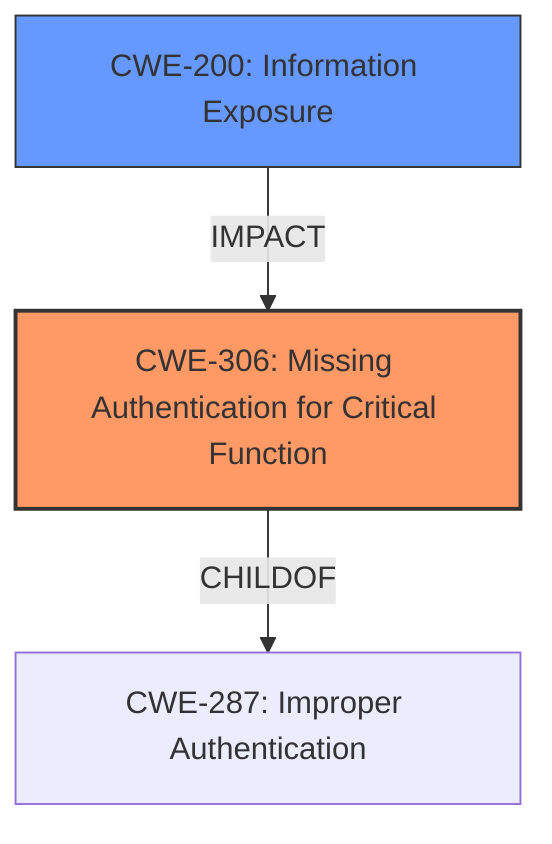

# Enhanced Analysis for CVE-2021-40654

# Summary
| CWE ID | CWE Name | Confidence | CWE Abstraction Level | CWE Vulnerability Mapping Label | CWE-Vulnerability Mapping Notes |
|---|---|---|---|---|---|
| CWE-306 | Missing Authentication for Critical Function | 0.9 | Base | Allowed | Primary CWE |
| CWE-200 | Information Exposure | 0.7 | Class | Allowed | Secondary CWE |

## Evidence and Confidence

*   **Confidence Score:** 0.8
*   **Evidence Strength:** HIGH

## Relationship Analysis
The primary relationship influencing my decision is the parent-child relationship between CWE-287 (Improper Authentication) and CWE-306 (Missing Authentication for Critical Function), where the latter is a more specific case of the former. CWE-200 (Information Exposure) is a related impact of the missing authentication.



## Vulnerability Chain
The vulnerability chain starts with the **missing authentication** (CWE-306) for the `/getcfg.php` page, leading to the **exposure of sensitive information** (CWE-200) such as usernames and passwords.

## Summary of Analysis
The initial assessment identified several potential CWEs based on the description and retriever results. However, after carefully reviewing the details, including the CVE Reference Links Content Summary, the most appropriate CWE is CWE-306 (**Missing Authentication for Critical Function**). The evidence clearly indicates that the `/getcfg.php` page, which serves a critical function (retrieving configuration data including credentials), **lacks any form of authentication**. This **allows** an attacker to forge a POST request and obtain sensitive information.

The selection of CWE-306 is based on the following evidence:

*   **Vulnerability Description Key Phrases:** No authentication.
*   **CVE Reference Links Content Summary:** "Lack of Authentication: The `/getcfg.php` page can be accessed without any prior authentication."

Additionally, the **disclosure of usernames and passwords** resulting from the missing authentication points to CWE-200 (**Information Exposure**) as a secondary weakness representing the impact.

The graph relationships support the selection of CWE-306 as the primary weakness due to its direct representation of the root cause. CWE-200 is a consequence of the missing authentication.

The selected CWEs are at the optimal level of specificity, as CWE-306 accurately describes the **lack of authentication** for a critical function, while CWE-200 captures the resulting **information exposure**.

Relevant CWE Information:

# Enhanced Context (25 CWEs)
The following CWEs were identified as potentially relevant to this vulnerability:

## CWE-41: Improper Resolution of Path Equivalence
**Abstraction Level**: Base
**Similarity Score**: 0.77
**Source**: dense

**Description**:
The product is vulnerable to file system contents disclosure through path equivalence. Path equivalence involves the use of special characters in file and directory names. The associated manipulations are intended to generate multiple names for the same object.

**Why Not Used:** This CWE is not relevant because the vulnerability does not involve path equivalence issues.

## CWE-1390: Weak Authentication
**Abstraction Level**: Class
**Similarity Score**: 0.77
**Source**: dense

**Description**:
The product uses an authentication mechanism to restrict access to specific users or identities, but the mechanism does not sufficiently prove that the claimed identity is correct.

**Why Not Used:** The vulnerability description states that there's no authentication in place, not a weak one.

## CWE-807: Reliance on Untrusted Inputs in a Security Decision
**Abstraction Level**: Base
**Similarity Score**: 0.77
**Source**: dense

**Description**:
The product uses a protection mechanism that relies on the existence or values of an input, but the input can be modified by an untrusted actor in a way that bypasses the protection mechanism.

**Why Not Used:** This CWE does not fit the vulnerability description since it does not involve a protection mechanism.

## CWE-74: Improper Neutralization of Special Elements in Output Used by a Downstream Component ('Injection')
**Abstraction Level**: Class
**Similarity Score**: 0.76
**Source**: dense

**Description**:
The product constructs all or part of a command, data structure, or record using externally-influenced input from an upstream component, but it does not neutralize or incorrectly neutralizes special elements that could modify how it is parsed or interpreted when it is sent to a downstream component.

**Why Not Used:** This CWE is not relevant as the vulnerability is not related to injection flaws.

## CWE-1391: Use of Weak Credentials
**Abstraction Level**: Class
**Similarity Score**: 0.76
**Source**: dense

**Description**:
The product uses weak credentials (such as a default key or hard-coded password) that can be calculated, derived, reused, or guessed by an attacker.

**Why Not Used:** The vulnerability description does not indicate the use of weak credentials. Instead, it is a case of missing authentication.

## CWE-639: Authorization Bypass Through User-Controlled Key
**Abstraction Level**: Base
**Similarity Score**: 0.76
**Source**: dense

**Description**:
The system's authorization functionality does not prevent one user from gaining access to another user's data or record by modifying the key value identifying the data.

**Why Not Used:** The vulnerability is not related to authorization bypass through a user-controlled key.

## CWE-303: Incorrect Implementation of Authentication Algorithm
**Abstraction Level**: Base
**Similarity Score**: 0.76
**Source**: dense

**Description**:
The requirements for the product dictate the use of an established authentication algorithm, but the implementation of the algorithm is incorrect.

**Why Not Used:** The vulnerability is not related to an incorrect implementation of authentication algorithms. There is no authentication at all.

## CWE-668: Exposure of Resource to Wrong Sphere
**Abstraction Level**: Class
**Similarity Score**: 0.76
**Source**: dense

**Description**:
The product exposes a resource to the wrong control sphere, providing unintended actors with inappropriate access to the resource.

**Why Not Used:** While there is information exposure, CWE-200 is more specific.

## CWE-184: Incomplete List of Disallowed Inputs
**Abstraction Level**: Base
**Similarity Score**: 0.76
**Source**: dense

**Description**:
The product implements a protection mechanism that relies on a list of inputs (or properties of inputs) that are not allowed by policy or otherwise require other action to neutralize before additional processing takes place, but the list is incomplete.

**Why Not Used:** This CWE is not relevant since the issue isn't related to an incomplete list of disallowed inputs.

## CWE-345: Insufficient Verification of Data Authenticity
**Abstraction Level**: Class
**Similarity Score**: 0.76
**Source**: dense

**Description**:
The product does not sufficiently verify the origin or authenticity of data, in a way that causes it to accept invalid data.

**Why Not Used:** This CWE is not relevant since the issue isn't related to verification of data authenticity.

## CWE-639: Authorization Bypass Through User-Controlled Key
**Abstraction Level**: Base
**Similarity Score**: 6735.03
**Source**: sparse

**Description**:
The system's authorization functionality does not prevent one user from gaining access to another user's data or record by modifying the key value identifying the data.

**Why Not Used:** The vulnerability is not related to authorization bypass through a user-controlled key.

## CWE-184: Incomplete List of Disallowed Inputs
**Abstraction Level**: Base
**Similarity Score**: 6645.16
**Source**: sparse

**Description**:
The product implements a protection mechanism that relies on a list of inputs (or properties of inputs) that are not allowed by policy or otherwise require other action to neutralize before additional processing takes place, but the list is incomplete.

**Why Not Used:** This CWE is not relevant since the issue isn't related to an incomplete list of disallowed inputs.

## CWE-259: Use of Hard-coded Password
**Abstraction Level**: Variant
**Similarity Score**: 6573.84
**Source**: sparse

**Description**:
The product contains a hard-coded password, which it uses for its own inbound authentication or for outbound communication to external components.

**Why Not Used:** The vulnerability is not related to the use of hard-coded passwords.

## CWE-863: Incorrect Authorization
**Abstraction Level**: Class
**Similarity Score**: 6530.20
**Source**: sparse

**Description**:
The product performs an authorization check when an actor attempts to access a resource or perform


## CWE Relationship Analysis

Current CWEs represent these abstraction levels: .


### Vulnerability Chain Analysis

**Chain starting from CWE-306:**
- 306 (Missing Authentication for Critical Function) - ROOT


**Chain starting from CWE-303:**
- 303 (Incorrect Implementation of Authentication Algorithm) - ROOT


### CWE Relationship Diagram

```mermaid
graph TD
    classDef primary fill:#f96,stroke:#333,stroke-width:2px
    classDef secondary fill:#69f,stroke:#333
    classDef tertiary fill:#9e9,stroke:#333
```