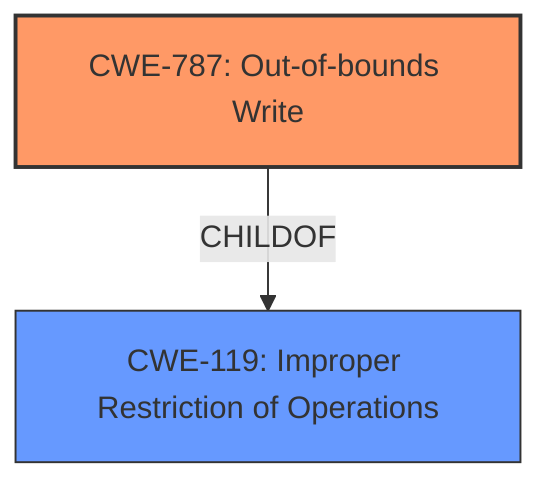

# Analysis Report for CVE-2021-40700

# Vulnerability Analysis Report: CVE-2021-40700

## Description


## Analysis (with Relationship Data)

# Summary
| CWE ID | CWE Name | Confidence | CWE Abstraction Level | CWE Vulnerability Mapping Label | CWE-Vulnerability Mapping Notes |
|---|---|---|---|---|---|
| CWE-787 | Out-of-bounds Write | 1.0 | Base | Primary | Allowed |

## Evidence and Confidence

*   **Confidence Score:** 1.0
*   **Evidence Strength:** HIGH

## Relationship Analysis
The primary relationship that impacted the decision was the ChildOf relationship between CWE-787 and CWE-119. CWE-787 is a more specific Base level CWE than CWE-119 which is a Class level CWE. The Retriever Results also list a similar CWE of CWE-788, but this is discouraged and the recommendation is to use either CWE-787 or CWE-125 depending on if it is a write or read. The evidence supports a write.



## Vulnerability Chain
The vulnerability chain starts with the **insecure handling** of a malicious TIFF file. This leads to **memory corruption** due to an out-of-bounds write (CWE-787), which then results in arbitrary code execution.

## Summary of Analysis
The analysis is based on the provided vulnerability description and the associated CVE reference links. The description clearly states that the vulnerability is due to **insecure handling** of a malicious TIFF file, leading to **memory corruption**. The CVE reference links further confirm that the root cause is "Access of Memory Location After End of Buffer (CWE-788)" and "Out-of-bounds memory access" is present.

The Retriever Results strongly suggest CWE-787 (Out-of-bounds Write) as the primary candidate, with a score of 1.0. CWE-788 (Access of Memory Location After End of Buffer) is also listed but is discouraged because the recommendation is to use CWE-787 or CWE-125 if the operation is known to be a write or read. Since the description explicitly mentions "**memory corruption**" which is a result of writing outside the boundaries of allocated memory, CWE-787 is the most appropriate choice.

The selection of CWE-787 is at the optimal level of specificity because it is a Base level CWE that accurately describes the vulnerability. The MITRE mapping guidance for CWE-787 allows its usage and states that "This CWE entry is at the Base level of abstraction, which is a preferred level of abstraction for mapping to the root causes of vulnerabilities".

The analysis concludes that CWE-787 (Out-of-bounds Write) is the best fit for this vulnerability.

Relevant CWE Information:
## CWE-787: Out-of-bounds Write
**Technical Explanation:** The vulnerability involves writing data beyond the allocated buffer's boundaries. This can overwrite adjacent memory regions, leading to unpredictable behavior, including code execution.
**Security Implications:** An attacker can overwrite critical data structures or inject malicious code into memory, potentially gaining control of the affected system.
**Parent-Child Relationships:** CWE-787 is a child of CWE-119 (Improper Restriction of Operations within the Bounds of a Memory Buffer), indicating a more specific type of buffer handling issue.
**Primary/Secondary:** This is the primary weakness.
**MITRE Mapping Guidance Influence:** The MITRE mapping guidance explicitly allows the use of CWE-787, stating that it is at the Base level of abstraction, which is preferred for mapping root causes.

## Other CWEs Considered:
*   **CWE-788 (Access of Memory Location After End of Buffer):** Although the CVE reference links mention CWE-788, the Retriever Results indicate that this CWE is discouraged. The description also says if a read or write is known, then a descendent CWE such as CWE-787 or CWE-125 should be used. Therefore, CWE-788 was not chosen.
*   **CWE-120 (Buffer Copy without Checking Size of Input ('Classic Buffer Overflow')):** This CWE was considered because it relates to buffer overflows. However, the vulnerability is not explicitly described as a buffer copy without checking size, but rather a general **memory corruption** due to **insecure handling**. Therefore, CWE-120 was not the best fit.
*   **CWE-20 (Improper Input Validation):** While **insecure handling** might suggest input validation issues, CWE-20 is a high-level class. The more specific CWE-787 is more appropriate for describing the memory corruption issue.


## CWE Relationship Analysis

Current CWEs represent these abstraction levels: .


### Vulnerability Chain Analysis

**Chain starting from CWE-787:**
- 787 (Out-of-bounds Write) - ROOT


**Chain starting from CWE-120:**
- 120 (Buffer Copy without Checking Size of Input ('Classic Buffer Overflow')) - ROOT


### CWE Relationship Diagram

```mermaid
graph TD
    classDef primary fill:#f96,stroke:#333,stroke-width:2px
    classDef secondary fill:#69f,stroke:#333
    classDef tertiary fill:#9e9,stroke:#333
```


*Report generated on 2025-04-01 18:22:49*
