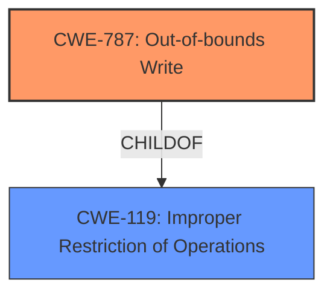

# Raw Analyzer Response for CVE-2021-40715

# Summary
| CWE ID | CWE Name | Confidence | CWE Abstraction Level | CWE Vulnerability Mapping Label | CWE-Vulnerability Mapping Notes |
|---|---|---|---|---|---|
| CWE-787 | Out-of-bounds Write | 0.8 | Base | Allowed | Primary CWE |
| CWE-119 | Improper Restriction of Operations within the Bounds of a Memory Buffer | 0.7 | Class | Allowed | Secondary Candidate |

## Evidence and Confidence

*   **Confidence Score:** 0.8
*   **Evidence Strength:** MEDIUM

## Relationship Analysis
The primary relationship influencing the CWE selection is the ChildOf relationship where CWE-787 (Out-of-bounds Write) is a child of CWE-119 (Improper Restriction of Operations within the Bounds of a Memory Buffer). This indicates a more specific form of memory corruption. The high retriever score of CWE-787 and the description of the vulnerability as memory corruption due to insecure handling support the selection of CWE-787 as the primary CWE. CWE-119 is considered due to it being a parent of CWE-787 and the primary CWE match for similar vulnerabilities.

## Vulnerability Chain
The vulnerability chain starts with the **insecure handling** of a malicious .exr file, leading to **memory corruption**, which can result in arbitrary code execution.
  - Root Cause: **Insecure Handling** of .exr file
  - Weakness: **Memory Corruption** (Out-of-bounds Write)
  - Impact: Arbitrary Code Execution

## Summary of Analysis
The initial assessment, based on the vulnerability description, points towards **memory corruption** due to **insecure handling** of a malicious .exr file. The retriever results strongly suggest CWE-787 (Out-of-bounds Write) as the most relevant CWE, with a score of 1.000 and "alternate_terms" matching the "memory corruption" weakness. The description of CWE-787 aligns well with the vulnerability, stating "The product writes data past the end, or before the beginning, of the intended buffer."

The "CWE for similar CVE Descriptions" section lists CWE-119 (Improper Restriction of Operations within the Bounds of a Memory Buffer) as the primary match. However, since the vulnerability involves writing past the buffer, CWE-787, being a more specific child of CWE-119, is a better fit. The CVE Reference Links Content Summary for CVE-2021-46816 notes CWE-788 (Access of Memory Location After End of Buffer) as the root cause, which is related to out-of-bounds access, further supporting a CWE in that category.

Therefore, the final conclusion is to assign CWE-787 (Out-of-bounds Write) as the primary CWE, representing the specific type of **memory corruption** that occurs. CWE-119 is included as a secondary candidate since it is a parent of CWE-787, and listed as the primary CWE match for similar vulnerabilities. This selection is at the optimal level of specificity, as it captures the root cause of the **memory corruption** due to writing outside the intended buffer.

Relevant CWE Information:

# Enhanced Context (25 CWEs)

## CWE-131: Incorrect Calculation of Buffer Size
**Abstraction Level**: Base
**Similarity Score**: 0.76
**Source**: dense
**Description**: The product does not correctly calculate the size to be used when allocating a buffer, which could lead to a buffer overflow.
*Reason Not Used:* While an incorrect calculation of buffer size could lead to an out-of-bounds write, the vulnerability description does not provide enough information to confirm this.

## CWE-788: Access of Memory Location After End of Buffer
**Abstraction Level**: Base
**Similarity Score**: 0.75
**Source**: dense
**Description**: The product reads or writes to a buffer using an index or pointer that references a memory location after the end of the buffer.
*Reason Not Used:* CWE-787 (Out-of-bounds Write) is more specific because the vulnerability involves writing past the buffer, making it more applicable than a general access of memory location. Also, CWE-788 is discouraged by MITRE.

## CWE-1289: Improper Validation of Unsafe Equivalence in Input
**Abstraction Level**: Base
**Similarity Score**: 0.75
**Source**: dense
**Description**: The product receives an input value that is used as a resource identifier or other type of reference, but it does not validate or incorrectly validates that the input is equivalent to a potentially-unsafe value.
*Reason Not Used:* The vulnerability doesn't focus on validating unsafe equivalence.

## CWE-125: Out-of-bounds Read
**Abstraction Level**: Base
**Similarity Score**: 0.75
**Source**: dense
**Description**: The product reads data past the end, or before the beginning, of the intended buffer.
*Reason Not Used:* The vulnerability involves writing to memory, not reading from it.

## CWE-1325: Improperly Controlled Sequential Memory Allocation
**Abstraction Level**: Base
**Similarity Score**: 0.75
**Source**: dense
**Description**: The product manages a group of objects or resources and performs a separate memory allocation for each object, but it does not properly limit the total amount of memory that is consumed by all of the combined objects.
*Reason Not Used:* The description doesn't indicate an issue with sequential memory allocation.

## CWE-789: Memory Allocation with Excessive Size Value
**Abstraction Level**: Variant
**Similarity Score**: 0.74
**Source**: dense
**Description**: The product allocates memory based on an untrusted, large size value, but it does not ensure that the size is within expected limits, allowing arbitrary amounts of memory to be allocated.
*Reason Not Used:* The description doesn't indicate an issue with memory allocation based on excessive size values.

## CWE-129: Improper Validation of Array Index
**Abstraction Level**: Variant
**Similarity Score**: 0.74
**Source**: dense
**Description**: The product uses untrusted input when calculating or using an array index, but the product does not validate or incorrectly validates the index to ensure the index references a valid position within the array.
*Reason Not Used:* The description doesn't mention the use of an array index.

## CWE-191: Integer Underflow (Wrap or Wraparound)
**Abstraction Level**: Base
**Similarity Score**: 0.74
**Source**: dense
**Description**: The product subtracts one value from another, such that the result is less than the minimum allowable integer value, which produces a value that is not equal to the correct result.
*Reason Not Used:* Integer underflow is not relevant to this vulnerability.

## CWE-674: Uncontrolled Recursion
**Abstraction Level**: Class
**Similarity Score**: 0.74
**Source**: dense
**Description**: The product does not properly control the amount of recursion that takes place, consuming excessive resources, such as allocated memory or the program stack.
*Reason Not Used:* The description doesn't indicate uncontrolled recursion.

## CWE-404: Improper Resource Shutdown or Release
**Abstraction Level**: Class
**Similarity Score**: 0.74
**Source**: dense
**Description**: The product does not release or incorrectly releases a resource before it is made available for re-use.
*Reason Not Used:* Resource shutdown or release is not relevant to this vulnerability.

## CWE-190: Integer Overflow or Wraparound
**Abstraction Level**: Base
**Similarity Score**: 6310.14
**Source**: sparse
**Description**: The product performs a calculation that can produce an integer overflow or wraparound when the logic assumes that the resulting value will always be larger than the original value.
*Reason Not Used:* Integer overflow is not mentioned or implied in the description.

## CWE-1284: Improper Validation of Specified Quantity in Input
**Abstraction Level**: Base
**Similarity Score**: 6181.01
**Source**: sparse
**Description**: The product receives input that is expected to specify a quantity (such as size or length), but it does not validate or incorrectly validates that the quantity has the required properties.
*Reason Not Used:* The description doesn't suggest improper validation of a specified quantity.

## CWE-770: Allocation of Resources Without Limits or Throttling
**Abstraction Level**: Base
**Similarity Score**: 5965.50
**Source**: sparse
**Description**: The product allocates a reusable resource or group of resources on behalf of an actor without imposing any restrictions on the size or number of resources that can be allocated, in violation of the intended security policy for that actor.
*Reason Not Used:* Resource allocation without limits is not relevant to this vulnerability.

## CWE