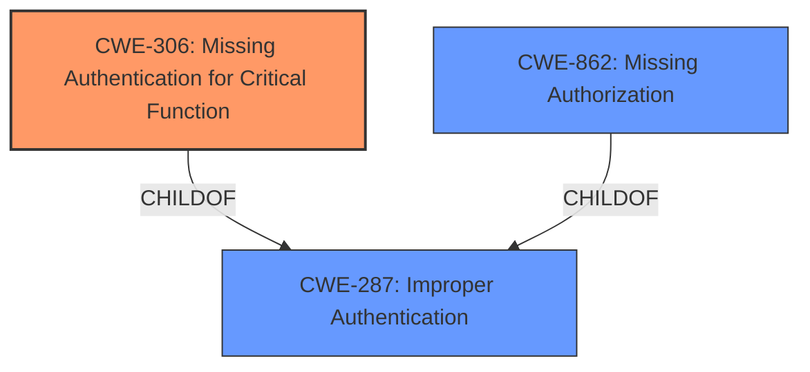

# Analysis Report for CVE-2021-4073

# Vulnerability Analysis Report: CVE-2021-4073

## Description


## Analysis (with Relationship Data)

# Summary
| CWE ID  | CWE Name  | Confidence | CWE Abstraction Level | CWE Vulnerability Mapping Label | CWE-Vulnerability Mapping Notes |
|-----------------|-----------------------------------------------------------------------|------------|-------------------------|-----------------------------------|-------------------------------------------------------------------------------------------------------------------------------------------------------------------------------------------------------------------------------------------------------------------------------------------------------------------|
| **CWE-306** | **Missing Authentication for Critical Function** | 1 | Base | Primary | Allowed. The application **does not perform any authentication** for a critical function, allowing unauthenticated users to log in as any site user. |
| CWE-862 | Missing Authorization | 0.9 | Class | Secondary | Allowed-with-Review. The application is **missing the authorization check** which leads to the vulnerability, which can be represented as a missing authorization. |
| CWE-287 | Improper Authentication | 0.8 | Class | Secondary | Discouraged. Although the issue leads to bypassing authentication, the root cause is more accurately described as a missing authentication check rather than an improper one. |

## Evidence and Confidence

*   **Confidence Score:** 1
*   **Evidence Strength:** HIGH

## Relationship Analysis
The analysis focused on the following CWE relationships:
  - CWE-306 (Missing Authentication for Critical Function) is a child of CWE-287 (Improper Authentication). CWE-306 is more specific than CWE-287 as it directly addresses the scenario where authentication is entirely missing, aligning perfectly with the vulnerability description.
  - CWE-862 (Missing Authorization) is related to CWE-306 in that both represent access control failures. However, CWE-306 focuses on the initial authentication phase, while CWE-862 typically applies to subsequent checks on resource access.
  - The abstraction levels guided the selection, preferring the Base level CWE-306 over the Class level CWE-287 when the evidence clearly supported the more specific classification.



## Vulnerability Chain
The vulnerability chain starts with the **missing authentication** in the `social_login_using_email()` function, leading to the ability for unauthenticated users to log in as any site user, including administrators.
  - **Root Cause:** **Missing Authentication** (CWE-306)
  - **Impact:** Account Takeover, Privilege Escalation

## Summary of Analysis
The initial analysis identified several potential CWEs based on the vulnerability description and retriever results. However, after a thorough review of the evidence and CWE specifications, CWE-306 (Missing Authentication for Critical Function) was determined to be the most accurate and specific classification.

The vulnerability description explicitly states "**missing identity validation**" in the `social_login_using_email()` function. The "CVE Reference Links Content Summary" further elaborates that the function "does not properly authenticate the user-supplied email address" and directly logs in the user without further verification. This directly aligns with the description of CWE-306, which states, "The product does not perform any authentication for functionality that requires a provable user identity."

The retriever results also support this conclusion, with CWE-306 being a top candidate. While other CWEs like CWE-287 (Improper Authentication) and CWE-862 (Missing Authorization) were considered, they were deemed less specific. CWE-287 is a broader category that includes cases where authentication is flawed but present, while CWE-862 focuses on authorization checks after authentication.

The decision to select CWE-306 was also influenced by the mapping guidance, which recommends using the most specific Base level CWE when possible. In this case, CWE-306 accurately captures the **missing authentication** issue, making it the optimal choice.

The confidence in this assessment is high (1.0) due to the clear and direct evidence in the vulnerability description and supporting documentation. The selection of CWE-306 is at the optimal level of specificity, accurately reflecting the root cause of the vulnerability.

Relevant CWE Information:

# Enhanced Context (25 CWEs)
The following CWEs were identified as potentially relevant to this vulnerability:

## CWE-472: External Control of Assumed-Immutable Web Parameter
**Abstraction Level**: Base
**Similarity Score**: 0.77
**Source**: dense

**Description**:
The web application does not sufficiently verify inputs that are assumed to be immutable but are actually externally controllable, such as hidden form fields.

**Mapping Guidance**:
- Usage: Allowed
- Rationale: This CWE entry is at the Base level of abstraction, which is a preferred level of abstraction for mapping to the root causes of vulnerabilities.

## CWE-80: Improper Neutralization of Script-Related HTML Tags in a Web Page (Basic XSS)
**Abstraction Level**: Variant
**Similarity Score**: 0.77
**Source**: dense

**Description**:
The product receives input from an upstream component, but it does not neutralize or incorrectly neutralizes special characters such as "<", ">", and "&" that could be interpreted as web-scripting elements when they are sent to a downstream component that processes web pages.

**Mapping Guidance**:
- Usage: Allowed
- Rationale: This CWE entry is at the Variant level of abstraction, which is a preferred level of abstraction for mapping to the root causes of vulnerabilities.

## CWE-74: Improper Neutralization of Special Elements in Output Used by a Downstream Component ('Injection')
**Abstraction Level**: Class
**Similarity Score**: 0.76
**Source**: dense

**Description**:
The product constructs all or part of a command, data structure, or record using externally-influenced input from an upstream component, but it does not neutralize or incorrectly neutralizes special elements that could modify how it is parsed or interpreted when it is sent to a downstream component.

**Mapping Guidance**:
- Usage: Discouraged
- Rationale: CWE-74 is high-level and often misused when lower-level weaknesses are more appropriate.

## CWE-116: Improper Encoding or Escaping of Output
**Abstraction Level**: Class
**Similarity Score**: 0.76
**Source**: dense

**Description**:
The product prepares a structured message for communication with another component, but encoding or escaping of the data is either missing or done incorrectly. As a result, the intended structure of the message is not preserved.

**Mapping Guidance**:
- Usage: Allowed-with-Review
- Rationale: This CWE entry is a Class and might have Base-level children that would be more appropriate

## CWE-1289: Improper Validation of Unsafe Equivalence in Input
**Abstraction Level**: Base
**Similarity Score**: 0.76
**Source**: dense

**Description**:
The product receives an input value that is used as a resource identifier or other type of reference, but it does not validate or incorrectly validates that the input is equivalent to a potentially-unsafe value.

**Mapping Guidance**:
- Usage: Allowed
- Rationale: This CWE entry is at the Base level of abstraction, which is a preferred level of abstraction for mapping to the root causes of vulnerabilities.

## CWE-639: Authorization Bypass Through User-Controlled Key
**Abstraction Level**: Base
**Similarity Score**: 0.76
**Source**: dense

**Description**:
The system's authorization functionality does not prevent one user from gaining access to another user's data or record by modifying the key value identifying the data.

**Mapping Guidance**:
- Usage: Allowed
- Rationale: This CWE entry is at the Base level of abstraction, which is a preferred level of abstraction for mapping to the root causes of vulnerabilities.

## CWE-838: Inappropriate Encoding for Output Context
**Abstraction Level**: Base
**Similarity Score**: 0.76
**Source**: dense

**Description**:
The product uses or specifies an encoding when generating output to a downstream component, but the specified encoding is not the same as the encoding that is expected by the downstream component.

**Mapping Guidance**:
- Usage: Allowed
- Rationale: This CWE entry is at the Base level of abstraction, which is a preferred level of abstraction for mapping to the root causes of vulnerabilities.

## CWE-807: Reliance on Untrusted Inputs in a Security Decision
**Abstraction Level**: Base
**Similarity Score**: 0.76
**Source**: dense

**Description**:
The product uses a protection mechanism that relies on the existence or values of an input, but the input can be modified by an untrusted actor in a way that bypasses the protection mechanism.

**Mapping Guidance**:
- Usage: Allowed
- Rationale: This CWE entry is at the Base level of abstraction, which is a preferred level of abstraction for mapping to the


## CWE Relationship Analysis

Current CWEs represent these abstraction levels: .


### Vulnerability Chain Analysis

**Chain starting from CWE-306:**
- 306 (Missing Authentication for Critical Function) - ROOT


**Chain starting from CWE-838:**
- 838 (Inappropriate Encoding for Output Context) - ROOT


### CWE Relationship Diagram

```mermaid
graph TD
    classDef primary fill:#f96,stroke:#333,stroke-width:2px
    classDef secondary fill:#69f,stroke:#333
    classDef tertiary fill:#9e9,stroke:#333
```


*Report generated on 2025-04-02 10:37:26*
