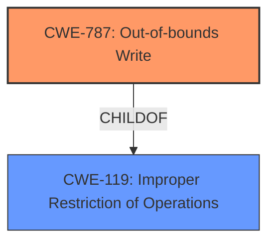

# Enhanced Analysis for CVE-2021-40733

# Summary
| CWE ID | CWE Name | Confidence | CWE Abstraction Level | CWE Vulnerability Mapping Label | CWE-Vulnerability Mapping Notes |
|---|---|---|---|---|---|
| CWE-787 | Out-of-bounds Write | 1.0 | Base | Primary | Allowed |
| CWE-119 | Improper Restriction of Operations within the Bounds of a Memory Buffer | 0.7 | Class | Secondary | Discouraged |

## Evidence and Confidence

*   **Confidence Score:** 0.9
*   **Evidence Strength:** HIGH

## Relationship Analysis
The primary CWE is CWE-787 **Out-of-bounds Write**, which is a **Base** level CWE and a child of CWE-119 **Improper Restriction of Operations within the Bounds of a Memory Buffer**. The **Vulnerability Description** notes **memory corruption** due to **insecure handling** of a .psd file, resulting in arbitrary code execution. The CVE Reference Links Content Summary confirms an "Access of Memory Location After End of Buffer (CWE-788)". However, since the retriever results also identified CWE-787 with the highest score, and the CVE summary mentioned out-of-bounds read/write, it's more appropriate to use CWE-787. CWE-119 is considered as a secondary, higher-level classification since CWE-787 is a child of CWE-119.



## Vulnerability Chain
The vulnerability chain begins with the **insecure handling** of a malicious .psd file, leading to **memory corruption** (out-of-bounds write), and culminating in arbitrary code execution.

## Summary of Analysis
The initial analysis strongly suggested CWE-787 **Out-of-bounds Write** due to the description of **memory corruption** resulting from **insecure handling** of a malicious .psd file. The CVE Reference Links Content Summary states: "Access of Memory Location After End of Buffer (CWE-788)" and "Out-of-bounds read/write, specifically accessing memory after the end of a buffer". The retriever results also ranked CWE-787 with the highest score.

The vulnerability description clearly points to **memory corruption** and arbitrary code execution, stemming from processing a malicious .psd file. The root cause is the **insecure handling** of this file, which leads to writing beyond the intended buffer.
The evidence is strong, with the vulnerability description explicitly mentioning **memory corruption** and the CVE reference links providing specifics about out-of-bounds access. CWE-787 is the most specific and appropriate classification, representing the **root cause** of the vulnerability.
CWE-787 is at the Base level of abstraction, which aligns with the goal of identifying the fundamental weakness. The MITRE mapping guidance allows the use of CWE-787.

CWE-119 **Improper Restriction of Operations within the Bounds of a Memory Buffer** was considered as a higher-level classification due to its parent relationship with CWE-787. However, due to the availability of more specific information (out-of-bounds write), CWE-787 was preferred.

Other CWEs considered but not selected:

*   CWE-788 Access of Memory Location After End of Buffer: While the CVE summary mentions this, the retriever results favor CWE-787, and CWE-788 is discouraged.
*   CWE-122 Heap-based Buffer Overflow and CWE-121 Stack-based Buffer Overflow: While these are types of buffer overflows, there isn't enough information to definitively say whether the overflow occurs on the heap or stack.
*   CWE-20 Improper Input Validation: While the **insecure handling** of the .psd file could be considered a form of input validation, it's more accurately described as an out-of-bounds write.

Relevant CWE Information:
*   CWE-787: Out-of-bounds Write - The product writes data past the end, or before the beginning, of the intended buffer.
*   CWE-119: Improper Restriction of Operations within the Bounds of a Memory Buffer - The product performs operations on a memory buffer, but it reads from or writes to a memory location outside the buffer's intended boundary. This may result in read or write operations on unexpected memory locations that could be linked to other variables, data structures, or internal program data.


## CWE Relationship Analysis

Current CWEs represent these abstraction levels: .


### Vulnerability Chain Analysis

**Chain starting from CWE-787:**
- 787 (Out-of-bounds Write) - ROOT


**Chain starting from CWE-121:**
- 121 (Stack-based Buffer Overflow) - ROOT


### CWE Relationship Diagram

```mermaid
graph TD
    classDef primary fill:#f96,stroke:#333,stroke-width:2px
    classDef secondary fill:#69f,stroke:#333
    classDef tertiary fill:#9e9,stroke:#333
```