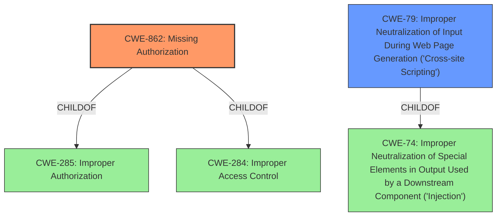

# Analysis for CVE-2021-4074

# Summary
| CWE ID | CWE Name | Confidence | CWE Abstraction Level | CWE Vulnerability Mapping Label | CWE-Vulnerability Mapping Notes |
|---|---|---|---|---|---|
| CWE-862 | Missing Authorization | 1.0 | Class | Primary | Allowed-with-Review |
| CWE-79 | Improper Neutralization of Input During Web Page Generation ('Cross-site Scripting') | 1.0 | Base | Secondary | Allowed |

## Evidence and Confidence

*   **Confidence Score:** 1.0
*   **Evidence Strength:** HIGH

## Relationship Analysis
The primary CWE is CWE-862, which is a Class-level weakness. It is a child of CWE-285 (Improper Authorization) and CWE-284 (Improper Access Control). The secondary CWE is CWE-79, which is a Base-level weakness. It is a child of CWE-74 (Improper Neutralization of Special Elements in Output Used by a Downstream Component ('Injection')). CWE-79 can precede CWE-494 (Download of Code Without Integrity Check). The selection of CWE-862 is supported by the **missing authorization checks** identified in the vulnerability description. CWE-79 is included because the **missing authorization checks** lead to a stored **cross-site scripting** vulnerability, indicating improper neutralization of input.

## Vulnerability Chain
The vulnerability chain starts with **missing authorization checks** (CWE-862), which allows low-level authenticated users to inject arbitrary web scripts via the cc_whmcs_bridge_url parameter. This leads to a stored cross-site scripting vulnerability (CWE-79), where the injected scripts are executed in the context of other users, potentially compromising their accounts or performing malicious actions on their behalf.

## Summary of Analysis
The initial analysis and resulting conclusion are based on the provided evidence, specifically the vulnerability description and key phrases. The **root cause** is the **missing authorization checks** on the cc_whmcs_bridge_add_admin function, which allows low-level authenticated users to exploit the vulnerability. This directly corresponds to CWE-862 (Missing Authorization). The resulting **weakness** is the stored **cross-site scripting** (CWE-79), which occurs because the input is not properly neutralized before being used in a web page. The graph relationships influenced the selection by highlighting the hierarchical relationships between CWE-862, CWE-285, and CWE-284, as well as the relationship between CWE-79 and CWE-74. The selected CWEs are at the optimal level of specificity, with CWE-862 being a Class-level weakness and CWE-79 being a Base-level weakness, both accurately representing the root cause and the resulting vulnerability.

Relevant CWE Information:

-   **CWE-862: Missing Authorization**: The product does not perform an authorization check when an actor attempts to access a resource or perform an action. This perfectly matches the description "**missing authorization checks** on the cc_whmcs_bridge_add_admin function".
-   **CWE-79: Improper Neutralization of Input During Web Page Generation ('Cross-site Scripting')**: The product does not neutralize or incorrectly neutralizes user-controllable input before it is placed in output that is used as a web page that is served to other users. This matches the vulnerability description where attackers can inject arbitrary web scripts, leading to a stored XSS.

CWEs considered but not used:

- CWE-284: Improper Access Control - This is a Pillar-level CWE and too high-level for this specific vulnerability. CWE-862, a child of CWE-284, is a more specific and appropriate choice.
- CWE-352: Cross-Site Request Forgery (CSRF) - There is no evidence of CSRF in the vulnerability description. The issue is related to **missing authorization checks** and stored **cross-site scripting**.
- CWE-116: Improper Encoding or Escaping of Output - While related to XSS, CWE-79 is a more direct and specific match for the stored **cross-site scripting** vulnerability.
- CWE-96: Improper Neutralization of Directives in Statically Saved Code ('Static Code Injection') - This CWE is not applicable as the code is not being injected into statically saved code. The XSS is occurring due to improper handling of input in web page generation.
- CWE-471: Modification of Assumed-Immutable Data (MAID) - This CWE is not applicable as there is no mention of modification of assumed-immutable data.
- CWE-138: Improper Neutralization of Special Elements - This CWE is a Class and less specific than CWE-79, which directly addresses XSS.
- CWE-434: Unrestricted Upload of File with Dangerous Type - This CWE is not applicable as there is no file upload involved in the vulnerability.
- CWE-285: Improper Authorization - Similar to CWE-284, this is a Class-level CWE, and CWE-862 provides a more specific classification.