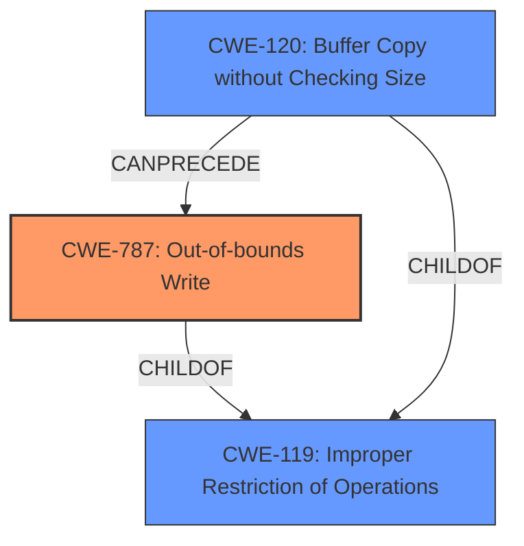

# Raw Analyzer Response for CVE-2021-40751

# Summary
| CWE ID | CWE Name | Confidence | CWE Abstraction Level | CWE Vulnerability Mapping Label | CWE-Vulnerability Mapping Notes |
|---|---|---|---|---|---|
| CWE-787 | Out-of-bounds Write | 1.0 | Base | Allowed | Primary CWE |
| CWE-119 | Improper Restriction of Operations within the Bounds of a Memory Buffer | 0.7 | Class | Discouraged | Secondary Candidate |
| CWE-120 | Buffer Copy without Checking Size of Input ('Classic Buffer Overflow') | 0.6 | Base | Allowed-with-Review | Secondary Candidate |

## Evidence and Confidence

*   **Confidence Score:** 0.9
*   **Evidence Strength:** HIGH

## Relationship Analysis
The primary CWE is CWE-787, which is a base-level CWE describing an out-of-bounds write. This is a child of the class-level CWE-119, which describes improper restriction of operations within the bounds of a memory buffer. CWE-120 (Buffer Copy without Checking Size of Input) can precede CWE-787. The decision to select CWE-787 was based on the explicit mention of memory corruption and **insecure handling** of a file leading to arbitrary code execution, coupled with the CVE Reference Links Content Summary indicating an out-of-bounds write. The base level of abstraction for CWE-787 makes it more specific than the class-level CWE-119.

## Vulnerability Chain
The vulnerability chain starts with the **insecure handling** of a malicious .m4a file (root cause), leading to **memory corruption** due to an out-of-bounds write (CWE-787), which results in arbitrary code execution.

## Summary of Analysis
Initially, CWE-119 seemed like a good fit, as it was the primary CWE match for similar CVE descriptions. However, the CVE Reference Links Content Summary explicitly states an "Access of memory location after end of buffer" and "Out-of-bounds read (CWE-788)," and the vulnerability description mentions "memory corruption" due to **insecure handling** of a malicious file. Given this information, along with "Top CWEs" result listing CWE-787 (Count: 12), I opted for CWE-787. While the content summary lists out-of-bounds read (CWE-788), the description states **memory corruption**, which is typically caused by out-of-bounds writes.

The evidence from the vulnerability description includes: "Adobe After Effects version 18.4 (and earlier) is affected by a **memory corruption** vulnerability due to **insecure handling** of a malicious .m4a file, potentially resulting in arbitrary code execution in the context of the current user."
The "CVE Reference Links Content Summary" section supports this by stating the "Root cause of vulnerability: Access of memory location after end of buffer."

CWE-787 is at the Base level of abstraction, providing more specificity than CWE-119, which is a Class. This aligns with best practices to select the most specific CWE.

CWE-120 was considered because it is related to buffer overflows, and it can precede CWE-787. However, the description doesn't explicitly state a buffer copy operation without checking the size, so it was not selected as the primary CWE.

Relevant CWE Information:
* CWE-787 (**CWE-787: Out-of-bounds Write**): The product writes data past the end, or before the beginning, of the intended buffer. This aligns with the **memory corruption** due to **insecure handling** of the .m4a file.
* CWE-119 (**CWE-119: Improper Restriction of Operations within the Bounds of a Memory Buffer**): The product performs operations on a memory buffer, but it reads from or writes to a memory location outside the buffer's intended boundary. This is a more general case of what is happening, but not as specific as CWE-787.
* CWE-120 (**CWE-120: Buffer Copy without Checking Size of Input ('Classic Buffer Overflow')**): Buffer Copy without Checking Size of Input ('Classic Buffer Overflow'). Not selected as there isn't evidence of a buffer copy operation.