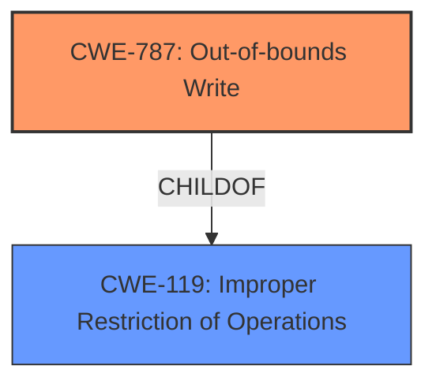

# Raw Analyzer Response for CVE-2021-40753

# Summary
| CWE ID  | CWE Name                       | Confidence | CWE Abstraction Level | CWE Vulnerability Mapping Label | CWE-Vulnerability Mapping Notes |
|---------|--------------------------------|------------|-----------------------|---------------------------------|-----------------------------------|
| CWE-787 | Out-of-bounds Write            | 0.9       | Base                  | Primary CWE                     | Allowed                           |
| CWE-119 | Improper Restriction of Operations within the Bounds of a Memory Buffer | 0.7       | Class                  | Secondary Candidate               | Discouraged                       |

## Evidence and Confidence

*   **Confidence Score:** 0.9
*   **Evidence Strength:** HIGH

## Relationship Analysis
The primary CWE, CWE-787, is a child of the class-level CWE-119. This parent-child relationship indicates that CWE-787 provides a more specific description of the vulnerability, focusing on the out-of-bounds write condition, which is a common type of memory corruption. The retriever results also suggest CWE-787 as the best match. Therefore, selecting CWE-787 is optimal due to its specificity.

## Vulnerability Chain
The vulnerability chain begins with the **insecure handling** of a malicious SVG file, leading to **memory corruption** due to an out-of-bounds write (CWE-787). This ultimately results in arbitrary code execution.

## Summary of Analysis
The initial analysis focused on identifying the root cause and the type of memory corruption. The vulnerability description clearly states that the "**insecure handling** of a malicious SVG file" results in "**memory corruption**". The CVE Reference Links Content Summary confirms this by stating "Access of Memory Location After End of Buffer" as the root cause and "Out-of-bounds read (CWE-788)" as the weakness. However, the retriever results suggest CWE-787 (Out-of-bounds Write) as the best match. Given that the vulnerability leads to arbitrary code execution, it's more likely that an out-of-bounds write is occurring rather than just a read. Therefore, the final decision is to classify this vulnerability as CWE-787 (Out-of-bounds Write).

Relevant CWE Information:

# Enhanced Context (25 CWEs)

## CWE-1289: Improper Validation of Unsafe Equivalence in Input
**Abstraction Level**: Base
**Similarity Score**: 0.77
**Source**: dense

**Description**:
The product receives an input value that is used as a resource identifier or other type of reference, but it does not validate or incorrectly validates that the input is equivalent to a potentially-unsafe value.
**REJECTED:** While the vulnerability involves handling an SVG file, the core issue isn't about validating equivalence but rather about memory corruption due to improper handling.

## CWE-73: External Control of File Name or Path
**Abstraction Level**: Base
**Similarity Score**: 0.76
**Source**: dense

**Description**:
The product allows user input to control or influence paths or file names that are used in filesystem operations.
**REJECTED:** This is not a path traversal issue; the vulnerability stems from the file's content causing memory corruption, not the file's path.

## CWE-41: Improper Resolution of Path Equivalence
**Abstraction Level**: Base
**Similarity Score**: 0.75
**Source**: dense

**Description**:
The product is vulnerable to file system contents disclosure through path equivalence. Path equivalence involves the use of special characters in file and directory names. The associated manipulations are intended to generate multiple names for the same object.
**REJECTED:** Similar to CWE-73, this is not about path equivalence but about the contents of the SVG file.

## CWE-59: Improper Link Resolution Before File Access ('Link Following')
**Abstraction Level**: Base
**Similarity Score**: 0.75
**Source**: dense

**Description**:
The product attempts to access a file based on the filename, but it does not properly prevent that filename from identifying a link or shortcut that resolves to an unintended resource.
**REJECTED:** This is not about link resolution; the vulnerability lies in how the file's content is processed, leading to memory corruption.

## CWE-379: Creation of Temporary File in Directory with Insecure Permissions
**Abstraction Level**: Base
**Similarity Score**: 0.75
**Source**: dense

**Description**:
The product creates a temporary file in a directory whose permissions allow unintended actors to determine the file's existence or otherwise access that file.
**REJECTED:** This is not related to temporary file creation or insecure permissions.

## CWE-184: Incomplete List of Disallowed Inputs
**Abstraction Level**: Base
**Similarity Score**: 0.75
**Source**: dense

**Description**:
The product implements a protection mechanism that relies on a list of inputs (or properties of inputs) that are not allowed by policy or otherwise require other action to neutralize before additional processing takes place, but the list is incomplete.
**REJECTED:** While SVG files have disallowed inputs, the core issue is not about an incomplete list but about improper memory handling when processing the file.

## CWE-552: Files or Directories Accessible to External Parties
**Abstraction Level**: Base
**Similarity Score**: 0.75
**Source**: dense

**Description**:
The product makes files or directories accessible to unauthorized actors, even though they should not be.
**REJECTED:** This vulnerability is not about unauthorized access to files or directories.

## CWE-665: Improper Initialization
**Abstraction Level**: Class
**Similarity Score**: 0.75
**Source**: dense

**Description**:
The product does not initialize or incorrectly initializes a resource, which might leave the resource in an unexpected state when it is accessed or used.
**REJECTED:** Although improper initialization could lead to memory corruption, the description more directly points to an out-of-bounds write caused by **insecure handling** of the SVG file.

## CWE-538: Insertion of Sensitive Information into Externally-Accessible File or Directory
**Abstraction Level**: Base
**Similarity Score**: 0.75
**Source**: dense

**Description**:
The product places sensitive information into files or directories that are accessible to actors who are allowed to have access to the files, but not to the sensitive information.
**REJECTED:** This is not about inserting sensitive information.

## CWE-378: Creation of Temporary File With Insecure Permissions
**Abstraction Level**: Base
**Similarity Score**: 0.75
**Source**: dense

**Description**:
Opening temporary files without appropriate measures or controls can leave the file, its contents and any function that it impacts vulnerable to attack.
**REJECTED:** Not related to temporary files.

## CWE-190: Integer Overflow or Wraparound
**Abstraction Level**: Base
**Similarity Score**: 5833.83
**Source**: sparse

**Description**:
The product performs a calculation that can
         produce an integer overflow or wraparound when the logic
         assumes that the resulting value will always be larger than
         the original value. This occurs when an integer value is
         incremented to a value that is too large to store in the
         associated representation. When this occurs, the value may
**REJECTED:** Integer overflow is possible but there is no evidence to support it.

## CWE-125: Out-of-bounds Read
**Abstraction Level**: Base
**Similarity Score**: 5778.19
**Source**: sparse

**Description**:
The product reads data past the end, or before the beginning, of the intended buffer.
**REJECTED:** The CVE Reference Links Content Summary lists an out-of-bounds read (CWE-788), however the overall vulnerability is an out-of-bounds write.

## CWE-1284: Improper Validation of Specified Quantity in Input
**Abstraction Level**: Base
**Similarity Score**: 5670.44
**Source**: sparse

**Description**:
The product receives input that is expected to specify a quantity (such as size or length), but it does not validate or incorrectly validates that the quantity has the required properties.
**REJECTED:** No evidence of improper validation of quantity in input.

## CWE-119: Improper Restriction of Operations within the Bounds of a Memory Buffer
**Abstraction Level**: Class
**Similarity Score**: 5470.24
**Source**: sparse

**Description**:
The product performs operations on a memory buffer, but it reads from or writes to a memory location outside the buffer's intended boundary. This may result in read or write operations on unexpected memory locations that could be linked to other variables, data structures, or internal program data.
**ACCEPTED as Secondary:** This is a higher-level class that encompasses the more specific CWE-7