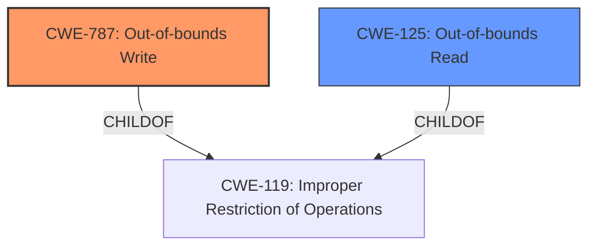

# Raw Analyzer Response for CVE-2021-40755

# Summary
| CWE ID | CWE Name | Confidence | CWE Abstraction Level | CWE Vulnerability Mapping Label | CWE-Vulnerability Mapping Notes |
|---|---|---|---|---|---|
| CWE-787 | Out-of-bounds Write | 1.0 | Base | Primary | Allowed |
| CWE-125 | Out-of-bounds Read | 0.7 | Base | Secondary | Allowed |

## Evidence and Confidence

*   **Confidence Score:** 0.9
*   **Evidence Strength:** HIGH

## Relationship Analysis
The primary weakness, **CWE-787 (Out-of-bounds Write)**, is a **Base** level CWE. It is directly related to **CWE-119 (Improper Restriction of Operations within the Bounds of a Memory Buffer)** as a ChildOf. The vulnerability description indicates **memory corruption** due to **insecure handling** of a malicious file, suggesting that data is being written outside the intended buffer. The secondary weakness, **CWE-125 (Out-of-bounds Read)**, is also a **Base** level CWE and a sibling to **CWE-787**. The CVE Reference Links Content Summary also mentions "Out-of-bounds read vulnerability caused by accessing memory locations beyond the allocated buffer." Both **CWE-787** and **CWE-125** are children of **CWE-119**, which is a more general Class-level CWE. Choosing the base-level CWEs gives us a higher degree of detail.

## Vulnerability Chain
The vulnerability chain starts with the **insecure handling** of a malicious SGI file. This leads to **memory corruption** due to an **out-of-bounds write (CWE-787)**, which could also involve an **out-of-bounds read (CWE-125)**. The impact is arbitrary code execution.

## Summary of Analysis
The initial assessment identified **CWE-787 (Out-of-bounds Write)** as the primary weakness due to the **memory corruption** resulting from **insecure handling** of a malicious SGI file. The CVE Reference Links Content Summary also mentions "Access of memory location after end of buffer". The retriever results also listed **CWE-787** as the top candidate. **CWE-125 (Out-of-bounds Read)** was considered as a secondary weakness due to the CVE Reference Links Content Summary mentioning "Out-of-bounds read vulnerability caused by accessing memory locations beyond the allocated buffer.".

The evidence provided in the vulnerability description supports the selection of **CWE-787** as the primary CWE. The description states "**memory corruption** vulnerability due to **insecure handling** of a malicious SGI file in the DoReadContinue function." The retriever results and relationship analysis reinforced this selection, ensuring the chosen CWE is at the optimal level of specificity. The evidence also mentions that "Out-of-bounds read vulnerability caused by accessing memory locations beyond the allocated buffer.", which supports the secondary weakness of **CWE-125**.

# Relevant CWE Information:

## Vulnerability Description

Adobe After Effects version 18.4.1 (and earlier) is affected by a **memory corruption** vulnerability due to **insecure handling** of a malicious SGI file in the DoReadContinue function, potentially resulting in arbitrary code execution in the context of the current user. User interaction is required to exploit this vulnerability.

### Vulnerability Description Key Phrases

*   **rootcause:** **insecure handling**
*   **weakness:** **memory corruption**
*   **impact:** arbitrary code execution
*   **vector:** malicious SGI file
*   **product:** Adobe After Effects
*   **version:** 18.4.1 (and earlier)
*   **component:** DoReadContinue function

## CVE Reference Links Content Summary

Based on the provided document, here's the information regarding CVE-2021-40755:

**Root Cause of Vulnerability:**

*   Access of memory location after end of buffer. (CWE-788)

**Weaknesses/Vulnerabilities Present:**

*   Out-of-bounds read vulnerability caused by accessing memory locations beyond the allocated buffer.

**Impact of Exploitation:**

*   Arbitrary code execution. Successful exploitation could allow an attacker to execute code of their choice within the context of the current user.

**Attack Vectors:**

*   Local (AV:L): The attack requires local access to the system.
*   User Interaction (UI:R): The attack requires user interaction.

**Required Attacker Capabilities/Position:**

*   The attacker needs to have local access to the system.
*   The attacker requires the user to open a malicious file or perform a specific action to trigger the vulnerability.

## Retriever Results

### Top Combined Results

| Rank | CWE ID | Name | Abstraction | Usage | Retrievers | Individual Scores |
|---|---|---|---|---|---|---|
| 1 | 787 | Out-of-bounds Write | Base | Allowed | alternate_terms | 1.000 |
| 2 | 788 | Access of Memory Location After End of Buffer | Base | Discouraged | sparse | 0.504 |
| 3 | 665 | Improper Initialization | Class | Discouraged | sparse | 0.332 |
| 4 | 122 | Heap-based Buffer Overflow | Variant | Allowed | sparse | 0.330 |
| 5 | 379 | Creation of Temporary File in Directory with Insecure Permissions | Base | Allowed | sparse | 0.315 |
| 6 | 125 | Out-of-bounds Read | Base | Allowed | dense | 0.493 |
| 7 | 123 | Write-what-where Condition | Base | Allowed | graph | 0.003 |
| 8 | 457 | Use of Uninitialized Variable | Variant | Allowed | sparse | 0.312 |
| 9 | 20 | Improper Input Validation | Class | Discouraged | sparse | 0.311 |
| 10 | 755 | Improper Handling of Exceptional Conditions | Class | Discouraged | sparse | 0.311 |

## CWE Analysis

### CWE-787: Out-of-bounds Write

*   **Explanation:** The vulnerability involves writing data past the end or before the beginning of the intended buffer. The description explicitly mentions "**memory corruption**," which aligns with the consequences of an out-of-bounds write.
*   **Security Implications:** This can lead to arbitrary code execution, as the attacker can overwrite critical data or code in memory.
*   **Relationship:** **CWE-787** is a Base level CWE and a ChildOf **CWE-119**.
*   **Mapping Guidance:** The Usage is ALLOWED, and the Rationale states that it is at the Base level of abstraction, which is preferred.
*   **Relevance:** The vulnerability description uses "**memory corruption**" due to "**insecure handling**" which are closely related to the **CWE-787** description and alternative terms.
*   **Confidence:** 1.0

### CWE-125: Out-of-bounds Read

*   **Explanation:** The product reads data past the end, or before the beginning, of the intended buffer. The CVE Reference Links Content Summary states "Out-of-bounds read vulnerability caused by accessing memory locations beyond the allocated buffer.".
*   **Security Implications:** This can lead to information disclosure or denial of service.
*   **Relationship:** **CWE-125** is a Base level CWE and a ChildOf **CWE-119**.
*   **Mapping Guidance:** The Usage is ALLOWED, and the Rationale states that it is at the Base level of abstraction, which is preferred.
*   **Relevance:** The CVE Reference Links Content Summary uses "Out-of-bounds read vulnerability".
*   **Confidence:** 0.7

### Considered but Not Used:

*   **CWE-788 (Access of Memory Location After End of Buffer):** This was listed as the Root Cause of Vulnerability. However, the Mapping Guidance is **Discouraged**. It suggests that if the "Access" operation is known to be a read or a write, then investigate children of entries such as **CWE-787** and **CWE-125**.
*   **CWE-665 (Improper Initialization):** The vulnerability description does not explicitly mention issues related to improper initialization.