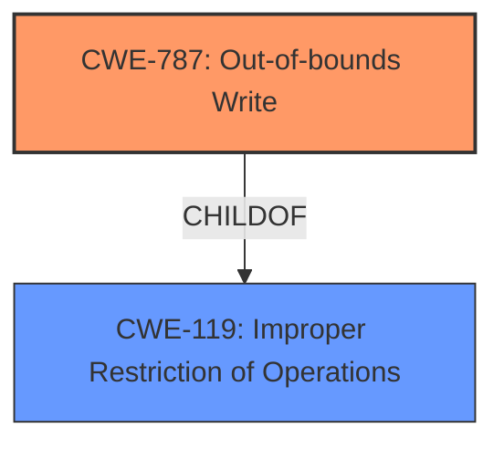

# Analysis Report for CVE-2021-40760

# Vulnerability Analysis Report: CVE-2021-40760

## Description


## Analysis (with Relationship Data)

# Summary
| CWE ID | CWE Name | Confidence | CWE Abstraction Level | CWE Vulnerability Mapping Label | CWE-Vulnerability Mapping Notes |
|---|---|---|---|---|---|
| CWE-787 | Out-of-bounds Write | 0.9 | Base | Allowed | Primary CWE |
| CWE-119 | Improper Restriction of Operations within the Bounds of a Memory Buffer | 0.6 | Class | Discouraged | Secondary CWE |

## Evidence and Confidence

*   **Confidence Score:** 0.9
*   **Evidence Strength:** HIGH

## Relationship Analysis
The primary CWE identified is CWE-787, which is a base-level CWE. It is a child of CWE-119, which indicates a broader class of memory corruption issues. The relationship between CWE-787 and CWE-119 reflects a hierarchical structure where CWE-787 represents a more specific type of memory corruption than its parent. The analysis focused on identifying the root cause and selecting the most specific CWE.



## Vulnerability Chain
The vulnerability chain starts with **insecure handling** of a malicious .m4a file, leading to **memory corruption**, specifically an out-of-bounds write (CWE-787). This results in arbitrary code execution.
  - Insecure Handling -> Memory Corruption (CWE-787) -> Arbitrary Code Execution

## Summary of Analysis
The initial analysis focused on the provided information and the retriever results to find the most appropriate CWE. The description clearly points to **memory corruption** due to **insecure handling** of a malicious file, leading to arbitrary code execution. The CVE Reference Links Content Summary mentions "Access of memory location after end of buffer" and "Out-of-bounds read". The primary CWE match from similar CVE descriptions is CWE-119, with CWE-787 also being a top contender.

The retriever results list CWE-787 (Out-of-bounds Write) as the top combined result. Given the "Access of memory location after end of buffer" and "Out-of-bounds read" from CVE Reference Links Content Summary, CWE-787 is a strong candidate.

CWE-787 is selected as the primary CWE because it accurately describes the **memory corruption** resulting from writing data past the end of a buffer. The **root cause** is the **insecure handling** of the file, but the direct result is the out-of-bounds write.

CWE-119 (Improper Restriction of Operations within the Bounds of a Memory Buffer) is considered a secondary CWE because it is a broader class that encompasses CWE-787.

The final decision is based on the evidence, relationship analysis, and mapping guidance, resulting in a primary mapping to CWE-787 and a secondary mapping to CWE-119.

Relevant CWE Information:

# Enhanced Context (25 CWEs)
The following CWEs were identified as potentially relevant to this vulnerability:

## CWE-1289: Improper Validation of Unsafe Equivalence in Input
**Abstraction Level**: Base
**Similarity Score**: 0.76
**Source**: dense

**Description**:
The product receives an input value that is used as a resource identifier or other type of reference, but it does not validate or incorrectly validates that the input is equivalent to a potentially-unsafe value.
**NOT USED:** This doesn't fit, as there's no mention of resource identifiers or equivalence checks.

## CWE-73: External Control of File Name or Path
**Abstraction Level**: Base
**Similarity Score**: 0.75
**Source**: dense

**Description**:
The product allows user input to control or influence paths or file names that are used in filesystem operations.
**NOT USED:** While the vulnerability involves a file, it's not about path manipulation.

## CWE-41: Improper Resolution of Path Equivalence
**Abstraction Level**: Base
**Similarity Score**: 0.75
**Source**: dense

**Description**:
The product is vulnerable to file system contents disclosure through path equivalence. Path equivalence involves the use of special characters in file and directory names. The associated manipulations are intended to generate multiple names for the same object.
**NOT USED:** This is not related to path equivalence or file system disclosure.

## CWE-378: Creation of Temporary File With Insecure Permissions
**Abstraction Level**: Base
**Similarity Score**: 0.75
**Source**: dense

**Description**:
Opening temporary files without appropriate measures or controls can leave the file, its contents and any function that it impacts vulnerable to attack.
**NOT USED:** No evidence of temporary files being created.

## CWE-379: Creation of Temporary File in Directory with Insecure Permissions
**Abstraction Level**: Base
**Similarity Score**: 0.75
**Source**: dense

**Description**:
The product creates a temporary file in a directory whose permissions allow unintended actors to determine the file's existence or otherwise access that file.
**NOT USED:** No evidence of temporary files being created.

## CWE-404: Improper Resource Shutdown or Release
**Abstraction Level**: Class
**Similarity Score**: 0.75
**Source**: dense

**Description**:
The product does not release or incorrectly releases a resource before it is made available for re-use.
**NOT USED:** Not related to resource shutdown or release.

## CWE-665: Improper Initialization
**Abstraction Level**: Class
**Similarity Score**: 0.74
**Source**: dense

**Description**:
The product does not initialize or incorrectly initializes a resource, which might leave the resource in an unexpected state when it is accessed or used.
**NOT USED:** The vulnerability isn't about improper initialization.

## CWE-667: Improper Locking
**Abstraction Level**: Class
**Similarity Score**: 0.74
**Source**: dense

**Description**:
The product does not properly acquire or release a lock on a resource, leading to unexpected resource state changes and behaviors.
**NOT USED:** This is not related to locking mechanisms.

## CWE-59: Improper Link Resolution Before File Access ('Link Following')
**Abstraction Level**: Base
**Similarity Score**: 0.74
**Source**: dense

**Description**:
The product attempts to access a file based on the filename, but it does not properly prevent that filename from identifying a link or shortcut that resolves to an unintended resource.
**NOT USED:** Not related to link resolution.

## CWE-552: Files or Directories Accessible to External Parties
**Abstraction Level**: Base
**Similarity Score**: 0.74
**Source**: dense

**Description**:
The product makes files or directories accessible to unauthorized actors, even though they should not be.
**NOT USED:** This vulnerability doesn't involve unauthorized access to files or directories.

## CWE-190: Integer Overflow or Wraparound
**Abstraction Level**: Base
**Similarity Score**: 5919.26
**Source**: sparse

**Description**:
The product performs a calculation that can
         produce an integer overflow or wraparound when the logic
         assumes that the resulting value will always be larger than
         the original value. This occurs when an integer value is
         incremented to a value that is too large to store in the
         associated representation. When this occurs, the value may
         become a very small or negative number.
**NOT USED:** No evidence of integer overflows.

## CWE-125: Out-of-bounds Read
**Abstraction Level**: Base
**Similarity Score**: 5812.50
**Source**: sparse

**Description**:
The product reads data past the end, or before the beginning, of the intended buffer.
**NOT USED:** The description focuses on writing out of bounds, not reading.

## CWE-1284: Improper Validation of Specified Quantity in Input
**Abstraction Level**: Base
**Similarity Score**: 5705.60
**Source**: sparse

**Description**:
The product receives input that is expected to specify a quantity (such as size or length), but it does not validate or incorrectly validates that the quantity has the required properties.
**NOT USED:** No evidence of quantity validation issues.

## CWE-119: Improper Restriction of Operations within the Bounds of a Memory Buffer
**Abstraction Level**: Class
**Similarity Score**: 5561.58
**Source**: sparse

**Description**:
The product performs operations on a memory buffer, but it reads from or writes to a memory location outside the buffer's intended boundary. This may result in read or write operations on unexpected memory locations that could be linked to other variables, data structures, or internal program data.
**CONSIDERED:** This is a parent of CWE-787 and is a general class for memory boundary issues. Used as secondary.


## CWE Relationship Analysis

Current CWEs represent these abstraction levels: .


### Vulnerability Chain Analysis

**Chain starting from CWE-667:**
- 667 (Improper Locking) - ROOT


**Chain starting from CWE-787:**
- 787 (Out-of-bounds Write) - ROOT


### CWE Relationship Diagram

```mermaid
graph TD
    classDef primary fill:#f96,stroke:#333,stroke-width:2px
    classDef secondary fill:#69f,stroke:#333
    classDef tertiary fill:#9e9,stroke:#333
```


*Report generated on 2025-04-02 05:24:04*
