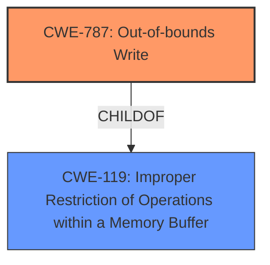

# Raw Analyzer Response for CVE-2021-40770

# Summary
| CWE ID | CWE Name | Confidence | CWE Abstraction Level | CWE Vulnerability Mapping Label | CWE-Vulnerability Mapping Notes |
|---|---|---|---|---|---|
| CWE-787 | Out-of-bounds Write | 1.0 | Base | Allowed | Primary CWE |
| CWE-119 | Improper Restriction of Operations within a Memory Buffer | 0.7 | Class | Allowed-with-Review | Secondary CWE |

## Evidence and Confidence

*   **Confidence Score:** 0.9
*   **Evidence Strength:** HIGH

## Relationship Analysis
The primary CWE is CWE-787, which is a base-level CWE and a child of CWE-119. CWE-119 is a class-level CWE and represents a broader category of memory buffer errors. The choice of CWE-787 is based on the specific detail that the vulnerability involves writing outside the intended buffer, which is a more precise description than simply stating there's an improper restriction of operations (CWE-119).

## Vulnerability Chain
The vulnerability chain begins with the **insecure handling** of a malicious M4A file, leading to **memory corruption** due to an out-of-bounds write, and culminating in arbitrary code execution.

## Summary of Analysis
The initial assessment, supported by the vulnerability description and the CVE reference link content summary, points to a memory corruption issue. The root cause is the **insecure handling** of a malicious M4A file, resulting in an out-of-bounds write.

The evidence from the "Vulnerability Description" includes the key phrases: "**insecure handling**" and "**memory corruption**." The "CVE Reference Links Content Summary" explicitly states "Out-of-bounds write, leading to memory corruption." This evidence supports the selection of CWE-787.

The retriever results also strongly suggest CWE-787 as the primary candidate. While CWE-119 is also relevant as a parent class, the specificity of CWE-787 makes it the better choice. The other candidates like CWE-457, CWE-122, and CWE-665, although present in the retriever results, do not accurately represent the specific flaw of writing outside buffer boundaries.

The selection of CWE-787 aligns with the mapping guidance, as it is a base-level CWE, and the description precisely matches the vulnerability's characteristics. CWE-119 serves as a broader classification, acknowledging the general category of memory buffer errors.

Relevant CWE Information:

# Enhanced Context (25 CWEs)
The following CWEs were identified as potentially relevant to this vulnerability:

## CWE-1289: Improper Validation of Unsafe Equivalence in Input
**Abstraction Level**: Base
**Similarity Score**: 0.78
**Source**: dense

**Description**:
The product receives an input value that is used as a resource identifier or other type of reference, but it does not validate or incorrectly validates that the input is equivalent to a potentially-unsafe value.

**Mapping Guidance**:
- Usage: Allowed
- Rationale: This CWE entry is at the Base level of abstraction, which is a preferred level of abstraction for mapping to the root causes of vulnerabilities.

**Why Not Used**: This CWE is about validation of equivalence in input, which isn't explicitly stated in the vulnerability description. The core issue is memory corruption due to handling a malicious file, not necessarily about validating the equivalence of input.

## CWE-280: Improper Handling of Insufficient Permissions or Privileges
**Abstraction Level**: Base
**Similarity Score**: 0.77
**Source**: dense

**Description**:
The product does not handle or incorrectly handles when it has insufficient privileges to access resources or functionality as specified by their permissions. This may cause it to follow unexpected code paths that may leave the product in an invalid state.

**Mapping Guidance**:
- Usage: Allowed
- Rationale: This CWE entry is at the Base level of abstraction, which is a preferred level of abstraction for mapping to the root causes of vulnerabilities.

**Why Not Used**: This CWE relates to handling insufficient permissions. The vulnerability isn't primarily about permission issues, but about memory corruption from **insecure handling** of a file.

## CWE-274: Improper Handling of Insufficient Privileges
**Abstraction Level**: Base
**Similarity Score**: 0.77
**Source**: dense

**Description**:
The product does not handle or incorrectly handles when it has insufficient privileges to perform an operation, leading to resultant weaknesses.

**Mapping Guidance**:
- Usage: Discouraged
- Rationale: This CWE entry could be deprecated in a future version of CWE.

**Why Not Used**: Similar to CWE-280, this focuses on privilege handling, which is not the central issue in the described vulnerability.

## CWE-404: Improper Resource Shutdown or Release
**Abstraction Level**: Class
**Similarity Score**: 0.77
**Source**: dense

**Description**:
The product does not release or incorrectly releases a resource before it is made available for re-use.

**Mapping Guidance**:
- Usage: Allowed-with-Review
- Rationale: This CWE entry is a Class and might have Base-level children that would be more appropriate

**Why Not Used**: This is about resource release, whereas the vulnerability stems from **insecure handling** of file data leading to memory corruption.

## CWE-266: Incorrect Privilege Assignment
**Abstraction Level**: Base
**Similarity Score**: 0.77
**Source**: dense

**Description**:
A product incorrectly assigns a privilege to a particular actor, creating an unintended sphere of control for that actor.

**Mapping Guidance**:
- Usage: Allowed
- Rationale: This CWE entry is at the Base level of abstraction, which is a preferred level of abstraction for mapping to the root causes of vulnerabilities.

**Why Not Used**: The vulnerability is not directly related to incorrect privilege assignments but to **insecure handling** of file content.

## CWE-807: Reliance on Untrusted Inputs in a Security Decision
**Abstraction Level**: Base
**Similarity Score**: 0.77
**Source**: dense

**Description**:
The product uses a protection mechanism that relies on the existence or values of an input, but the input can be modified by an untrusted actor in a way that bypasses the protection mechanism.

**Mapping Guidance**:
- Usage: Allowed
- Rationale: This CWE entry is at the Base level of abstraction, which is a preferred level of abstraction for mapping to the root causes of vulnerabilities.

**Why Not Used**: While the vulnerability involves untrusted input (the M4A file), the core issue is memory corruption due to **insecure handling**, not primarily a flawed security decision based on that input.

## CWE-667: Improper Locking
**Abstraction Level**: Class
**Similarity Score**: 0.77
**Source**: dense

**Description**:
The product does not properly acquire or release a lock on a resource, leading to unexpected resource state changes and behaviors.

**Mapping Guidance**:
- Usage: Allowed-with-Review
- Rationale: This CWE entry is a Class and might have Base-level children that would be more appropriate

**Why Not Used**: Locking is not mentioned or implied in the vulnerability description. The issue is related to how the M4A file is processed, not synchronization mechanisms.

## CWE-183: Permissive List of Allowed Inputs
**Abstraction Level**: Base
**Similarity Score**: 0.76
**Source**: dense

**Description**:
The product implements a protection mechanism that relies on a list of inputs (or properties of inputs) that are explicitly allowed by policy because the inputs are assumed to be safe, but the list is too permissive - that is, it allows an input that is unsafe, leading to resultant weaknesses.

**Mapping Guidance**:
- Usage: Allowed
- Rationale: This CWE entry is at the Base level of abstraction, which is a preferred level of abstraction for mapping to the root causes of vulnerabilities.

**Why Not Used**: This CWE deals with overly permissive input lists, which is not the primary issue in the vulnerability description.

## CWE-267: Privilege Defined With Unsafe Actions
**Abstraction Level**: Base
**Similarity Score**: 0.76
**Source**: dense

**Description**:
A particular privilege, role, capability, or right can be used to perform unsafe actions that were not intended, even when it is assigned to the correct entity.

**Mapping Guidance**:
- Usage: Allowed
- Rationale: This CWE entry is at the Base level of abstraction, which is a preferred level of abstraction for mapping to the root causes of vulnerabilities.

**Why Not Used**: This is about privilege misuse, which is not directly related to the described memory corruption caused by **insecure handling**.

## CWE-668: Exposure of Resource to Wrong Sphere
**Abstraction Level**: Class
**Similarity Score**: 0.76