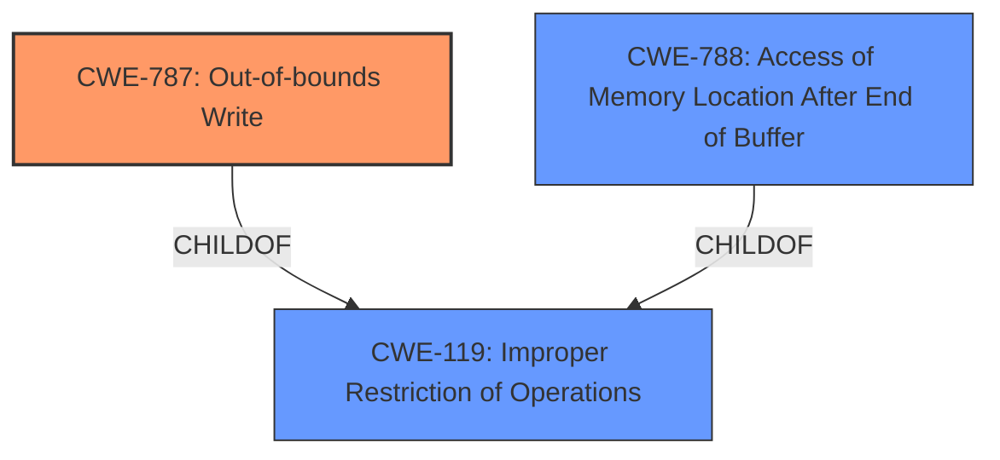

# Enhanced Analysis for CVE-2021-40771

# Summary
| CWE ID | CWE Name | Confidence | CWE Abstraction Level | CWE Vulnerability Mapping Label | CWE-Vulnerability Mapping Notes |
|---|---|---|---|---|---|
| CWE-787 | Out-of-bounds Write | 0.9 | Base | Allowed | Primary CWE |
| CWE-788 | Access of Memory Location After End of Buffer | 0.6 | Base | Discouraged | Secondary Candidate |

## Evidence and Confidence

*   **Confidence Score:** 0.9
*   **Evidence Strength:** HIGH

## Relationship Analysis
The primary relationship is the ChildOf relationship between CWE-787 and CWE-119, indicating that an out-of-bounds write is a specific type of improper restriction of operations within memory buffers. Additionally, CWE-788 is also a child of CWE-119 and could be considered as an alternative, but CWE-787 is more specific in this case because the content summary explicitly mentions "accessing a memory location after the end of a buffer," which directly implies writing.



## Vulnerability Chain
The vulnerability chain starts with **insecure handling** of a malicious WAV file, leading to **memory corruption**, specifically an out-of-bounds write (CWE-787), and ultimately resulting in arbitrary code execution.

## Summary of Analysis
The initial assessment identified the **weakness** as **memory corruption** due to **insecure handling** of a malicious WAV file. The CVE reference link content summary states: "The vulnerability is caused by accessing a memory location after the end of a buffer (CWE-788)". While CWE-788 is a valid consideration, the vulnerability description also states that it could lead to arbitrary code execution. The primary CWE match for similar CVE descriptions is CWE-119. The retriever results also indicates CWE-787 as the top combined result. 

The evidence supports CWE-787 because the content summary explicitly mentions "accessing a memory location after the end of a buffer" which implies that the software is writing past the end of the buffer.

*   "The vulnerability is caused by accessing a memory location after the end of a buffer (CWE-788)."

Based on the evidence and relationship analysis, CWE-787 is selected as the primary CWE because it represents the specific **weakness** of writing data past the end of the buffer. The CWE is at the optimal level of specificity (Base).

Relevant CWE Information:

# Enhanced Context (25 CWEs)

## CWE-1289: Improper Validation of Unsafe Equivalence in Input
**Abstraction Level**: Base
**Similarity Score**: 0.78
Not selected as it does not relate to validating equivalence in input.

## CWE-807: Reliance on Untrusted Inputs in a Security Decision
**Abstraction Level**: Base
**Similarity Score**: 0.77
Not selected as the provided description does not contain any security decisions being made based on untrusted inputs.

## CWE-280: Improper Handling of Insufficient Permissions or Privileges
**Abstraction Level**: Base
**Similarity Score**: 0.77
Not selected as the vulnerability does not stem from permission or privilege issues.

## CWE-274: Improper Handling of Insufficient Privileges
**Abstraction Level**: Base
**Similarity Score**: 0.77
Not selected as the vulnerability does not stem from permission or privilege issues.

## CWE-266: Incorrect Privilege Assignment
**Abstraction Level**: Base
**Similarity Score**: 0.76
Not selected as the vulnerability does not stem from permission or privilege issues.

## CWE-183: Permissive List of Allowed Inputs
**Abstraction Level**: Base
**Similarity Score**: 0.76
Not selected as the vulnerability is not related to a permissive list of allowed inputs.

## CWE-404: Improper Resource Shutdown or Release
**Abstraction Level**: Class
**Similarity Score**: 0.76
Not selected as the vulnerability does not relate to resource shutdown or release.

## CWE-653: Improper Isolation or Compartmentalization
**Abstraction Level**: Class
**Similarity Score**: 0.76
Not selected as the vulnerability does not relate to isolation or compartmentalization issues.

## CWE-267: Privilege Defined With Unsafe Actions
**Abstraction Level**: Base
**Similarity Score**: 0.76
Not selected as the vulnerability does not stem from privilege issues.

## CWE-668: Exposure of Resource to Wrong Sphere
**Abstraction Level**: Class
**Similarity Score**: 0.75
Not selected as the vulnerability does not relate to exposing resources to the wrong sphere.

## CWE-190: Integer Overflow or Wraparound
**Abstraction Level**: Base
**Similarity Score**: 6080.56
Not selected as the vulnerability doesn't involve integer overflow or wraparound.

## CWE-125: Out-of-bounds Read
**Abstraction Level**: Base
**Similarity Score**: 6039.58
Not selected as the vulnerability description leans towards a write rather than a read.

## CWE-1284: Improper Validation of Specified Quantity in Input
**Abstraction Level**: Base
**Similarity Score**: 5952.11
Not selected as the vulnerability doesn't explicitly relate to improper validation of specified quantities in input.

## CWE-252: Unchecked Return Value
**Abstraction Level**: Base
**Similarity Score**: 5867.42
Not selected as the vulnerability does not explicitly relate to unchecked return values.

## CWE-457: Use of Uninitialized Variable
**Abstraction Level**: Variant
**Similarity Score**: 5839.23
Not selected as it doesn't directly relate to the use of uninitialized variables.

## CWE-120: Buffer Copy without Checking Size of Input ('Classic Buffer Overflow')
**Abstraction Level**: base
**Similarity Score**: 4.33
Not selected as it is less specific than CWE-787.

## CWE-190: Integer Overflow or Wraparound
**Abstraction Level**: base
**Similarity Score**: 4.33
Not selected as the vulnerability doesn't involve integer overflow or wraparound.

## CWE-22: Improper Limitation of a Pathname to a Restricted Directory ('Path Traversal')
**Abstraction Level**: base
**Similarity Score**: 4.33
Not selected as it doesn't relate to path traversal issues.

## CWE-770: Allocation of Resources Without Limits or Throttling
**Abstraction Level**: base
**Similarity Score**: 4.33
Not selected as it doesn't relate to resource allocation without limits or throttling.

## CWE-170: Improper Null Termination
**Abstraction Level**: base
**Similarity Score**: 4.33
Not selected as it doesn't relate to improper null termination.

## CWE-89: Improper Neutralization of Special Elements used in an SQL Command ('SQL Injection')
**Abstraction Level**: base
**Similarity Score**: 4.33
Not selected as it doesn't relate to SQL injection vulnerabilities.

## CWE-476: NULL Pointer Dereference
**Abstraction Level**: base
**Similarity Score**: 4.33
Not selected as it doesn't relate to null pointer dereferences.

## CWE-908: Use of Uninitialized Resource
**Abstraction Level**: base
**Similarity Score**: 4.33
Not selected as the description does not directly relate to usage of uninitialized resources.

## CWE-252: Unchecked Return Value
**Abstraction Level**: base
**Similarity Score**: 4.33
Not selected as the vulnerability does not explicitly relate to unchecked return values.

## CWE-125: Out-of-bounds Read
**Abstraction Level**: base
**Similarity Score**: 3.89
Not selected as the vulnerability description leans towards a write rather than a read.


## CWE Relationship Analysis

Current CWEs represent these abstraction levels: .


### Vulnerability Chain Analysis

**Chain starting from CWE-787:**
- 787 (Out-of-bounds Write) - ROOT


**Chain starting from CWE-404:**
- 404 (Improper Resource Shutdown or Release) - ROOT


### CWE Relationship Diagram

```mermaid
graph TD
    classDef primary fill:#f96,stroke:#333,stroke-width:2px
    classDef secondary fill:#69f,stroke:#333
    classDef tertiary fill:#9e9,stroke:#333
```