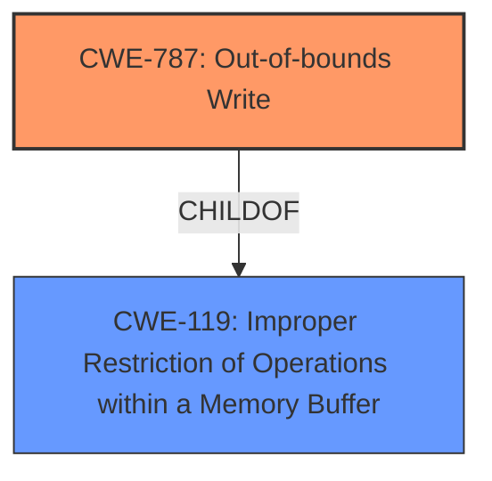

# Enhanced Analysis for CVE-2021-40775

# Summary
| CWE ID | CWE Name | Confidence | CWE Abstraction Level | CWE Vulnerability Mapping Label | CWE-Vulnerability Mapping Notes |
|---|---|---|---|---|---|
| CWE-787 | Out-of-bounds Write | 1.0 | Base | Allowed | Primary CWE |
| CWE-119 | Improper Restriction of Operations within a Memory Buffer | 0.8 | Class | Allowed-with-Review | Secondary CWE |

## Evidence and Confidence

*   **Confidence Score:** 0.9
*   **Evidence Strength:** HIGH

## Relationship Analysis
The primary weakness is **CWE-787 (Out-of-bounds Write)**, which is a base-level CWE and a child of **CWE-119 (Improper Restriction of Operations within a Memory Buffer)**. **CWE-119** is a broader class that encompasses various memory corruption issues. Since the description explicitly mentions memory corruption due to insecure handling leading to out-of-bounds write, **CWE-787** is more specific and appropriate.



## Vulnerability Chain
The vulnerability chain starts with the **insecure handling** of a malicious SVG file, leading to **memory corruption** due to an out-of-bounds write (**CWE-787**), and finally results in arbitrary code execution.

## Summary of Analysis
Based on the vulnerability description, the root cause is the **insecure handling** of a malicious SVG file, which leads to **memory corruption**. The CVE Reference Links Content Summary confirms this, stating the root cause as "Access of memory location after end of buffer" and identifies "Out-of-bounds read (CWE-788)" as a weakness.

The Retriever Results also suggest **CWE-787 (Out-of-bounds Write)** as the top candidate. While the content summary mentions out-of-bounds read, the vulnerability description explicitly mentions **memory corruption** due to **insecure handling** which implies a write operation causing the corruption. Therefore, **CWE-787** is more appropriate than **CWE-788**.

The primary CWE match provided, CWE-119, is a parent Class of CWE-787.
The top CWEs for similar CVE Descriptions also lists CWE-787.

I am overriding the "Out-of-bounds read (CWE-788)" suggested by the CVE Reference Links Content Summary because the Vulnerability Description explicitly mentions memory corruption, suggesting a write operation.

**CWE-787** is at the Base level of abstraction, making it a precise representation of the weakness.
**CWE-119** is included as a secondary CWE to represent the broader category of memory corruption issues.

Relevant CWE Information:

# Enhanced Context (25 CWEs)

## CWE-1289: Improper Validation of Unsafe Equivalence in Input
**Abstraction Level**: Base
**Similarity Score**: 0.76
**Source**: dense

**Description**:
The product receives an input value that is used as a resource identifier or other type of reference, but it does not validate or incorrectly validates that the input is equivalent to a potentially-unsafe value.
*Not Selected*: Not applicable because the vulnerability is about insecure handling of an SVG file leading to memory corruption, not about improper validation of input equivalence.

## CWE-73: External Control of File Name or Path
**Abstraction Level**: Base
**Similarity Score**: 0.75
**Source**: dense

**Description**:
The product allows user input to control or influence paths or file names that are used in filesystem operations.
*Not Selected*: Not applicable because the vulnerability is about insecure handling of an SVG file's content, not about controlling file names or paths.

## CWE-665: Improper Initialization
**Abstraction Level**: Class
**Similarity Score**: 0.75
**Source**: dense

**Description**:
The product does not initialize or incorrectly initializes a resource, which might leave the resource in an unexpected state when it is accessed or used.
*Not Selected*: Not applicable because the vulnerability is about insecure handling of a malicious SVG file leading to memory corruption, not about improper initialization of resources.

## CWE-41: Improper Resolution of Path Equivalence
**Abstraction Level**: Base
**Similarity Score**: 0.75
**Source**: dense

**Description**:
The product is vulnerable to file system contents disclosure through path equivalence. Path equivalence involves the use of special characters in file and directory names. The associated manipulations are intended to generate multiple names for the same object.
*Not Selected*: Not applicable because the vulnerability is about insecure handling of an SVG file's content, not about path equivalence issues.

## CWE-807: Reliance on Untrusted Inputs in a Security Decision
**Abstraction Level**: Base
**Similarity Score**: 0.75
**Source**: dense

**Description**:
The product uses a protection mechanism that relies on the existence or values of an input, but the input can be modified by an untrusted actor in a way that bypasses the protection mechanism.
*Not Selected*: Not applicable because the vulnerability is about insecure handling of an SVG file leading to memory corruption, not about reliance on untrusted inputs for security decisions.

## CWE-184: Incomplete List of Disallowed Inputs
**Abstraction Level**: Base
**Similarity Score**: 0.74
**Source**: dense

**Description**:
The product implements a protection mechanism that relies on a list of inputs (or properties of inputs) that are not allowed by policy or otherwise require other action to neutralize before additional processing takes place, but the list is incomplete.
*Not Selected*: Not applicable because the vulnerability is about insecure handling of an SVG file leading to memory corruption, not about an incomplete list of disallowed inputs.

## CWE-379: Creation of Temporary File in Directory with Insecure Permissions
**Abstraction Level**: Base
**Similarity Score**: 0.74
**Source**: dense

**Description**:
The product creates a temporary file in a directory whose permissions allow unintended actors to determine the file's existence or otherwise access that file.
*Not Selected*: Not applicable because the vulnerability is about insecure handling of an SVG file's content, not about temporary file creation.

## CWE-59: Improper Link Resolution Before File Access ('Link Following')
**Abstraction Level**: Base
**Similarity Score**: 0.74
**Source**: dense

**Description**:
The product attempts to access a file based on the filename, but it does not properly prevent that filename from identifying a link or shortcut that resolves to an unintended resource.
*Not Selected*: Not applicable because the vulnerability is about insecure handling of an SVG file's content, not about improper link resolution.

## CWE-667: Improper Locking
**Abstraction Level**: Class
**Similarity Score**: 0.74
**Source**: dense

**Description**:
The product does not properly acquire or release a lock on a resource, leading to unexpected resource state changes and behaviors.
*Not Selected*: Not applicable because the vulnerability is about insecure handling of an SVG file leading to memory corruption, not about improper locking.

## CWE-552: Files or Directories Accessible to External Parties
**Abstraction Level**: Base
**Similarity Score**: 0.74
**Source**: dense

**Description**:
The product makes files or directories accessible to unauthorized actors, even though they should not be.
*Not Selected*: Not applicable because the vulnerability is about insecure handling of an SVG file's content, not about file or directory access control.

## CWE-190: Integer Overflow or Wraparound
**Abstraction Level**: Base
**Similarity Score**: 5883.35
**Source**: sparse

**Description**:
The product performs a calculation that can
         produce an integer overflow or wraparound when the logic
         assumes that the resulting value will always be larger than
         the original value. This occurs when an integer value is
         incremented to a value that is too large to store in the
         associated representation. When this occurs, the value may
         become a very small or negative number.
*Not Selected*: Not applicable because the vulnerability is about insecure handling of a malicious SVG file leading to memory corruption and arbitrary code execution, and not specifically an integer overflow.

## CWE-125: Out-of-bounds Read
**Abstraction Level**: Base
**Similarity Score**: 5860.84
**Source**: sparse

**Description**:
The product reads data past the end, or before the beginning, of the intended buffer.
*Not Selected*: While the CVE Reference Links Content Summary mentions Out-of-bounds read (CWE-788), the Vulnerability Description explicitly mentions memory corruption, suggesting a write operation (CWE-787).

## CWE-1284: Improper Validation of Specified Quantity in Input
**Abstraction Level**: Base
**Similarity Score**: 57


## CWE Relationship Analysis

Current CWEs represent these abstraction levels: .


### Vulnerability Chain Analysis

**Chain starting from CWE-667:**
- 667 (Improper Locking) - ROOT


**Chain starting from CWE-787:**
- 787 (Out-of-bounds Write) - ROOT


### CWE Relationship Diagram

```mermaid
graph TD
    classDef primary fill:#f96,stroke:#333,stroke-width:2px
    classDef secondary fill:#69f,stroke:#333
    classDef tertiary fill:#9e9,stroke:#333
```