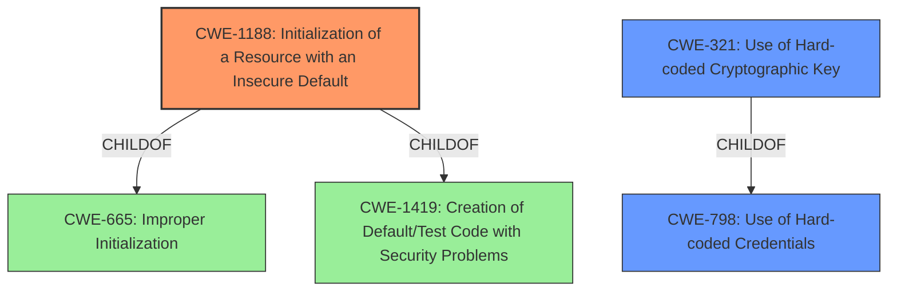

# Enhanced Analysis for CVE-2021-40825

# Summary
| CWE ID    | CWE Name                                            | Confidence | CWE Abstraction Level | CWE Vulnerability Mapping Label | CWE-Vulnerability Mapping Notes |
| :-------- | :-------------------------------------------------- | :--------- | :-------------------- | :------------------------------ | :------------------------------ |
| CWE-1188  | Initialization of a Resource with an Insecure Default | 0.9        | Base                  | Allowed                       | Primary CWE                     |
| CWE-798   | Use of Hard-coded Credentials                       | 0.8        | Base                  | Allowed                       | Secondary Candidate              |
| CWE-321   | Use of Hard-coded Cryptographic Key                 | 0.7        | Variant               | Allowed                       | Secondary Candidate              |

## Evidence and Confidence

*   **Confidence Score:** 0.9
*   **Evidence Strength:** HIGH

## Relationship Analysis
The primary CWE, CWE-1188 **Initialization of a Resource with an Insecure Default**, is a base-level CWE, which is the preferred level for root cause analysis. CWE-1188 is related to CWE-665 and CWE-1419, indicating that it's a specific type of initialization issue. CWE-798 **Use of Hard-coded Credentials** and CWE-321 **Use of Hard-coded Cryptographic Key** are also related, with CWE-321 being a variant of CWE-798. The relationships highlight how a default insecure key leads to the use of hardcoded credentials, specifically cryptographic keys in this instance.



## Vulnerability Chain
The vulnerability chain starts with the **initialization of a resource with an insecure default** (CWE-1188), specifically the cryptographic key. This leads to the **use of hard-coded credentials** (CWE-798) or a **hard-coded cryptographic key** (CWE-321). An attacker exploits this default key to gain unauthorized access and control over lighting conditions and software updates.

## Summary of Analysis
The primary weakness is the **default key vulnerability** where the nECY does not force a change to the key upon the initial configuration of an affected device, as evidenced by:
*   **Vulnerability Description Key Phrases:** "**rootcause:** **default key vulnerability**"
*   **CVE Reference Links Content Summary:** "The nLight ECLYPSE (nECY) system controllers have a default, hardcoded key (referred to as "SensorView Password" or "Gateway Password") that is not changed upon initial device configuration."

CWE-1188 **Initialization of a Resource with an Insecure Default** is the most accurate because the core problem is that the system is shipped with a default key that isn't secure and isn't forced to be changed. The high retriever score and the allowed usage mapping guidance support this choice.

CWE-798 **Use of Hard-coded Credentials** is a good secondary choice because the **default key** effectively functions as a hard-coded credential until it is changed.

CWE-321 **Use of Hard-coded Cryptographic Key** is a more specific variant of CWE-798. Since the **default key** is used for cryptographic purposes, this CWE is also applicable.

CWE-306 **Missing Authentication for Critical Function** was considered but not selected as the primary CWE. While the use of a **default key** weakens authentication, it isn't entirely missing. Authentication still exists, but it's easily bypassed using the well-known default key.

CWE-327 **Use of a Broken or Risky Cryptographic Algorithm** was also considered, but the vulnerability lies in the use of a **default key**, not necessarily a broken algorithm.
Relevant CWE Information:

# Enhanced Context (25 CWEs)
The following CWEs were identified as potentially relevant to this vulnerability:

## CWE-1391: Use of Weak Credentials
**Abstraction Level**: Class
**Similarity Score**: 0.76
**Source**: dense

**Description**:
The product uses weak credentials (such as a default key or hard-coded password) that can be calculated, derived, reused, or guessed by an attacker.

**Mapping Guidance**:
- Usage: Allowed-with-Review
- Rationale: This CWE entry is a Class and might have Base-level children that would be more appropriate

## CWE-274: Improper Handling of Insufficient Privileges
**Abstraction Level**: Base
**Similarity Score**: 0.76
**Source**: dense

**Description**:
The product does not handle or incorrectly handles when it has insufficient privileges to perform an operation, leading to resultant weaknesses.

**Mapping Guidance**:
- Usage: Discouraged
- Rationale: This CWE entry could be deprecated in a future version of CWE.

## CWE-668: Exposure of Resource to Wrong Sphere
**Abstraction Level**: Class
**Similarity Score**: 0.75
**Source**: dense

**Description**:
The product exposes a resource to the wrong control sphere, providing unintended actors with inappropriate access to the resource.

**Mapping Guidance**:
- Usage: Discouraged
- Rationale: CWE-668 is high-level and is often misused as a catch-all when lower-level CWE IDs might be applicable. It is sometimes used for low-information vulnerability reports [REF-1287]. It is a level-1 Class (i.e., a child of a Pillar). It is not useful for trend analysis.

## CWE-798: Use of Hard-coded Credentials
**Abstraction Level**: Base
**Similarity Score**: 0.75
**Source**: dense

**Description**:
The product contains hard-coded credentials, such as a password or cryptographic key.

**Mapping Guidance**:
- Usage: Allowed
- Rationale: This CWE entry is at the Base level of abstraction, which is a preferred level of abstraction for mapping to the root causes of vulnerabilities.

## CWE-807: Reliance on Untrusted Inputs in a Security Decision
**Abstraction Level**: Base
**Similarity Score**: 0.75
**Source**: dense

**Description**:
The product uses a protection mechanism that relies on the existence or values of an input, but the input can be modified by an untrusted actor in a way that bypasses the protection mechanism.

**Mapping Guidance**:
- Usage: Allowed
- Rationale: This CWE entry is at the Base level of abstraction, which is a preferred level of abstraction for mapping to the root causes of vulnerabilities.

## CWE-280: Improper Handling of Insufficient Permissions or Privileges
**Abstraction Level**: Base
**Similarity Score**: 0.75
**Source**: dense

**Description**:
The product does not handle or incorrectly handles when it has insufficient privileges to access resources or functionality as specified by their permissions. This may cause it to follow unexpected code paths that may leave the product in an invalid state.

**Mapping Guidance**:
- Usage: Allowed
- Rationale: This CWE entry is at the Base level of abstraction, which is a preferred level of abstraction for mapping to the root causes of vulnerabilities.

## CWE-1188: Initialization of a Resource with an Insecure Default
**Abstraction Level**: Base
**Similarity Score**: 0.75
**Source**: dense

**Description**:
The product initializes or sets a resource with a default that is intended to be changed by the administrator, but the default is not secure.

**Mapping Guidance**:
- Usage: Allowed
- Rationale: This CWE entry is at the Base level of abstraction, which is a preferred level of abstraction for mapping to the root causes of vulnerabilities.

## CWE-1390: Weak Authentication
**Abstraction Level**: Class
**Similarity Score**: 0.75
**Source**: dense

**Description**:
The product uses an authentication mechanism to restrict access to specific users or identities, but the mechanism does not sufficiently prove that the claimed identity is correct.

**Mapping Guidance**:
- Usage: Allowed-with-Review
- Rationale: This CWE entry is a Class and might have Base-level children that would be more appropriate

## CWE-345: Insufficient Verification of Data Authenticity
**Abstraction Level


## CWE Relationship Analysis

Current CWEs represent these abstraction levels: .


### Vulnerability Chain Analysis

**Chain starting from CWE-1188:**
- 1188 (Initialization of a Resource with an Insecure Default) - ROOT


**Chain starting from CWE-306:**
- 306 (Missing Authentication for Critical Function) - ROOT


### CWE Relationship Diagram

```mermaid
graph TD
    classDef primary fill:#f96,stroke:#333,stroke-width:2px
    classDef secondary fill:#69f,stroke:#333
    classDef tertiary fill:#9e9,stroke:#333
```