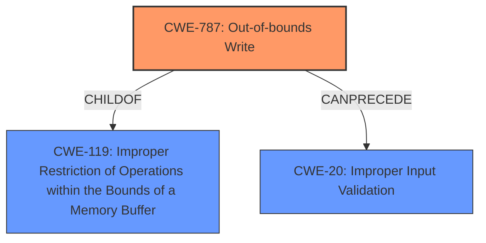

# Enhanced Analysis for CVE-2021-40826

# Summary
| CWE ID | CWE Name | Confidence | CWE Abstraction Level | CWE Vulnerability Mapping Label | CWE-Vulnerability Mapping Notes |
|---|---|---|---|---|---|
| CWE-787 | Out-of-bounds Write | 0.9 | Base | Allowed | Primary CWE |
| CWE-119 | Improper Restriction of Operations within the Bounds of a Memory Buffer | 0.7 | Class | Discouraged | Secondary Candidate |
| CWE-20 | Improper Input Validation | 0.6 | Class | Discouraged | Secondary Candidate |

## Evidence and Confidence

*   **Confidence Score:** 0.9
*   **Evidence Strength:** HIGH

## Relationship Analysis
The primary CWE is CWE-787 (**Out-of-bounds Write**), which is a base-level CWE and a child of CWE-119 (**Improper Restriction of Operations within the Bounds of a Memory Buffer**). CWE-119 is a class-level CWE. The vulnerability also relates to CWE-20 (**Improper Input Validation**) because the **lack of proper validation** of the MP3 file leads to the out-of-bounds write.



## Vulnerability Chain
The vulnerability chain starts with the **lack of input validation (CWE-20)**, which leads to an **out-of-bounds write (CWE-787)**. This can result in a **denial-of-service (DoS)** or **arbitrary code execution**.

## Summary of Analysis
The initial assessment identified CWE-787 (**Out-of-bounds Write**) as the primary weakness due to the **User Mode Write Access Violation** at `clementine+0x3aa207`. The instruction `mov dword ptr [esi+4],eax` attempts to write to a memory address controlled by the attacker via a crafted MP3 file. This directly leads to memory corruption, making CWE-787 the most appropriate base-level CWE.

CWE-119 (**Improper Restriction of Operations within the Bounds of a Memory Buffer**) was considered but is a more general class-level CWE. While technically accurate, CWE-787 provides a more specific description of the vulnerability. The mapping guidance for CWE-119 discourages its use when more specific CWEs are available.

CWE-20 (**Improper Input Validation**) is relevant because the vulnerability stems from the application's failure to properly validate the MP3 file's contents, allowing attacker-controlled values to be used as memory addresses. However, the core issue is the resulting out-of-bounds write, making CWE-787 the more direct and descriptive classification.

The selection of CWE-787 is based on the following evidence:

*   **Vulnerability Description Key Phrases:** "**User Mode Write Access Violation**"
*   **CVE Reference Links Content Summary:** "The code attempts to write to a memory location pointed to by the `esi` register plus an offset, but the value of `esi` can be controlled by a crafted MP3 file, resulting in a write to an invalid memory address and triggering an access violation."

The relationships between CWEs, particularly the parent-child relationship between CWE-119 and CWE-787, influenced the decision to choose the more specific base-level CWE. The chain relationship also highlights the role of **improper input validation (CWE-20)** as a contributing factor.

The final selection of CWE-787 is at the optimal level of specificity because it directly addresses the root cause of the vulnerability: the out-of-bounds write resulting from the mishandling of a crafted MP3 file.


## CWE Relationship Analysis

Current CWEs represent these abstraction levels: .


### Vulnerability Chain Analysis

**Chain starting from CWE-787:**
- 787 (Out-of-bounds Write) - ROOT


**Chain starting from CWE-119:**
- 119 (Improper Restriction of Operations within the Bounds of a Memory Buffer) - ROOT


### CWE Relationship Diagram

```mermaid
graph TD
    classDef primary fill:#f96,stroke:#333,stroke-width:2px
    classDef secondary fill:#69f,stroke:#333
    classDef tertiary fill:#9e9,stroke:#333
```