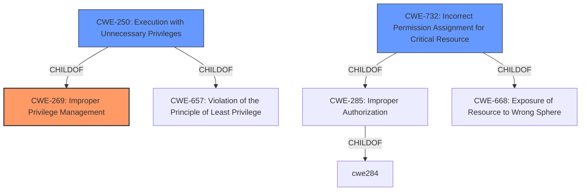

# Raw Analyzer Response for CVE-2021-40854

# Summary
| CWE ID  | CWE Name                                                        | Confidence | CWE Abstraction Level | CWE Vulnerability Mapping Label | CWE-Vulnerability Mapping Notes |
| :-------- | :-------------------------------------------------------------- | :--------- | :---------------------- | :------------------------------ | :------------------------------ |
| CWE-269 | Improper Privilege Management                                   | 0.8        | Class                   | Allowed-with-Review             | Primary CWE                     |
| CWE-250 | Execution with Unnecessary Privileges                           | 0.7        | Base                    | Allowed                         | Secondary Candidate              |
| CWE-732 | Incorrect Permission Assignment for Critical Resource           | 0.6        | Class                   | Allowed-with-Review             | Secondary Candidate              |

## Evidence and Confidence

*   **Confidence Score:** 0.8
*   **Evidence Strength:** MEDIUM

## Relationship Analysis
The primary CWE is CWE-269, which describes **improper privilege management**. CWE-250 (Execution with Unnecessary Privileges) is a child of CWE-269 and CWE-657, indicating a more specific case. CWE-732 (Incorrect Permission Assignment for Critical Resource) is related as it deals with incorrect permissions leading to unintended access, and is a child of CWE-285 and CWE-668. The choice of CWE-269 as primary is due to its higher-level applicability to the **improper handling of privileges** that allows a local user to gain administrator rights.

## Vulnerability Chain
The vulnerability chain starts with the **improper privilege management** in AnyDesk (CWE-269). This leads to Notepad being launched with elevated privileges (CWE-250). A local user can then exploit this by using the "Open Chat Log" feature and then using Notepad to launch other applications with those elevated privileges.

## Summary of Analysis
The initial assessment focused on the **improper handling of privileges** when opening the chat log, which allows for privilege escalation.

The evidence from the CVE Reference Links Content Summary states that the root cause is "Opening the chat log through the UI launches Notepad with escalated privileges" and the weakness is "Improper privilege handling when opening the chat log, allowing for privilege escalation".

Based on the retriever results, CWE-269 (Improper Privilege Management) had a high score. Although it is discouraged, the description fits the vulnerability: "The product does not properly assign, modify, track, or check privileges for an actor, creating an unintended sphere of control for that actor."

CWE-250 (Execution with Unnecessary Privileges) is also applicable. The description states: "The product performs an operation at a privilege level that is higher than the minimum level required, which creates new weaknesses or amplifies the consequences of other weaknesses."

CWE-732 (Incorrect Permission Assignment for Critical Resource) was also considered, since the escalated Notepad process could be seen as a critical resource with incorrect permissions.

I have chosen to focus on CWE-269 as the primary weakness, because the **root cause** is related to **improperly managing privileges**.
I considered CWE-284, CWE-285, and CWE-863 but they were too general.

Relevant CWE Information:

# Enhanced Context (25 CWEs)
## CWE-250: Execution with Unnecessary Privileges
**Abstraction:** Base
**Similarity Score**: 0.079
**Source**: sparse

**Description**:
The product performs an operation at a privilege level that is higher than the minimum level required, which creates new weaknesses or amplifies the consequences of other weaknesses.

## CWE-732: Incorrect Permission Assignment for Critical Resource
**Abstraction:** Class
**Similarity Score**: 0.068
**Source**: sparse

**Description**:
The product specifies permissions for a security-critical resource in a way that allows that resource to be read or modified by unintended actors.

## CWE-269: Improper Privilege Management
**Abstraction:** Class
**Similarity Score**: 0.436
**Source**: dense

**Description**:
The product does not properly assign, modify, track, or check privileges for an actor, creating an unintended sphere of control for that actor.