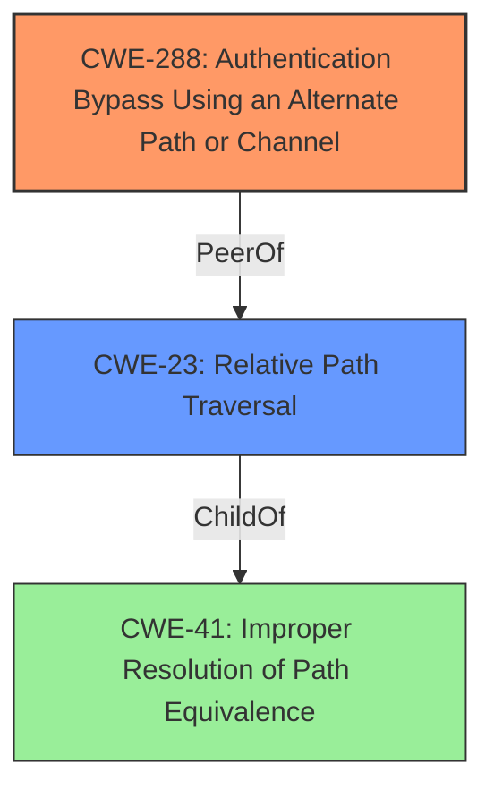

# Enhanced Analysis for CVE-2021-40856

# Summary
| CWE ID | CWE Name | Confidence | CWE Abstraction Level | CWE Vulnerability Mapping Label | CWE-Vulnerability Mapping Notes |
|---|---|---|---|---|---|
| CWE-288 | Authentication Bypass Using an Alternate Path or Channel | 0.9 | Base | Primary | Allowed |
| CWE-23 | Relative Path Traversal | 0.7 | Base | Secondary | Allowed |

## Evidence and Confidence

*   **Confidence Score:** 0.8
*   **Evidence Strength:** HIGH

## Relationship Analysis
The primary CWE is CWE-288 which is a base level CWE. The secondary CWE is CWE-23 which is also a base level CWE.



## Vulnerability Chain
The vulnerability chain starts with the **improper** handling of path traversal sequences, specifically the '/about/../' substring. This leads to an **authentication bypass**, granting unauthorized access to sensitive information.

CWE-23 (Relative Path Traversal) -> CWE-288 (Authentication Bypass Using an Alternate Path or Channel)

## Summary of Analysis
The analysis is based on the provided evidence which includes the vulnerability description and the CVE reference links content summary. The vulnerability description indicates an authentication bypass due to the usage of the "/about/../" substring. The CVE reference links content summary confirms that the root cause is the **failure to properly handle relative path traversal**, which allows access to restricted API endpoints without authentication.

The primary CWE, CWE-288 (Authentication Bypass Using an Alternate Path or Channel), is selected because it directly addresses the core issue of bypassing authentication through an alternate path. The vulnerability description and CVE reference summary explicitly state that the "/about/../" substring allows bypassing the authentication check.

The secondary CWE, CWE-23 (Relative Path Traversal), is included because it represents the underlying mechanism that enables the authentication bypass. The **improper handling of the "/about/../" sequence** leads to accessing resources outside the intended directory, which bypasses the authentication requirements.

The selected CWEs are at the base level of specificity, providing a clear and accurate representation of the vulnerability.

Relevant CWE Information:

# Enhanced Context (25 CWEs)
The following CWEs were identified as potentially relevant to this vulnerability:

## CWE-41: Improper Resolution of Path Equivalence
**Abstraction Level**: Base
**Similarity Score**: 0.79
**Source**: dense

**Description**:
The product is vulnerable to file system contents disclosure through path equivalence. Path equivalence involves the use of special characters in file and directory names. The associated manipulations are intended to generate multiple names for the same object.

**Mapping Guidance**:
- Usage: Allowed
- Rationale: This CWE entry is at the Base level of abstraction, which is a preferred level of abstraction for mapping to the root causes of vulnerabilities.

## CWE-23: Relative Path Traversal
**Abstraction Level**: Base
**Similarity Score**: 0.77
**Source**: dense

**Description**:
The product uses external input to construct a pathname that should be within a restricted directory, but it does not properly neutralize sequences such as ".." that can resolve to a location that is outside of that directory.

**Mapping Guidance**:
- Usage: Allowed
- Rationale: This CWE entry is at the Base level of abstraction, which is a preferred level of abstraction for mapping to the root causes of vulnerabilities.

## CWE-288: Authentication Bypass Using an Alternate Path or Channel

The product allows an attacker to bypass authentication and gain unauthorized access to functionality by using an alternate, unprotected path or channel to access the resource.

### Vulnerability Discussion

This weakness can occur when a web server or application makes an access control decision based on the URL or URI path that is used to access a resource. If the server allows alternate paths to access the same resource, then an attacker might be able to bypass the intended access control checks. For example, the server might only check the primary URL, but not any aliases or alternate paths.

### Observed Examples

| Reference | Description |
|---|---|
| [CVE-2021-3347](https://vulners.com/cve/CVE-2021-3347) | Improper Access Control vulnerability in Fortinet FortiWeb version 7.0.0 through 7.0.1, version 6.4.0 through 6.4.2, version 6.3.0 through 6.3.15, version 6.2.0 through 6.2.6, version 6.1.0 through 6.1.2, version 6.0.0 through 6.0.7, version 5.9.0 through 5.9.1, version 5.8.0 through 5.8.12, version 5.7.0 through 5.7.5, version 5.6.0 through 5.6.11, version 5.5.0 through 5.5.5, version 5.4.0 through 5.4.4, version 5.3.0 through 5.3.10, version 5.2.0 through 5.2.5, version 5.1.0 through 5.1.3 and version 5.0.0 through 5.0.8 allows a remote unauthenticated attacker to bypass firewall policies and access restricted resources by crafting a specific HTTP request. |
| [CVE-2015-1000005](https://vulners.com/cve/CVE-2015-1000005) | The WP All Import plugin before 3.1.8 for WordPress does not properly restrict access to wp-admin/admin-ajax.php, which allows remote attackers to trigger arbitrary import actions via the action parameter. |
| [CVE-2008-2938](https://vulners.com/cve/CVE-2008-2938) | Directory traversal vulnerability in editfile.php in MyBulletinBoard (MyBB) 1.4.0, and possibly earlier, allows remote attackers to read arbitrary files via a .. (dot dot) sequence in the file parameter. |

**CWE-288 Explanation:**

The Auerswald COMfortel devices **allow an attacker to bypass authentication** by using the alternate path "/about/../". This unprotected path leads to unauthorized access. The security implication is that an attacker can gain access to sensitive information and potentially perform malicious actions. This is a primary weakness because the **authentication bypass** is the direct result of the alternate path usage. The relationship to CWE-23 is that the path traversal makes the alternate path possible.

**CWE-23 Explanation:**

The Auerswald COMfortel devices **improperly handle the ".." sequence**, allowing an attacker to traverse directories and access resources outside the intended directory. The security implication is that an attacker can bypass access controls and potentially access sensitive files. This is a secondary weakness as it supports the primary weakness (CWE-288) by enabling access to alternate paths.

The following CWEs were considered but not used:

*   CWE-57 (Path Equivalence: 'fakedir/../realdir/filename'): While related, CWE-57 focuses more on the manipulation of path names for file system access, while the primary concern here is the authentication bypass achieved through path manipulation.
*   CWE-290 (Authentication Bypass by Spoofing): This CWE is not applicable because the authentication bypass is not achieved by spoofing an identity, but by exploiting an alternate path.
*   CWE-295 (Improper Certificate Validation): This CWE is irrelevant to the vulnerability because it involves certificate validation, which is not part of the vulnerability description.
*   CWE-291 (Reliance on IP Address for Authentication): This CWE is not applicable because the authentication bypass is not related to IP address verification.
*   CWE-187 (Partial String Comparison): This CWE is not applicable because the authentication bypass is not related to partial string comparison.
*   CWE-289 (Authentication Bypass by Alternate Name): This CWE is similar but less specific than CWE-288. CWE-288 specifies an alternate path, whereas CWE-289 is more general and can refer to alternate names in general, not just paths.
*   CWE-178 (Improper Handling of Case Sensitivity): This CWE is not applicable because the authentication bypass is not related to case sensitivity.
*   CWE-923 (Improper Restriction of Communication Channel to Intended Endpoints): This CWE is too broad


## CWE Relationship Analysis

Current CWEs represent these abstraction levels: .


### Vulnerability Chain Analysis

**Chain starting from CWE-288:**
- 288 (Authentication Bypass Using an Alternate Path or Channel) - ROOT


**Chain starting from CWE-41:**
- 41 (Improper Resolution of Path Equivalence) - ROOT


### CWE Relationship Diagram

```mermaid
graph TD
    classDef primary fill:#f96,stroke:#333,stroke-width:2px
    classDef secondary fill:#69f,stroke:#333
    classDef tertiary fill:#9e9,stroke:#333
```