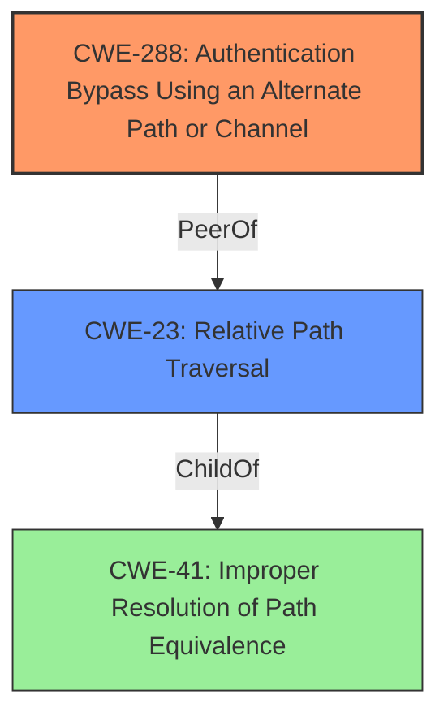

# Analysis for CVE-2021-40856

# Summary
| CWE ID | CWE Name | Confidence | CWE Abstraction Level | CWE Vulnerability Mapping Label | CWE-Vulnerability Mapping Notes |
|---|---|---|---|---|---|
| CWE-288 | Authentication Bypass Using an Alternate Path or Channel | 0.9 | Base | Primary | Allowed |
| CWE-23 | Relative Path Traversal | 0.7 | Base | Secondary | Allowed |

## Evidence and Confidence

*   **Confidence Score:** 0.8
*   **Evidence Strength:** HIGH

## Relationship Analysis
The primary CWE is CWE-288 which is a base level CWE. The secondary CWE is CWE-23 which is also a base level CWE.



## Vulnerability Chain
The vulnerability chain starts with the **improper** handling of path traversal sequences, specifically the '/about/../' substring. This leads to an **authentication bypass**, granting unauthorized access to sensitive information.

CWE-23 (Relative Path Traversal) -> CWE-288 (Authentication Bypass Using an Alternate Path or Channel)

## Summary of Analysis
The analysis is based on the provided evidence which includes the vulnerability description and the CVE reference links content summary. The vulnerability description indicates an authentication bypass due to the usage of the "/about/../" substring. The CVE reference links content summary confirms that the root cause is the **failure to properly handle relative path traversal**, which allows access to restricted API endpoints without authentication.

The primary CWE, CWE-288 (Authentication Bypass Using an Alternate Path or Channel), is selected because it directly addresses the core issue of bypassing authentication through an alternate path. The vulnerability description and CVE reference summary explicitly state that the "/about/../" substring allows bypassing the authentication check.

The secondary CWE, CWE-23 (Relative Path Traversal), is included because it represents the underlying mechanism that enables the authentication bypass. The **improper handling of the "/about/../" sequence** leads to accessing resources outside the intended directory, which bypasses the authentication requirements.

The selected CWEs are at the base level of specificity, providing a clear and accurate representation of the vulnerability.

Relevant CWE Information:

# Enhanced Context (25 CWEs)
The following CWEs were identified as potentially relevant to this vulnerability:

## CWE-41: Improper Resolution of Path Equivalence
**Abstraction Level**: Base
**Similarity Score**: 0.79
**Source**: dense

**Description**:
The product is vulnerable to file system contents disclosure through path equivalence. Path equivalence involves the use of special characters in file and directory names. The associated manipulations are intended to generate multiple names for the same object.

**Mapping Guidance**:
- Usage: Allowed
- Rationale: This CWE entry is at the Base level of abstraction, which is a preferred level of abstraction for mapping to the root causes of vulnerabilities.

## CWE-23: Relative Path Traversal
**Abstraction Level**: Base
**Similarity Score**: 0.77
**Source**: dense

**Description**:
The product uses external input to construct a pathname that should be within a restricted directory, but it does not properly neutralize sequences such as ".." that can resolve to a location that is outside of that directory.

**Mapping Guidance**:
- Usage: Allowed
- Rationale: This CWE entry is at the Base level of abstraction, which is a preferred level of abstraction for mapping to the root causes of vulnerabilities.

## CWE-288: Authentication Bypass Using an Alternate Path or Channel

The product allows an attacker to bypass authentication and gain unauthorized access to functionality by using an alternate, unprotected path or channel to access the resource.

### Vulnerability Discussion

This weakness can occur when a web server or application makes an access control decision based on the URL or URI path that is used to access a resource. If the server allows alternate paths to access the same resource, then an attacker might be able to bypass the intended access control checks. For example, the server might only check the primary URL, but not any aliases or alternate paths.

### Observed Examples

| Reference | Description |
|---|---|
| [CVE-2021-3347](https://vulners.com/cve/CVE-2021-3347) | Improper Access Control vulnerability in Fortinet FortiWeb version 7.0.0 through 7.0.1, version 6.4.0 through 6.4.2, version 6.3.0 through 6.3.15, version 6.2.0 through 6.2.6, version 6.1.0 through 6.1.2, version 6.0.0 through 6.0.7, version 5.9.0 through 5.9.1, version 5.8.0 through 5.8.12, version 5.7.0 through 5.7.5, version 5.6.0 through 5.6.11, version 5.5.0 through 5.5.5, version 5.4.0 through 5.4.4, version 5.3.0 through 5.3.10, version 5.2.0 through 5.2.5, version 5.1.0 through 5.1.3 and version 5.0.0 through 5.0.8 allows a remote unauthenticated attacker to bypass firewall policies and access restricted resources by crafting a specific HTTP request. |
| [CVE-2015-1000005](https://vulners.com/cve/CVE-2015-1000005) | The WP All Import plugin before 3.1.8 for WordPress does not properly restrict access to wp-admin/admin-ajax.php, which allows remote attackers to trigger arbitrary import actions via the action parameter. |
| [CVE-2008-2938](https://vulners.com/cve/CVE-2008-2938) | Directory traversal vulnerability in editfile.php in MyBulletinBoard (MyBB) 1.4.0, and possibly earlier, allows remote attackers to read arbitrary files via a .. (dot dot) sequence in the file parameter. |

**CWE-288 Explanation:**

The Auerswald COMfortel devices **allow an attacker to bypass authentication** by using the alternate path "/about/../". This unprotected path leads to unauthorized access. The security implication is that an attacker can gain access to sensitive information and potentially perform malicious actions. This is a primary weakness because the **authentication bypass** is the direct result of the alternate path usage. The relationship to CWE-23 is that the path traversal makes the alternate path possible.

**CWE-23 Explanation:**

The Auerswald COMfortel devices **improperly handle the ".." sequence**, allowing an attacker to traverse directories and access resources outside the intended directory. The security implication is that an attacker can bypass access controls and potentially access sensitive files. This is a secondary weakness as it supports the primary weakness (CWE-288) by enabling access to alternate paths.

The following CWEs were considered but not used:

*   CWE-57 (Path Equivalence: 'fakedir/../realdir/filename'): While related, CWE-57 focuses more on the manipulation of path names for file system access, while the primary concern here is the authentication bypass achieved through path manipulation.
*   CWE-290 (Authentication Bypass by Spoofing): This CWE is not applicable because the authentication bypass is not achieved by spoofing an identity, but by exploiting an alternate path.
*   CWE-295 (Improper Certificate Validation): This CWE is irrelevant to the vulnerability because it involves certificate validation, which is not part of the vulnerability description.
*   CWE-291 (Reliance on IP Address for Authentication): This CWE is not applicable because the authentication bypass is not related to IP address verification.
*   CWE-187 (Partial String Comparison): This CWE is not applicable because the authentication bypass is not related to partial string comparison.
*   CWE-289 (Authentication Bypass by Alternate Name): This CWE is similar but less specific than CWE-288. CWE-288 specifies an alternate path, whereas CWE-289 is more general and can refer to alternate names in general, not just paths.
*   CWE-178 (Improper Handling of Case Sensitivity): This CWE is not applicable because the authentication bypass is not related to case sensitivity.
*   CWE-923 (Improper Restriction of Communication Channel to Intended Endpoints): This CWE is too broad

# Enhanced Query for CVE-2021-40856

## Vulnerability Description
Auerswald COMfortel 1400 IP and 2600 IP before 2.8G devices allow Authentication Bypass via the /about/../ substring.

### Vulnerability Description Key Phrases
- **impact:** Authentication Bypass
- **vector:** /about/../ substring
- **product:** Auerswald COMfortel 1400 IP and 2600 IP
- **version:** before 2.8G

## CVE Reference Links Content Summary
```
{
  "vulnerability_details": {
    "root_cause": "The vulnerability lies in the web-based configuration management interface of Auerswald COMfortel IP desktop phones. The application fails to properly handle relative path traversal using '/about/../' allowing access to restricted API endpoints without authentication.",
    "weaknesses": [
      "Authentication Bypass",
      "Path Traversal"
    ],
    "impact": "Successful exploitation allows an attacker to bypass authentication and gain unauthorized access to sensitive information, including login credentials used for authentication at the PBX. Attackers can then authenticate as the respective phone at the PBX and potentially perform malicious actions such as calling premium rate numbers or intercepting phone calls.",
    "attack_vectors": "The attack vector is through HTTP requests to the web-based management interface on port 80. By inserting the prefix '/about/../' before the target API endpoint, the authentication check can be bypassed.",
    "attacker_capabilities": "The attacker must be able to send HTTP requests to the vulnerable device on the network. No prior authentication is needed."
  }
}
```

## Retriever Results

### Top Combined Results

| Rank | CWE ID | Name | Abstraction | Usage  | Retrievers | Individual Scores |
|------|--------|------|-------------|-------|------------|-------------------|
| 1 | 57 | Path Equivalence: 'fakedir/../realdir/filename' | Variant | Allowed | sparse | 0.079 |
| 2 | 290 | Authentication Bypass by Spoofing | Base | Allowed | sparse | 0.026 |
| 3 | 295 | Improper Certificate Validation | Base | Allowed | sparse | 0.024 |
| 4 | 291 | Reliance on IP Address for Authentication | Variant | Allowed | sparse | 0.022 |
| 5 | 187 | Partial String Comparison | Variant | Allowed | sparse | 0.022 |
| 6 | 289 | Authentication Bypass by Alternate Name | Base | Allowed | dense | 0.527 |
| 7 | 178 | Improper Handling of Case Sensitivity | Base | Allowed | graph | 0.002 |
| 8 | 923 | Improper Restriction of Communication Channel to Intended Endpoints | Class | Allowed-with-Review | sparse | 0.022 |
| 9 | 1393 | Use of Default Password | Base | Allowed | sparse | 0.022 |
| 10 | 625 | Permissive Regular Expression | Base | Allowed | sparse | 0.022 |


# Complete CWE Specifications


## CWE-57: Path Equivalence: 'fakedir/../realdir/filename'
**Abstraction:** Variant
**Status:** Incomplete

### Description
The product contains protection mechanisms to restrict access to 'realdir/filename', but it constructs pathnames using external input in the form of 'fakedir/../realdir/filename' that are not handled by those mechanisms. This allows attackers to perform unauthorized actions against the targeted file.

### Extended Description
Not provided

### Alternative Terms
None

### Relationships
ChildOf -> CWE-41

### Mapping Guidance
**Usage:** Allowed
**Rationale:** This CWE entry is at the Variant level of abstraction, which is a preferred level of abstraction for mapping to the root causes of vulnerabilities.
**Comments:** Carefully read both the name and description to ensure that this mapping is an appropriate fit. Do not try to 'force' a mapping to a lower-level Base/Variant simply to comply with this preferred level of abstraction.
**Reasons:**
- Acceptable-Use


### Additional Notes
**[Theoretical]** This is a manipulation that uses an injection for one consequence (containment violation using relative path) to achieve a different consequence (equivalence by alternate name).


### Observed Examples
- **CVE-2001-1152:** Proxy allows remote attackers to bypass denylist restrictions and connect to unauthorized web servers by modifying the requested URL, including (1) a // (double slash), (2) a /SUBDIR/.. where the desired file is in the parentdir, (3) a /./, or (4) URL-encoded characters.
- **CVE-2000-0191:** application check access for restricted URL before canonicalization
- **CVE-2005-1366:** CGI source disclosure using "dirname/../cgi-bin"


## CWE-290: Authentication Bypass by Spoofing
**Abstraction:** Base
**Status:** Incomplete

### Description
This attack-focused weakness is caused by incorrectly implemented authentication schemes that are subject to spoofing attacks.

### Extended Description
Not provided

### Alternative Terms
None

### Relationships
ChildOf -> CWE-1390
ChildOf -> CWE-287

### Mapping Guidance
**Usage:** Allowed
**Rationale:** This CWE entry is at the Base level of abstraction, which is a preferred level of abstraction for mapping to the root causes of vulnerabilities.
**Comments:** Carefully read both the name and description to ensure that this mapping is an appropriate fit. Do not try to 'force' a mapping to a lower-level Base/Variant simply to comply with this preferred level of abstraction.
**Reasons:**
- Acceptable-Use


### Additional Notes
**[Relationship]** This can be resultant from insufficient verification.


### Observed Examples
- **CVE-2022-30319:** S-bus functionality in a home automation product performs access control using an IP allowlist, which can be bypassed by a forged IP address.
- **CVE-2009-1048:** VOIP product allows authentication bypass using 127.0.0.1 in the Host header.


## CWE-295: Improper Certificate Validation
**Abstraction:** Base
**Status:** Draft

### Description
The product does not validate, or incorrectly validates, a certificate.

### Extended Description
When a certificate is invalid or malicious, it might allow an attacker to spoof a trusted entity by interfering in the communication path between the host and client. The product might connect to a malicious host while believing it is a trusted host, or the product might be deceived into accepting spoofed data that appears to originate from a trusted host.

### Alternative Terms
None

### Relationships
ChildOf -> CWE-287
ChildOf -> CWE-287
PeerOf -> CWE-322

### Mapping Guidance
**Usage:** Allowed
**Rationale:** This CWE entry is at the Base level of abstraction, which is a preferred level of abstraction for mapping to the root causes of vulnerabilities.
**Comments:** Carefully read both the name and description to ensure that this mapping is an appropriate fit. Do not try to 'force' a mapping to a lower-level Base/Variant simply to comply with this preferred level of abstraction.
**Reasons:**
- Acceptable-Use


### Observed Examples
- **CVE-2019-12496:** A Go framework for robotics, drones, and IoT devices skips verification of root CA certificates by default.
- **CVE-2014-1266:** chain: incorrect "goto" in Apple SSL product bypasses certificate validation, allowing Adversary-in-the-Middle (AITM) attack (Apple "goto fail" bug). CWE-705 (Incorrect Control Flow Scoping) -> CWE-561 (Dead Code) -> CWE-295 (Improper Certificate Validation) -> CWE-393 (Return of Wrong Status Code) -> CWE-300 (Channel Accessible by Non-Endpoint).
- **CVE-2021-22909:** Chain: router's firmware update procedure uses curl with "-k" (insecure) option that disables certificate validation (CWE-295), allowing adversary-in-the-middle (AITM) compromise with a malicious firmware image (CWE-494).


## CWE-291: Reliance on IP Address for Authentication
**Abstraction:** Variant
**Status:** Incomplete

### Description
The product uses an IP address for authentication.

### Extended Description
IP addresses can be easily spoofed. Attackers can forge the source IP address of the packets they send, but response packets will return to the forged IP address. To see the response packets, the attacker has to sniff the traffic between the victim machine and the forged IP address. In order to accomplish the required sniffing, attackers typically attempt to locate themselves on the same subnet as the victim machine. Attackers may be able to circumvent this requirement by using source routing, but source routing is disabled across much of the Internet today. In summary, IP address verification can be a useful part of an authentication scheme, but it should not be the single factor required for authentication.

### Alternative Terms
None

### Relationships
ChildOf -> CWE-290
ChildOf -> CWE-923
ChildOf -> CWE-471

### Mapping Guidance
**Usage:** Allowed
**Rationale:** This CWE entry is at the Variant level of abstraction, which is a preferred level of abstraction for mapping to the root causes of vulnerabilities.
**Comments:** Carefully read both the name and description to ensure that this mapping is an appropriate fit. Do not try to 'force' a mapping to a lower-level Base/Variant simply to comply with this preferred level of abstraction.
**Reasons:**
- Acceptable-Use


### Observed Examples
- **CVE-2022-30319:** S-bus functionality in a home automation product performs access control using an IP allowlist, which can be bypassed by a forged IP address.


## CWE-187: Partial String Comparison
**Abstraction:** Variant
**Status:** Incomplete

### Description
The product performs a comparison that only examines a portion of a factor before determining whether there is a match, such as a substring, leading to resultant weaknesses.

### Extended Description
For example, an attacker might succeed in authentication by providing a small password that matches the associated portion of the larger, correct password.

### Alternative Terms
None

### Relationships
ChildOf -> CWE-1023

### Mapping Guidance
**Usage:** Allowed
**Rationale:** This CWE entry is at the Variant level of abstraction, which is a preferred level of abstraction for mapping to the root causes of vulnerabilities.
**Comments:** Carefully read both the name and description to ensure that this mapping is an appropriate fit. Do not try to 'force' a mapping to a lower-level Base/Variant simply to comply with this preferred level of abstraction.
**Reasons:**
- Acceptable-Use


### Additional Notes
**[Relationship]** This is conceptually similar to other weaknesses, such as insufficient verification and regular expression errors. It is primary to some weaknesses.


### Observed Examples
- **CVE-2014-6394:** Product does not prevent access to restricted directories due to partial string comparison with a public directory
- **CVE-2004-1012:** Argument parser of an IMAP server treats a partial command "body[p" as if it is "body.peek", leading to index error and out-of-bounds corruption.
- **CVE-2004-0765:** Web browser only checks the hostname portion of a certificate when the hostname portion of the URI is not a fully qualified domain name (FQDN), which allows remote attackers to spoof trusted certificates.


## CWE-289: Authentication Bypass by Alternate Name
**Abstraction:** Base
**Status:** Incomplete

### Description
The product performs authentication based on the name of a resource being accessed, or the name of the actor performing the access, but it does not properly check all possible names for that resource or actor.

### Extended Description
Not provided

### Alternative Terms
None

### Relationships
ChildOf -> CWE-1390

### Mapping Guidance
**Usage:** Allowed
**Rationale:** This CWE entry is at the Base level of abstraction, which is a preferred level of abstraction for mapping to the root causes of vulnerabilities.
**Comments:** Carefully read both the name and description to ensure that this mapping is an appropriate fit. Do not try to 'force' a mapping to a lower-level Base/Variant simply to comply with this preferred level of abstraction.
**Reasons:**
- Acceptable-Use


### Additional Notes
**[Relationship]** Overlaps equivalent encodings, canonicalization, authorization, multiple trailing slash, trailing space, mixed case, and other equivalence issues.

**[Theoretical]** Alternate names are useful in data driven manipulation attacks, not just for authentication.


### Observed Examples
- **CVE-2003-0317:** Protection mechanism that restricts URL access can be bypassed using URL encoding.
- **CVE-2004-0847:** Bypass of authentication for files using "\" (backslash) or "%5C" (encoded backslash).


## CWE-178: Improper Handling of Case Sensitivity
**Abstraction:** Base
**Status:** Incomplete

### Description
The product does not properly account for differences in case sensitivity when accessing or determining the properties of a resource, leading to inconsistent results.

### Extended Description


Improperly handled case sensitive data can lead to several possible consequences, including:


  - case-insensitive passwords reducing the size of the key space, making brute force attacks easier

  - bypassing filters or access controls using alternate names

  - multiple interpretation errors using alternate names.


### Alternative Terms
None

### Relationships
ChildOf -> CWE-706
ChildOf -> CWE-706
CanPrecede -> CWE-433
CanPrecede -> CWE-289

### Mapping Guidance
**Usage:** Allowed
**Rationale:** This CWE entry is at the Base level of abstraction, which is a preferred level of abstraction for mapping to the root causes of vulnerabilities.
**Comments:** Carefully read both the name and description to ensure that this mapping is an appropriate fit. Do not try to 'force' a mapping to a lower-level Base/Variant simply to comply with this preferred level of abstraction.
**Reasons:**
- Acceptable-Use


### Additional Notes
**[Research Gap]** These are probably under-studied in Windows and Mac environments, where file names are case-insensitive and thus are subject to equivalence manipulations involving case.


### Observed Examples
- **CVE-2000-0499:** Application server allows attackers to bypass execution of a jsp page and read the source code using an upper case JSP extension in the request.
- **CVE-2000-0497:** The server is case sensitive, so filetype handlers treat .jsp and .JSP as different extensions. JSP source code may be read because .JSP defaults to the filetype "text".
- **CVE-2000-0498:** The server is case sensitive, so filetype handlers treat .jsp and .JSP as different extensions. JSP source code may be read because .JSP defaults to the filetype "text".


## CWE-923: Improper Restriction of Communication Channel to Intended Endpoints
**Abstraction:** Class
**Status:** Incomplete

### Description
The product establishes a communication channel to (or from) an endpoint for privileged or protected operations, but it does not properly ensure that it is communicating with the correct endpoint.

### Extended Description


Attackers might be able to spoof the intended endpoint from a different system or process, thus gaining the same level of access as the intended endpoint.


While this issue frequently involves authentication between network-based clients and servers, other types of communication channels and endpoints can have this weakness.


### Alternative Terms
None

### Relationships
ChildOf -> CWE-284

### Mapping Guidance
**Usage:** Allowed-with-Review
**Rationale:** This CWE entry is a Class and might have Base-level children that would be more appropriate
**Comments:** Examine children of this entry to see if there is a better fit
**Reasons:**
- Abstraction


### Observed Examples
- **CVE-2022-30319:** S-bus functionality in a home automation product performs access control using an IP allowlist, which can be bypassed by a forged IP address.
- **CVE-2022-22547:** A troubleshooting tool exposes a web server on a random port between 9000-65535 that could be used for information gathering
- **CVE-2022-4390:** A WAN interface on a router has firewall restrictions enabled for IPv4, but it does not for IPv6, which is enabled by default


## CWE-1393: Use of Default Password
**Abstraction:** Base
**Status:** Incomplete

### Description
The product uses default passwords for potentially critical functionality.

### Extended Description
It is common practice for products to be designed to use default passwords for authentication. The rationale is to simplify the manufacturing process or the system administrator's task of installation and deployment into an enterprise. However, if admins do not change the defaults, then it makes it easier for attackers to quickly bypass authentication across multiple organizations. There are many lists of default passwords and default-password scanning tools that are easily available from the World Wide Web.

### Alternative Terms
None

### Relationships
ChildOf -> CWE-1392

### Mapping Guidance
**Usage:** Allowed
**Rationale:** This CWE entry is at the Base level of abstraction, which is a preferred level of abstraction for mapping to the root causes of vulnerabilities.
**Comments:** Carefully read both the name and description to ensure that this mapping is an appropriate fit. Do not try to 'force' a mapping to a lower-level Base/Variant simply to comply with this preferred level of abstraction.
**Reasons:**
- Acceptable-Use


### Observed Examples
- **CVE-2022-30270:** Remote Terminal Unit (RTU) uses default credentials for some SSH accounts
- **CVE-2022-2336:** OPC Unified Architecture (OPC UA) industrial automation product has a default password
- **CVE-2021-38759:** microcontroller board has default password


## CWE-625: Permissive Regular Expression
**Abstraction:** Base
**Status:** Draft

### Description
The product uses a regular expression that does not sufficiently restrict the set of allowed values.

### Extended Description


This effectively causes the regexp to accept substrings that match the pattern, which produces a partial comparison to the target. In some cases, this can lead to other weaknesses. Common errors include:


  - not identifying the beginning and end of the target string

  - using wildcards instead of acceptable character ranges

  - others


### Alternative Terms
None

### Relationships
ChildOf -> CWE-185
PeerOf -> CWE-187
PeerOf -> CWE-184
PeerOf -> CWE-183

### Mapping Guidance
**Usage:** Allowed
**Rationale:** This CWE entry is at the Base level of abstraction, which is a preferred level of abstraction for mapping to the root causes of vulnerabilities.
**Comments:** Carefully read both the name and description to ensure that this mapping is an appropriate fit. Do not try to 'force' a mapping to a lower-level Base/Variant simply to comply with this preferred level of abstraction.
**Reasons:**
- Acceptable-Use


### Observed Examples
- **CVE-2021-22204:** Chain: regex in EXIF processor code does not correctly determine where a string ends (CWE-625), enabling eval injection (CWE-95), as exploited in the wild per CISA KEV.
- **CVE-2006-1895:** ".*" regexp leads to static code injection
- **CVE-2002-2175:** insertion of username into regexp results in partial comparison, causing wrong database entry to be updated when one username is a substring of another.

