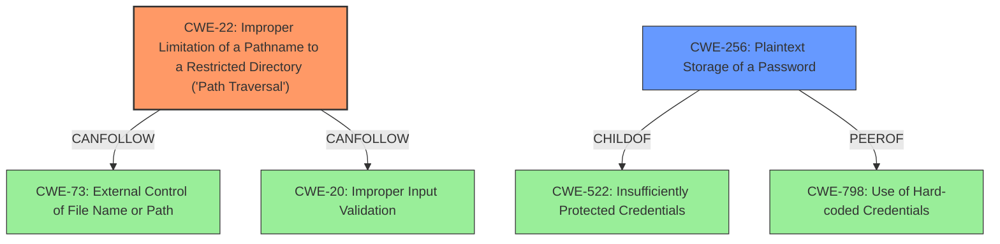

# Analysis for CVE-2021-40858

# Summary
| CWE ID | CWE Name | Confidence | CWE Abstraction Level | CWE Vulnerability Mapping Label | CWE-Vulnerability Mapping Notes |
|---|---|---|---|---|---|
| CWE-22 | Improper Limitation of a Pathname to a Restricted Directory ('Path Traversal') | 1.0 | Base | Primary | Allowed |
| CWE-256 | Plaintext Storage of a Password | 0.8 | Base | Secondary | Allowed |

## Evidence and Confidence

*   **Confidence Score:** 0.9
*   **Evidence Strength:** HIGH

## Relationship Analysis
The primary weakness is CWE-22, which describes the **improper limitation of a pathname to a restricted directory ('Path Traversal')**. This is a base-level CWE, which is appropriate as it directly represents the root cause of the vulnerability. The "Vulnerability Description Key Phrases" and "CVE Reference Links Content Summary" clearly state that the vulnerability is due to the **lack of proper input sanitization** of the `fileName` parameter, allowing an attacker to use directory traversal sequences like `../` to access files outside the intended directory.

CWE-22 has several relationships:
*   `ParentOf`: CWE-22 is a parent of CWE-23 (Relative Path Traversal), which is a more specific variant, but CWE-22 is more appropriate as the description doesn't explicitly mention relative path traversal only.
*   `CanFollow`: CWE-22 can be followed by CWE-73 (External Control of File Name or Path), and CWE-20 (Improper Input Validation) which makes sense because **improper input validation** and **external control of file name or path** can lead to Path Traversal.

The secondary weakness is CWE-256, which describes the **plaintext storage of a password**. This is a base-level CWE, which is appropriate as it directly represents the root cause of this secondary vulnerability. The "CVE Reference Links Content Summary" clearly states that the configuration database stores the "Admin" user's password in cleartext.
CWE-256 is a child of CWE-522 (Insufficiently Protected Credentials), which is a Class-level CWE. CWE-256 is more specific and therefore more appropriate.

## Vulnerability Chain
The vulnerability chain starts with **improper input validation** (implicit in CWE-22).
1.  **CWE-22 (Improper Limitation of a Pathname to a Restricted Directory ('Path Traversal'))**: The sub-admin can manipulate the `fileName` parameter to access arbitrary files.
2.  **CWE-256 (Plaintext Storage of a Password)**: The Admin password is stored in cleartext within a configuration file accessible via the path traversal.
3.  **Impact**: Arbitrary File Disclosure, leading to exposure of sensitive information (Admin password).

## Summary of Analysis
The initial analysis identified CWE-22 as the primary weakness due to the path traversal vulnerability and CWE-256 as a secondary issue. The evidence from the "Vulnerability Description Key Phrases" and "CVE Reference Links Content Summary" sections supports this classification. The graph relationships confirm that CWE-22 is appropriately specific and can lead to the exploitation of sensitive information.

The final decision is based on the provided evidence, the retriever results, and the CWE specifications. The CWEs selected are at the optimal level of specificity because they directly represent the root causes of the vulnerabilities: **improper input validation** leading to path traversal (CWE-22) and **plaintext storage of a password** (CWE-256).

CWEs considered but not used:

*   CWE-41 (Improper Resolution of Path Equivalence): While path equivalence could be a factor, the primary issue is the directory traversal, making CWE-22 more relevant.
*   CWE-73 (External Control of File Name or Path): This is related to CWE-22, as external control of the file name or path is a prerequisite for path traversal. However, CWE-22 is more specific to the vulnerability.
*   CWE-319 (Cleartext Transmission of Sensitive Information): This CWE is about transmitting sensitive information in cleartext, which is not the case here. The password is stored in cleartext, not transmitted.
*   CWE-798 (Use of Hard-coded Credentials): This CWE is about hard-coded credentials, while the vulnerability involves storing the admin password in plaintext in the configuration database.
*   CWE-425 (Direct Request ('Forced Browsing')): This is related to authorization issues, but the primary issue here is path traversal.