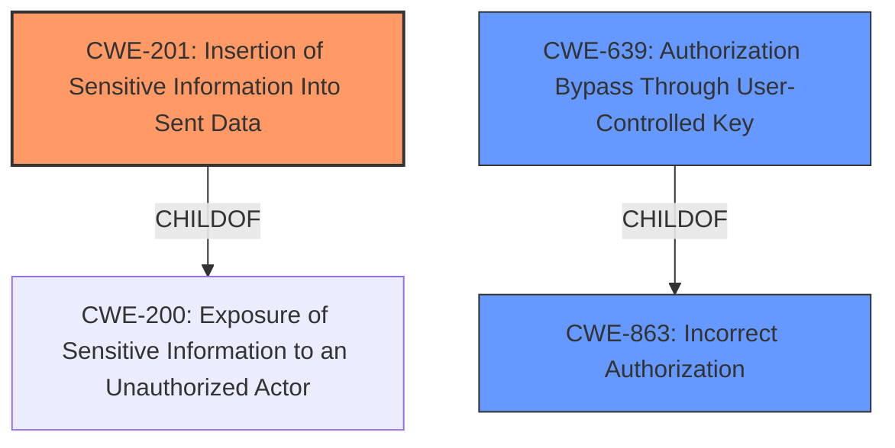

# Analysis for CVE-2021-40862

# Summary
| CWE ID  | CWE Name                                                   | Confidence | CWE Abstraction Level | CWE Vulnerability Mapping Label | CWE-Vulnerability Mapping Notes |
| :-------- | :--------------------------------------------------------- | :--------- | :---------------------- | :------------------------------ | :------------------------------ |
| CWE-201 | Insertion of Sensitive Information Into Sent Data   | 0.9       | Base                    | Primary                        | Allowed                       |
| CWE-639 | Authorization Bypass Through User-Controlled Key     | 0.7       | Base                    | Secondary                      | Allowed                       |
| CWE-863 | Incorrect Authorization                                  | 0.6       | Class                    | Secondary                      | Allowed-with-Review         |

## Evidence and Confidence

*   **Confidence Score:** 0.8
*   **Evidence Strength:** HIGH

## Relationship Analysis
The primary CWE is CWE-201, which has a ChildOf relationship to CWE-200 (Exposure of Sensitive Information to an Unauthorized Actor). CWE-639 (Authorization Bypass Through User-Controlled Key) is a child of CWE-863 (Incorrect Authorization). The relationships highlight that exposing sensitive information can lead to authorization bypass, which can then lead to privilege escalation. The selection of CWE-201 as the primary weakness is due to the explicit disclosure of the sensitive URL, which directly aligns with the description of CWE-201.

## Vulnerability Chain
The chain of root cause and weaknesses that followed for the Vulnerability Description:
1.  **Root Cause:** The **API endpoint that erroneously disclosed a sensitive URL**.
2.  **Weakness:** Exposure of sensitive URLs containing secrets (CWE-201).
3.  **Authorization Bypass:** An attacker could potentially bypass authorization checks using the exposed URL (CWE-639).
4.  **Impact:** Privilege escalation and unauthorized modification of a Terraform configuration.

## Summary of Analysis
Initial Analysis:
The initial assessment focused on the **API endpoint that erroneously disclosed a sensitive URL**, and the subsequent impact of privilege escalation. The high retriever score for CWE-201 (Insertion of Sensitive Information Into Sent Data) and the clear description match pointed towards it being the primary weakness. The additional potential for authorization bypass due to the exposed URL led to considering CWE-639.

Criticism:
While privilege escalation is the final impact, it is a consequence of the **exposure** of the sensitive URL. Therefore, the root cause is the **disclosure** itself (CWE-201) and the potential for abusing the disclosed information (CWE-639).

Final Conclusion:
The primary CWE is CWE-201 because the core issue is the **erroneous disclosure of a sensitive URL**. This is directly supported by the vulnerability description's key phrases: "**API endpoint that erroneously disclosed a sensitive URL**" and the CVE Reference Links Content Summary: "The Configuration Versions API in Terraform Enterprise was erroneously exposing sensitive URLs associated with configuration versions in its responses."

The selection of CWE-201 is at the optimal level of specificity as it precisely captures the root cause. The secondary CWEs, CWE-639 and CWE-863, address the potential for authorization bypass that could arise from the exposed URL, contributing to the overall risk.
# Relevant CWE Information:

# Enhanced Context (25 CWEs)

## CWE-552: Files or Directories Accessible to External Parties
**Abstraction Level**: Base
**Similarity Score**: 0.79
**Source**: dense

**Description**:
The product makes files or directories accessible to unauthorized actors, even though they should not be.

**Mapping Guidance**:
- Usage: Allowed
- Rationale: This CWE entry is at the Base level of abstraction, which is a preferred level of abstraction for mapping to the root causes of vulnerabilities.

## CWE-23: Relative Path Traversal
**Abstraction Level**: Base
**Similarity Score**: 0.78
**Source**: dense

**Description**:
The product uses external input to construct a pathname that should be within a restricted directory, but it does not properly neutralize sequences such as ".." that can resolve to a location that is outside of that directory.

**Mapping Guidance**:
- Usage: Allowed
- Rationale: This CWE entry is at the Base level of abstraction, which is a preferred level of abstraction for mapping to the root causes of vulnerabilities.

## CWE-668: Exposure of Resource to Wrong Sphere
**Abstraction Level**: Class
**Similarity Score**: 0.78
**Source**: dense

**Description**:
The product exposes a resource to the wrong control sphere, providing unintended actors with inappropriate access to the resource.

**Mapping Guidance**:
- Usage: Discouraged
- Rationale: CWE-668 is high-level and is often misused as a catch-all when lower-level CWE IDs might be applicable. It is sometimes used for low-information vulnerability reports [REF-1287]. It is a level-1 Class (i.e., a child of a Pillar). It is not useful for trend analysis.

## CWE-538: Insertion of Sensitive Information into Externally-Accessible File or Directory
**Abstraction Level**: Base
**Similarity Score**: 0.78
**Source**: dense

**Description**:
The product places sensitive information into files or directories that are accessible to actors who are allowed to have access to the files, but not to the sensitive information.

**Mapping Guidance**:
- Usage: Allowed
- Rationale: This CWE entry is at the Base level of abstraction, which is a preferred level of abstraction for mapping to the root causes of vulnerabilities.

## CWE-41: Improper Resolution of Path Equivalence
**Abstraction Level**: Base
**Similarity Score**: 0.77
**Source**: dense

**Description**:
The product is vulnerable to file system contents disclosure through path equivalence. Path equivalence involves the use of special characters in file and directory names. The associated manipulations are intended to generate multiple names for the same object.

**Mapping Guidance**:
- Usage: Allowed
- Rationale: This CWE entry is at the Base level of abstraction, which is a preferred level of abstraction for mapping to the root causes of vulnerabilities.

## CWE-59: Improper Link Resolution Before File Access ('Link Following')
**Abstraction Level**: Base
**Similarity Score**: 0.77
**Source**: dense

**Description**:
The product attempts to access a file based on the filename, but it does not properly prevent that filename from identifying a link or shortcut that resolves to an unintended resource.

**Mapping Guidance**:
- Usage: Allowed
- Rationale: This CWE entry is at the Base level of abstraction, which is a preferred level of abstraction for mapping to the root causes of vulnerabilities.

## CWE-36: Absolute Path Traversal
**Abstraction Level**: Base
**Similarity Score**: 0.77
**Source**: dense

**Description**:
The product uses external input to construct a pathname that should be within a restricted directory, but it does not properly neutralize absolute path sequences such as "/abs/path" that can resolve to a location that is outside of that directory.

**Mapping Guidance**:
- Usage: Allowed
- Rationale: This CWE entry is at the Base level of abstraction, which is a preferred level of abstraction for mapping to the root causes of vulnerabilities.

## CWE-73: External Control of File Name or Path
**Abstraction Level**: Base
**Similarity Score**: 0.77
**Source**: dense

**Description**:
The product allows user input to control or influence paths or file names that are used in filesystem operations.

**Mapping Guidance**:
- Usage: Allowed
- Rationale: This CWE entry is at the Base level of abstraction, which is a preferred level of abstraction for mapping to the root causes of vulnerabilities.

## CWE-610: Externally Controlled Reference to a Resource in Another Sphere
**Abstraction Level**: Class
**Similarity Score**: 0.76
**Source**: dense

**Description**:
The product uses an externally controlled name or reference that resolves to a resource that is outside of the intended control sphere.

**Mapping Guidance**:
- Usage: Discouraged
- Rationale: This CWE entry is a level-1 Class (i.e., a child of a Pillar). It might have lower-level children that would be more appropriate

## CWE-497: Exposure of Sensitive System Information to an Unauthorized Control Sphere
**Abstraction Level**: Base
**Similarity Score**: 0.76
**Source**: dense

**Description**:
The product does not properly prevent