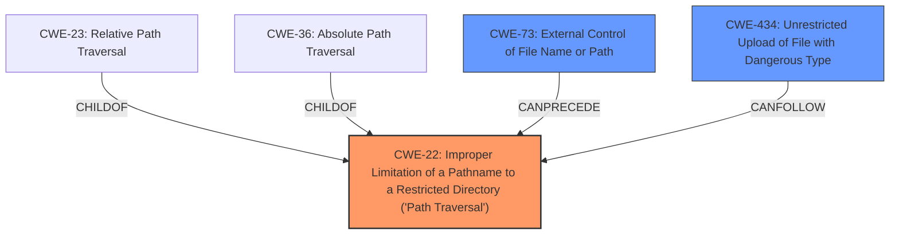

# Analysis Report for CVE-2021-40964

# Vulnerability Analysis Report: CVE-2021-40964

## Description


## Analysis (with Relationship Data)

# Summary
| CWE ID | CWE Name | Confidence | CWE Abstraction Level | CWE Vulnerability Mapping Label | CWE-Vulnerability Mapping Notes |
|---|---|---|---|---|---|
| CWE-22 | Improper Limitation of a Pathname to a Restricted Directory ('Path Traversal') | 1.0 | Base | Allowed | Primary CWE |
| CWE-73 | External Control of File Name or Path | 0.7 | Base | Allowed | Secondary Candidate |
| CWE-434 | Unrestricted Upload of File with Dangerous Type | 0.5 | Base | Allowed | Secondary Candidate |

## Evidence and Confidence

*   **Confidence Score:** 0.9
*   **Evidence Strength:** HIGH

## Relationship Analysis
The primary CWE, CWE-22, is the base class for **Path Traversal** vulnerabilities. Several variant CWEs, such as CWE-23 (Relative Path Traversal) and CWE-36 (Absolute Path Traversal), are children of CWE-22, providing more specific classifications. CWE-73 (External Control of File Name or Path) can precede CWE-22, indicating a potential chain where external control over the filename leads to a path traversal vulnerability. CWE-434 (Unrestricted Upload of File with Dangerous Type) is related as the **Path Traversal** allows the upload to occur. The selection of CWE-22 as the primary weakness is due to its direct match with the vulnerability description, while other related CWEs provide additional context.



## Vulnerability Chain
The vulnerability chain starts with **external control of the filename** via the `fullpath` parameter. This leads to **improper limitation of a pathname to a restricted directory (Path Traversal)**, which allows an attacker to **upload a file** with a dangerous type to an arbitrary location.

## Summary of Analysis
The initial assessment, based on the vulnerability description "A **Path Traversal** vulnerability exists... that allows attackers to upload a file (with Admin credentials or with the CSRF vulnerability) with the fullpath parameter containing path traversal strings (../ and ..\) in order to escape the servers intended working directory and write malicious files onto any directory on the computer," strongly suggests CWE-22 (Improper Limitation of a Pathname to a Restricted Directory ('Path Traversal')).

The **Vulnerability Description Key Phrases** also highlights the **weakness** as **Path Traversal**.

The **CVE Reference Links Content Summary** states:

*   "The root cause is a **lack of proper input sanitization** in the `fullpath` parameter during file uploads in TinyFileManager."
*   "**Relative Path Traversal (CWE-23)**: The application **fails to properly validate** the `fullpath` parameter, allowing attackers to use path traversal sequences like `../` and `..\` to navigate outside of the intended directory on the server."
*   "Attackers can exploit this vulnerability to upload malicious files to any directory on the server, potentially overwriting existing files or introducing new malicious code."

The retriever results also support this assessment, with CWE-22 having the highest score.

The relationship analysis reinforces this selection, as CWE-22 is the base class for path traversal vulnerabilities. The evidence clearly points to a failure in limiting the pathname to a restricted directory, allowing attackers to traverse the file system.

CWE-73 (External Control of File Name or Path) is a secondary candidate, as the `fullpath` parameter is directly controlled by the user. This external control enables the path traversal vulnerability.

CWE-434 (Unrestricted Upload of File with Dangerous Type) is also a secondary candidate, as the path traversal vulnerability allows the attacker to upload a file.

The selected CWEs are at the optimal level of specificity, as they accurately represent the root cause and contributing factors of the vulnerability.

Relevant CWE Information:

## CWE-22: Improper Limitation of a Pathname to a Restricted Directory ('Path Traversal')
**How the vulnerability's details match the CWE's characteristics:** The vulnerability description explicitly states a "Path Traversal" vulnerability, which aligns directly with CWE-22's description: "The product uses external input to construct a pathname that is intended to identify a file or directory that is located underneath a restricted parent directory, but the product does not properly neutralize special elements within the pathname that can cause the pathname to resolve to a location that is outside of the restricted directory."
**The security implications and potential impact:** Attackers can escape the intended working directory and write malicious files onto any directory on the computer, leading to arbitrary file write and potential remote code execution.
**Any parent-child relationships or chain patterns that influenced your mapping:** CWE-23 (Relative Path Traversal) and CWE-36 (Absolute Path Traversal) are child CWEs of CWE-22, representing specific types of path traversal. The vulnerability description mentions "../" and "..\", indicating relative path traversal, but CWE-22 is chosen as the base class. CWE-73 (External Control of File Name or Path) can precede CWE-22, as external control over the filename is a prerequisite for path traversal.
**Whether the weakness is primary or secondary in the vulnerability:** CWE-22 is the primary weakness.
**How the official MITRE mapping guidance influenced your decision:** The MITRE mapping guidance recommends using the Base level of abstraction when possible, and CWE-22 fits the vulnerability description well.

## CWE-73: External Control of File Name or Path
**How the vulnerability's details match the CWE's characteristics:** The `fullpath` parameter is controlled by the attacker, allowing them to influence the path used in filesystem operations. This aligns with CWE-73's description: "The product allows user input to control or influence paths or file names that are used in filesystem operations."
**The security implications and potential impact:** Attackers can manipulate the file path to access or modify system files or other critical application files.
**Any parent-child relationships or chain patterns that influenced your mapping:** CWE-73 can precede CWE-22, indicating that external control over the filename is a prerequisite for path traversal.
**Whether the weakness is primary or secondary in the vulnerability:** CWE-73 is a secondary weakness, as it enables the primary weakness (CWE-22).
**How the official MITRE mapping guidance influenced your decision:** The MITRE mapping guidance recommends using the Base level of abstraction when possible, and CWE-73 fits the vulnerability description.

## CWE-434: Unrestricted Upload of File with Dangerous Type
**How the vulnerability's details match the CWE's characteristics:** The path traversal allows the attacker to upload a file. This aligns with CWE-434's description: "The product allows the upload or transfer of dangerous file types that are automatically processed within its environment."
**The security implications and potential impact:** Attackers can upload a file, overwriting existing files or introducing new malicious code, leading to remote code execution.
**Any parent-child relationships or chain patterns that influenced your mapping:** CWE-434 is a secondary weakness that follows from CWE-22.
**Whether the weakness is primary or secondary in the vulnerability:** CWE-434 is a secondary weakness.
**How the official MITRE mapping guidance influenced your decision:** The MITRE mapping guidance recommends using the Base level of abstraction when possible, and CWE-434 fits the vulnerability description.

CWEs considered but not used:

*   CWE-23 (Relative Path Traversal): While the vulnerability description mentions "../" and "..\", CWE-22 is more appropriate as the base class.
*   CWE-36 (Absolute Path Traversal): The vulnerability description does not specifically mention absolute path traversal, so this CWE is not used.
*   CWE-59 (Improper Link Resolution Before File Access ('Link Following')): There is no mention of symlinks or link following in the vulnerability description, so this CWE is not used.
*   CWE-427 (Uncontrolled Search Path Element): The vulnerability does not involve uncontrolled search path elements, so this CWE is not used.
*   CWE-41 (Improper Resolution of Path Equivalence): The vulnerability description does not mention path equivalence issues, so this CWE is not used.


## CWE Relationship Analysis

Current CWEs represent these abstraction levels: .


### Vulnerability Chain Analysis

**Chain starting from CWE-36:**
- 36 (Absolute Path Traversal) - ROOT


**Chain starting from CWE-73:**
- 73 (External Control of File Name or Path) - ROOT


### CWE Relationship Diagram

```mermaid
graph TD
    classDef primary fill:#f96,stroke:#333,stroke-width:2px
    classDef secondary fill:#69f,stroke:#333
    classDef tertiary fill:#9e9,stroke:#333
```


*Report generated on 2025-04-02 16:57:26*
