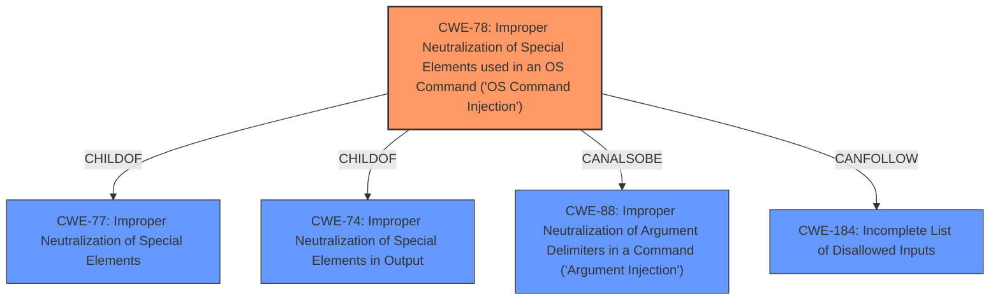

# Analysis for CVE-2021-40986

# Summary
| CWE ID | CWE Name | Confidence | CWE Abstraction Level | CWE Vulnerability Mapping Label | CWE-Vulnerability Mapping Notes |
|---|---|---|---|---|---|
| CWE-78 | Improper Neutralization of Special Elements used in an OS Command ('OS Command Injection') | 1.0 | Base | Primary | Allowed |

## Evidence and Confidence

*   **Confidence Score:** 1.0
*   **Evidence Strength:** HIGH

## Relationship Analysis
The primary CWE selected is CWE-78, which is a Base level CWE. It is a child of CWE-77, CWE-74, and CWE-77, indicating a hierarchical relationship. The relationships of CWE-78 include CanFollow -> CWE-184, CanAlsoBe -> CWE-88, ChildOf -> CWE-77, ChildOf -> CWE-74, ChildOf -> CWE-77 which indicates how OS command injection can lead to other weaknesses.

## Vulnerability Chain
The vulnerability chain starts with the **improper neutralization** of special elements within an OS command, which results in remote arbitrary command execution.
  - **Root Cause:** Improper Neutralization of Special Elements used in an OS Command (CWE-78)
  - **Impact:** Remote arbitrary command execution

## Summary of Analysis
The initial analysis identified that the vulnerability results in remote arbitrary command execution in Aruba ClearPass Policy Manager due to **improper neutralization**. The vulnerability description key phrases clearly indicate the impact as "remote arbitrary command execution". The primary CWE match from similar CVE descriptions is CWE-77, and CWE-78 is also listed as a Top CWE. The retriever results also list CWE-78 as the top combined result.

Based on the provided evidence, the final selection is CWE-78 (Improper Neutralization of Special Elements used in an OS Command ('OS Command Injection')). This CWE accurately describes the root cause of the vulnerability, where the system **fails to properly neutralize** special elements, allowing an attacker to execute arbitrary commands. The confidence in this mapping is high (1.0) due to the clear description of the **improper neutralization** and the resulting command execution. The CWE is at the optimal level of specificity (Base) as it directly addresses the **root cause** of the vulnerability.

CWE-22 (Improper Limitation of a Pathname to a Restricted Directory ('Path Traversal')) and CWE-89 (Improper Neutralization of Special Elements used in an SQL Command ('SQL Injection')) were considered but not used. CWE-22 was not selected because the vulnerability does not involve path manipulation. CWE-89 was not selected because the vulnerability does not involve SQL injection. CWE-863 (Incorrect Authorization), CWE-284 (Improper Access Control), and CWE-269 (Improper Privilege Management) were also not selected because the vulnerability is primarily about command injection rather than authorization or privilege management issues.